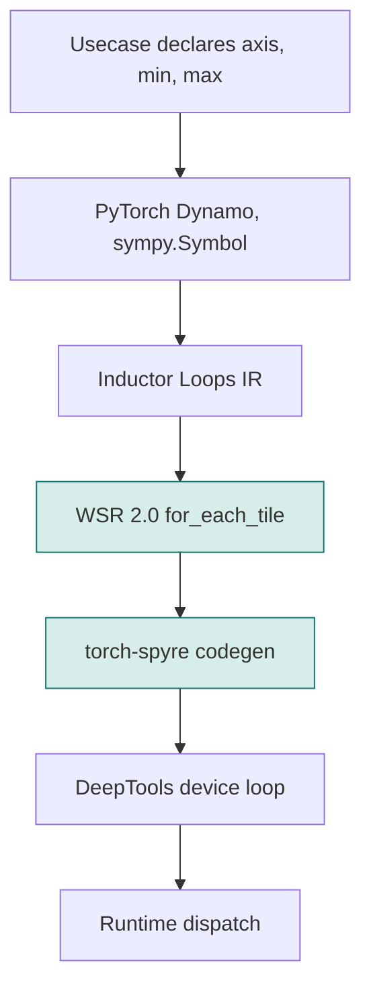
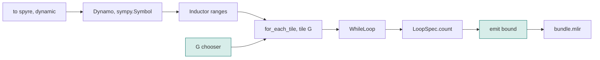
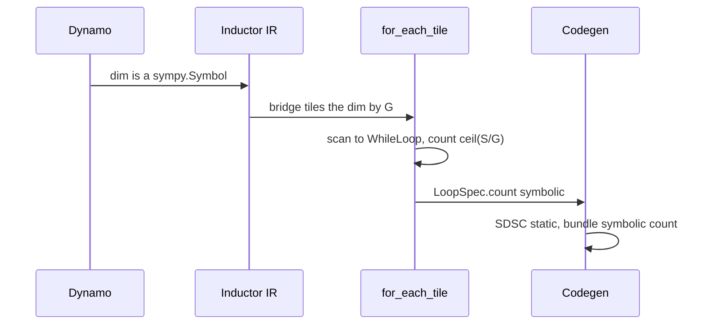
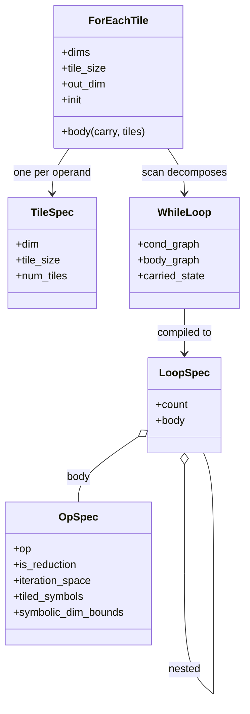
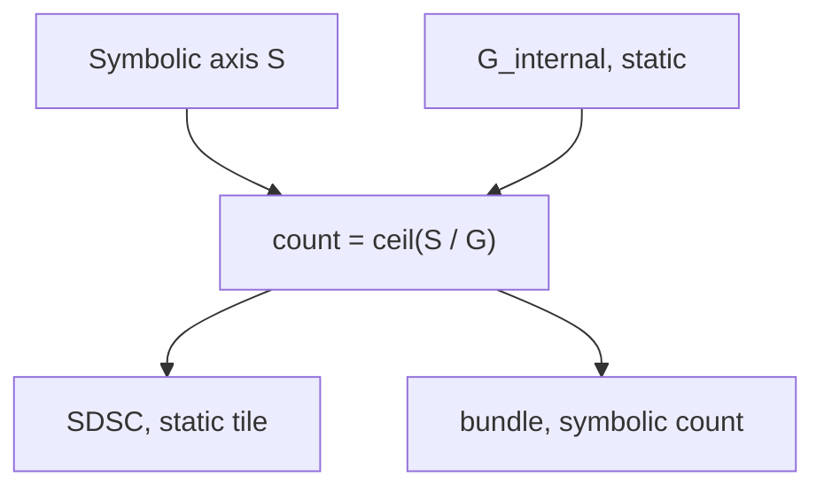
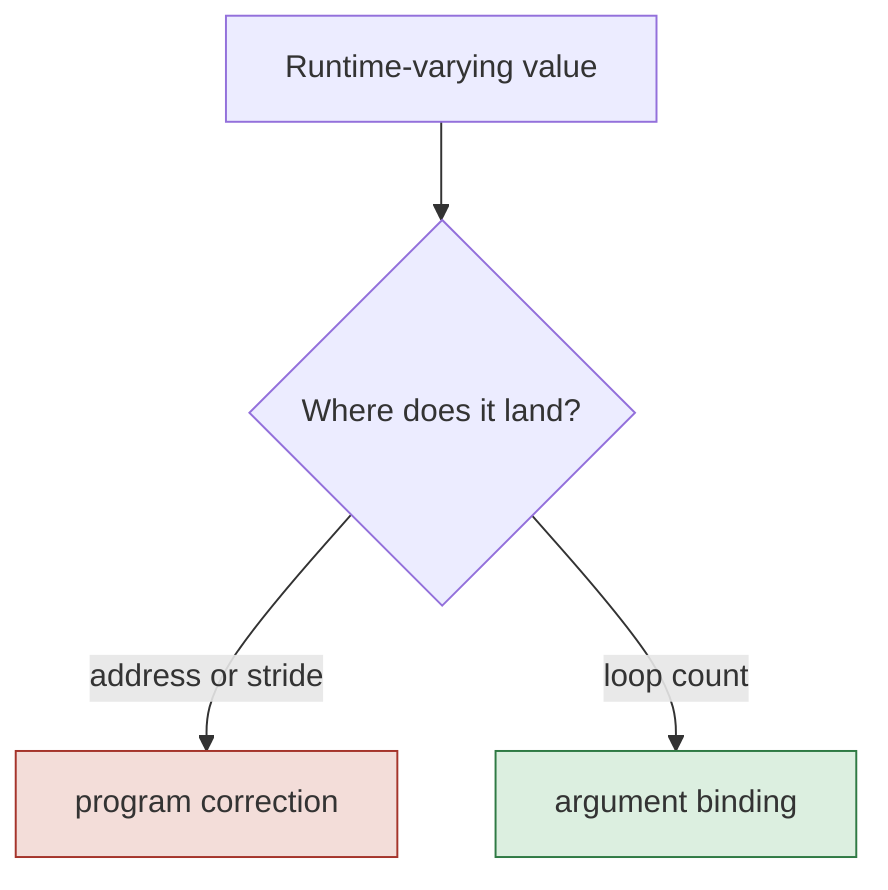
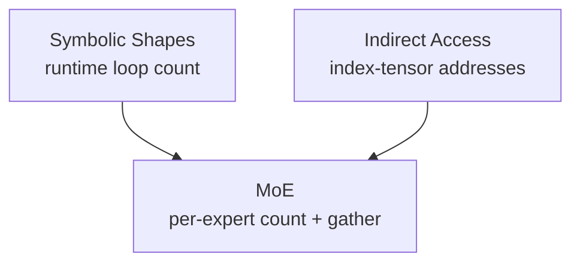
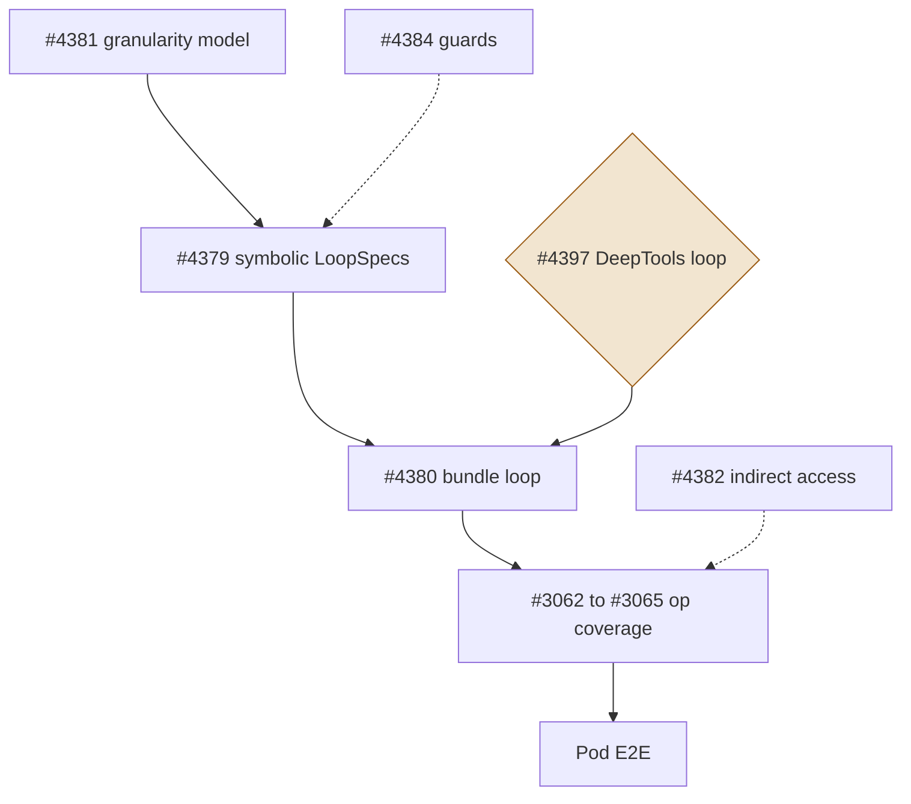

# Symbolic Shapes: High-Level Design

#### Status: draft for review. Revised for the WSR 2.0 loop production and the Phase 1 ticket plan.
#### Scope: torch-spyre Inductor front-end compiler path ( FX --> SDSC + Bundle )
#### Core Front-end Output change: symbolic loop count in the bundle with static addresses in per-tile SDSC. The loop that carries the count is now produced through the WSR 2.0 for_each_tile construct rather than the WSR 1.0 tiling pass.

## 1. Why this exists

### 1.1 The workloads are dynamic, not static

The shapes that reach a serving backend genuinely vary at runtime, and this variation could be large.

- Decoder serving is dynamic at the iteration level. Modern LLM serving uses continuous batching ( introduced by Orca [1] and now standard through vLLM [2] ), so the packed token count that reaches the compiler is therefore different on almost every dispatch.

- Encoder serving is dynamic at the request level. Query length, document length, and sentence length differ per request. This is the classic ragged-tensor case that CoRa [3] targets. Also, inference servers employ methods like dynamic batching to improve response throughput for encoder use cases

So the input shape is not a fixed thing the backend can assume. A static-shape backend has to absorb this variation somehow, and every option has a measured cost.

### 1.2 What existing systems do, and what it costs

There are five common ways to absorb dynamic shapes.

- **Pad and mask to a uniform shape.** This is the default in most frameworks. CoRa [3] states plainly that padding and masking to make shapes uniform "can lead to a lot of wasted computation and therefore a loss in performance," and shows a 1.6x geomean speedup on a transformer encoder just from removing that padding waste. So the waste is a measured 1.6x on a real encoder, not a corner case.
- **Bucketing.** Compile a handful of shapes and pad each input up to the nearest one. DietCode [4] refines this by tuning a program per sub-range of shapes. It cuts the padding compared to pad-to-max, but it does not remove it, and it multiplies the number of binaries.
- **Static graphs plus bucketing.** vLLM and TensorRT-LLM capture CUDA graphs, and a captured graph can only replay the exact shape it captured. So they capture a set of buckets and pad every input up to the nearest one. TensorRT-LLM's own guidance accepts the cost of computing wasted tokens because it is still better than falling back to slow eager execution.
- **Recompile per exact shape.** Compile a new binary for each shape. This is the very reason PyTorch built symbolic shapes. The PyTorch 2 work [5] tracks a symbolic shape and generates code once, in their words "rather than the static shape," to "minimize recompilations," and torch.compile caps how many times it will recompile before it gives up. Recompiling per shape does not scale.
- **Dedicated dynamic-shape compilers.** Nimble [6], DISC [7], and TVM Relax treat dynamic shapes as first-class. The research direction has held for half a decade. Dynamic and symbolic shapes need real compiler support, and static-only is the outlier.

### 1.3 Where torch-spyre sits today

torch-spyre currently recompiles per exact shape, with no symbolic reuse. So it pays the full recompile cost every time, a long warmup, a growing pile of cached binaries, and a recompile cliff the moment a new shape appears. That is the gap this work closes.

The recompile cost is not small, and it is measured. A cold compile of a large-context model takes about one hour at a 32k sequence length, most of it in the per-SDSC backend optimisation. That hour is paid on the first deployment of each model at each shape, and paid again after any stack upgrade. Covering k sequence lengths today means k full static compilations. The internal compile-time roadmap lists four levers against this bill. Warm and incremental caching make a repeat compile cheap, parallel backend invocations make a cold compile faster, and the fourth lever is this design, symbolic-loop compile, one cold compile for a shape range instead of one per shape. The caching levers make each compile cheaper, this design makes there be fewer of them, and the two compose.

### 1.4 What this design brings, and how it compares

We add symbolic shapes to torch-spyre by utilizing PyTorch's mature symbol ecosystem and deeptool's symbolic loop count support.

PyTorch's symbolic system (the one described in the PyTorch 2 paper [5]) introduces dynamic dimension is a SymPy symbol from Dynamo down, and we extend that symbol into our backend through [PyTorch looplevel IR](https://dev-discuss.pytorch.org/t/torchinductor-a-pytorch-native-compiler-with-define-by-run-ir-and-symbolic-shapes/747/3), Then we land the symbol in the spyre device loop count and keep every address static. A CUDA graph bakes the shape, so vLLM and TensorRT-LLM must pick either a static graph with padding or dynamic execution with overhead. Our program is one static-address binary and the varying dimension rides as a hardware loop trip count, so the static-program property and work-proportional compute hold at the same time. The one thing a captured graph cannot carry, a runtime trip count that changes the work done, is exactly what our bundle carries natively.

| Approach | How a new shape is handled | Compute waste | Binaries and warmup | Seen in |
|---|---|---|---|---|
| Pad to max | one binary, pad every input up to the max | high, grows with the gap to max | one binary | early serving stacks |
| Bucketing | a few binaries, pad up to the nearest bucket | medium, up to about 2x just past a boundary | N binaries, warmup grows with N | HF pipelines, DietCode [4] |
| Static graph + bucket | replay the nearest captured graph, pad the input | about 25 percent average for power-of-two buckets | N graphs, capture time grows with N | vLLM, TensorRT-LLM |
| Recompile per exact shape | compile a fresh binary for each shape | none, but a recompile cliff | unbounded binaries, repeated warmup | torch-spyre today |
| Dedicated dynamic-shape compiler | symbolic codegen, one program | low | one program | Nimble [6], DISC [7], TVM Relax, torch.compile [5] |
| Ours| one static-address program, symbolic loop count | low, pad only up to G ( and G can be tuned to finer values ) | one binary | this work |

### 1.5 The enabling insight

The whole design turns on one fact. A symbol is cheap only when it lives in a loop count. The moment it lands in an address or a stride, the device program is rewritten at dispatch, and that host program correction was measured in high microseconds per dispatch. So the entire job is to keep the symbol in the loop count and out of the addresses.

## 2. Symbolic Shape Support Delivery

We deliver symbolic shapes in two phases. The line between them is one question, does the symbolic axis sit on a reduction that we compile. Phase 1 is the axis that does not, Phase 2 is the axis that does, and that is exactly why Phase 2 is harder.

### 2.1 Phase 1, dynamic batch

What it is. A symbolic outer dimension flowing through pointwise, reduction and matmul. The axis is outermost and is not reduced by anything we compile, so it becomes a symbolic outer loop count over static tiles.

What it enables.
- Decoder packed-token inference on vLLM and spyre-inference. The packed token count changes on almost every iteration under continuous batching [1][2], and one symbolic binary serves the whole range instead of a bucket table.
- Encoder dynamic batching on HF-adapters. The batch size varies with load, and one binary serves any batch in the range.
- Dynamic batching for any inference server, for example Triton Inference Servers, which forms a variable batch from arriving requests.

Why we need it first. The batch and token-count axis is the axis that varies most often in serving, since it changes every iteration under continuous batching. It is also the clean case, the symbol is outermost and off the reduction, so it is the right place to prove the whole path end to end.

Phase 1 keeps one symbolic dimension per graph, the outer axis. Multiple and nested symbolic dimensions have a worked design already, but they sit in a later phase and do not gate anything here.

The hard parts. Choosing an execution granularity that fits the on-chip scratchpad. Holding the contract that the runtime size is a multiple of the granularity. Matmul on the symbolic dimension, which needs the DeepTools device loop. And keeping every address static so no host correction fires.

### 2.2 Phase 2, dynamic stick (sequence)

What it is. Adds SDPA, and the Phase 1 ops on the sequence axis. The sequence is symbolic on both axes of the attention score matrix and on the softmax reduction.

What it enables.
- Encoder dynamic sequence on hf-adapters and FMS. Document and query length varies per request, the ragged case CoRa [3] measured at 1.6x on an encoder. Padding the sequence is the dominant quadratic compute waste, because attention cost grows with the square of the padded length.
- Dynamic sequence for any inference server on the same SDPA path.

Why we need it. Sequence length is the other major varying axis, and it is where the largest raw-compute waste lives, since attention is quadratic in it.

**Note:** The symbol now sits on the softmax reduction axis, so the online softmax couples two nested loops instead of a single independent one. The sequence sits under the batch dimension, so the batch stride depends on it, which is the nested-symbolic-dimension address question that decides whether addresses can stay static (This may need HBM allocation updates for dynamic tensors).  And the attention decomposition divides the sequence by a block size as a plain integer today, which has to become a symbolic ceiling division.

### 2.3 What stays out of scope

This is the front-end compiler path only.
- The runtime max strided tensor allocation.
- The runtime dispatch and the C++ launch path need to be handled separately.
- The device loop support by DeepTools. This is now a filed ask, issue #4397, and Section 7.3 covers the contract.


Beyond Phase 2, the same machinery is meant to carry the indirect-access and MoE epics, covered in Section 9. A per-expert token count is a data-dependent version of the same symbolic loop count, and MoE today pays the same padding tax that MegaBlocks [8] measured, where frameworks must choose between dropping tokens or wasting compute and memory on padding, and MegaBlocks reports up to 4.35x by removing it. Keeping our loop count source-agnostic is what lets that epic sit on top of this one.


## 3. Architecture overview

The symbol travels a layered stack. Two layers are ours, the rest we inherit from PyTorch above and hand to DeepTools and the runtime below.



Our owned surface is the bridge that turns a marked dynamic dimension into the for_each_tile loop, and the codegen that splits that loop into a static SDSC and a symbolic bundle bound. Everything above is PyTorch and Inductor. Everything below is the DeepTools and runtime contract. The loop construct itself belongs to the WSR 2.0 work, we generate it and ride it.

## 4. Reusing PyTorch's symbolic system

This is the design principle we care about most. A dynamic dimension enters as a PyTorch SymInt and stays a sympy expression the whole way down to our loop count. The WSR 2.0 change strengthens this principle rather than weakening it, because the loop itself now also comes from upstream machinery. for_each_tile reduces to scan, a standard higher-order operator, and scan decomposes to the WhileLoop IR that PyTorch already ships. The internal compile-time roadmap states the same requirement from its side, that symbolic-loop compile needs a higher-order operator which preserves loop structure through lowering instead of specialising at a fixed trip count. for_each_tile is that operator.



The same story as a table, showing how little is new.

| Stage | Mechanism | Whose |
|---|---|---|
| Mark the dynamic dim | the plugin annotation calls mark_dynamic, giving a SymInt | ours at the surface, PyTorch underneath |
| Capture as a symbol | Dynamo records a sympy.Symbol | PyTorch |
| Range and guards | ShapeEnv holds min and max | PyTorch, we read it |
| Symbol in loop bounds | Inductor Loops IR ranges are sympy | Inductor |
| Tile the symbolic dim | a for_each_tile over that dim with a static tile of G | WSR 2.0 construct, our bridge generates it |
| Lower to a loop | for_each_tile reduces to scan, scan decomposes to WhileLoop | upstream HOP machinery |
| Symbolic loop count | the WhileLoop count and LoopSpec.count are sympy expressions | our IR, sympy-typed |
| Choose execution granularity | G_internal plus an LX fit check | ours, net-new |
| Emit the bundle bound | sympy expression to an MLIR input_arg | ours, net-new |

The practical meaning is that we do not keep a side-channel annotation in sync with the graph, and we do not keep a private loop maker either. The symbol lives where PyTorch already puts it, the loop lives where WSR 2.0 puts it, and we extend both into the backend.

## 5. Internal compiler design

### 5.1 The WSR 2.0 loop production in brief

WSR 1.0 inferred the tiled loop in a hidden compiler pass. WSR 2.0 puts an explicit loop into the graph instead, through a higher-order operator called for_each_tile. It takes a body function and applies it across tiles. The body has one fixed shape, it takes a carry and the tile arguments, and returns a new carry and an output tile.

- Map style. The tiles are independent, out_dim says where output tiles are stacked, and the carry is unused. Splitting the M dimension of a matmul is this style.
- Scan style. Each tile folds into an accumulator that starts at init, and there is no separate output. Splitting the contraction dimension K is this style.

The dims argument says which dimension of each operand is tiled, and None means the operand rides whole as a loop-invariant input. An operand can also be reached indirectly through an index operand that is itself tiled, which is how the paged-attention prototype walks pages, the pools stay resident and a page index picks the tile. So a body sees three kinds of operand, tiled, whole, and indirect.

One rule matters more than the rest, the body operates on tiles and must not slice tensors itself. PyTorch tracing cannot handle a data-dependent slice, so for_each_tile generates the tiling code directly, together with the WhileLoop IR, instead of hoping a trace discovers it. That is also why a plain Python loop is no good, Dynamo unrolls it flat, and why the source-level while_loop is no good, its traced body would have to slice.

The lowering chain is mechanical. for_each_tile reduces to scan, and the decomposition turns the scan into a WhileLoop, one while_loop node per nest level, no surviving scan node. A WhileLoop is three graphs, a main graph that sets up the initial state, a condition graph that checks the counter against the tile count, and a body graph that does one iteration and produces the next state. The backend then compiles the WhileLoop down to LoopSpec and the scf.for in the bundle, which needs subgraph compilation (already merged), tile-advance extraction from the index expressions, and the loop insertion with tensor copies, since the bundle allows no loop-carried variables, the carry lives in a fixed buffer.

One scoping fact from the WSR 2.0 plan matters to us directly. The first cut expects the for_each_tile to be written explicitly. Automatic tiling from named dimensions and Spyre hints is deferred. So the bridge from a marked dynamic dimension to a for_each_tile is not something we inherit, it is something this design supplies.

### 5.2 Where symbolic rides it

The two pieces of work answer two different questions about the same loop. WSR decides how big a tile is, so it fits the LX scratchpad. Symbolic decides how many tiles run, because the varying dimension only changes the count. They meet at the tile size and compose cleanly, since the per-tile footprint stays static. Every iteration works on the same fixed-size tile with the same LX footprint, so the LX planning looks at exactly one static tile and never needs to know that S is symbolic.

Concretely, for a marked dynamic dimension our bridge generates a for_each_tile over that dimension with a static tile of G. The tile size comes from the user granularity in the annotation, refined by the LX-fit chooser of Section 6, and not from Spyre hints. The hint-driven machinery stays for the static case, and it is in any case the part the WSR 2.0 first cut defers. The count of that loop is ceil(S over G), and it stays a sympy expression through the scan, through the WhileLoop condition, and into LoopSpec.count. It is never concretised to the warmup value. That last property is the whole feature, a count that collapses to a number silently produces a static binary.

Nesting falls out of the same shape. A tensor that is both dynamic and too large for LX gets a symbolic outer loop over the dynamic dimension and a static inner loop for the LX tiling. The loop count in our IR is a list, one entry per level, and each entry is a constant or a symbol on its own, so a symbolic outer with a static inner is expressible as it stands.

One entry-point question is still open with the WSR 2.0 owners. Either the bridge emits a real for_each_tile into the graph, or, as a transitional step, it stamps the same symbolic-count LoopSpec at the coarse-tiling point the way the 1.0 pass does. Both roads reach the same LoopSpec and the same scf.for, which is what makes the transition safe. This is tracked in issue #4379.

### 5.3 The compile-time flow



The important line in that flow is that the count is born symbolic where the tile is produced and stays symbolic until the bundle emission. The granularity chooser hooks in where the tile is sized, before any geometry is baked.

### 5.4 The IR objects

The loop source, the lowered loop, and the emitted loop are separate objects. for_each_tile holds the tiling intent. The WhileLoop is the lowered loop with its condition and body subgraphs. The loop spec is the emitted counted loop, and its count is allowed to be a symbolic expression.



A few notes on these.
- The TileSpec carries the tiled dim, the per-dimension tile size vector, and the operand's own tile count. For the symbolic dim that count is the symbolic expression.
- The loop count is per nesting level, and each level may independently be a constant or a symbol. This is already the shape the nested case needs.
- The WhileLoop carried state cannot survive into the bundle as a loop variable, the scf.for allows none. The carry is placed in a fixed buffer and moved with tensor copies. This matters for reductions and matmul under a symbolic count, not for the plain batch case.
- The op spec keeps the symbolic dim bounds as metadata, the max and the granularity per symbol. This is what the SDSC uses to bake geometry to max.
- The 1.0 pass objects, CoarseTileInfo and the counted scheduler node, are what this replaces. The transitional entry point of Section 5.2 would stamp the same LoopSpec from that pass, which is why both roads stay open.

### 5.5 Where the split lands

Codegen is a mechanical split of one tiled loop into two artefacts.

- The SDSC describes the static inner tile. Geometry is concretised to the max, and the symbol survives only as metadata. This is correct, the runtime size must not travel through the SDSC.
- The bundle describes the loop. It declares the count as an input argument carrying granularity and max, and it emits the loop bound from that argument. The front end authors no divide here, Section 7.3 explains why.

### 5.6 The net-new pieces, mapped to tickets

Everything above is either PyTorch, the WSR 2.0 machinery, or already present in our IR. The genuinely new pieces are filed as the Phase 1 tickets.

- The bridge and the symbolic LoopSpec, issue #4379. Produce the loop with a symbolic count for a marked dynamic dimension, keep the count sympy-safe end to end.
- The symbolic bundle emission, issue #4380. Mainline currently refuses a symbolic count at the emission point by design. A working emission exists on the POC branch, the work is to land it against the pinned loop form.
- The granularity chooser, issue #4381. Separates the contract granularity from the execution granularity and sizes the tile against LX.
- The constraint guards, issue #4384. Annotation-time and dispatch-time checks.
- The indirect-access analysis and guard, issue #4382.

## 6. Tiling and granularity

### 6.1 The annotation and the contract granularity

The user declares the dynamic dimension when moving the tensor to the device, and compiles with the default dynamic setting.

```python
x = torch.randn(64, 128, 1024)
x_spyre = x.to("spyre", dynamic={0: dict(min=32, max=576)})
compiled = torch.compile(model, dynamic=None)
```

The rules of this contract are short.

- The min doubles as the contract granularity G_user. There is no separate hint for the symbolic tile, the annotation is the single source. The max must be a multiple of the min, and the min should be at least two, since PyTorch specialises sizes zero and one.
- The plugin reserves the tensor at max, marks the dimension dynamic underneath, and pads every runtime input up to a multiple of G_user. mark_dynamic is a compile-time hint, so marking consistently on every input costs nothing per call and causes no recompile.
- dynamic stays None on torch.compile, not True. True would mark every dimension including the stick dimension, and a symbol on the stick breaks the static-address property.
- Phase 1 marks the outer axis, dim 0. The reservation refuses the innermost stick dimension, stick dynamism is the Phase 2 question.

### 6.2 The tile

Tiling keeps the symbol in the loop count. Split the symbolic axis into a static tile of extent G and a symbolic count of ceil(S over G). The number of tiles varies, the tile itself does not.



### 6.3 Why the addresses stay static: max-strided allocation

The addresses stay static because the tensor is allocated in HBM at its maximum stride. The runtime reserves the buffer at the max size, so the layout is pinned at max no matter what the runtime size is. Each tile then sits at base plus tile-index times G times the max stride, and that is a compile-time constant. A smaller runtime size does not move any tile, it only makes fewer tiles live, and that number is the loop bound. This max-strided allocation comes from the earlier symbolic-shapes work and is reused here. It is a runtime responsibility, described in Section 7.

For nested symbolic loops the same rule holds. In a dense encoder tensor of shape batch by sequence by hidden, if the sequence is symbolic and the tensor is allocated at the max sequence, the batch stride is max-sequence times hidden, which is static. Each batch item sits at a static offset, and within it each sequence tile sits at a static offset, so only the loop counts vary. The condition for this is that the dynamic tensor is allocated at the max stride, which may need runtime allocation updates for the nested case.

### 6.4 Two granularities, two owners

There are two granularities and they are kept separate.

- G_user, the contract granularity. It is the min from the annotation. The plugin owns it, because the plugin pads the runtime input to a multiple of it. It is about padding and alignment.
- G_internal, the execution granularity. We own it, because it is a fit decision about the LX scratchpad. The user does not need to know LX capacity.

The invariant is that G_internal divides G_user. Any runtime size that is a multiple of G_user is then a multiple of G_internal, so every tile stays full and the contract is untouched. The only visible effect is the loop count going up by the divisor.

### 6.5 The granularity cost model

The chooser is a cost model, not a fixed rule. It compares the contract granularity G_user against its divisors G_user/i and picks the one with the lowest estimated cost. Two terms compete, LX scratchpad fit and loop count.

- LX scratchpad fit. A larger tile uses more scratchpad. The per-tile working set is linear in the tile, A times G plus B, where A is the bytes per tile row over the live buffers and B is the resident set that does not scale with the tile. A tile that does not fit the frontend LX budget spills to HBM, which is a cliff. A tile that fits but leaves no room for a second tile cannot overlap data movement with compute, so it stalls. So this term favours a tile that fits with headroom to double-buffer.
- Loop count. The number of iterations is ceil(S over G_internal), which is i times the count at G_user. Each iteration carries loop overhead, re-stages any per-tile setup, and gives the compiler less to pipeline across. So this term favours a larger tile.

Total compute is about the same whatever the tile size, since more tiles of a smaller size do the same work, so it does not decide the choice. The decision is the balance of the two terms.

- If G_user fits the budget with double-buffer headroom, use G_user. It has the fewest iterations and the best weight reuse, and shrinking gains nothing.
- If G_user does not fit, or fits too tightly to double-buffer, step down to the largest divisor G_user/i that fits with headroom. This accepts i times more iterations in exchange for the tile fitting and the data movement overlapping.
- If a single stick will not fit, shrinking this axis is not enough. Tile a feature dimension too, which lowers A, then re-run the model.

One extra constraint, the chosen granularity needs enough divisors to spread across cores, so the model skips a value that would starve core-level parallelism, like a small prime times a stick.

## 7. Cross-team dependencies

This design is the front-end compiler path. It depends on three things owned by other teams. Each is a hard dependency, so they are set out here.

### 7.1 Runtime: max-strided HBM allocation

The runtime allocates the dynamic tensor in HBM at its maximum stride and pins the layout at max. This is what makes the per-tile addresses static, as Section 6.3 describes. It comes from the earlier symbolic-shapes work and is reused. For Phase 1 the outer axis is allocated at max. For the Phase 2 nested case, a sequence under a batch, the dynamic tensor needs to be allocated at the max stride as well, which may need allocation updates.

### 7.2 Runtime: dispatch and the C++ launch path

At dispatch the runtime binds the base addresses and one loop scalar into the argument slots the program reads. Whether that scalar is the padded size S or the precomputed tile count depends on the loop form the golden reference pins, Section 7.3 has the fork. Making the runtime pass the scalar, and the C++ launch path around it, is separate work owned by the runtime team.

### 7.3 DeepTools: symbolic loop support

DeepTools builds the device loop from the bundle. We design against the contract, that a symbolic loop bound is supported with a static SDSC and the device runs it as a loop. The contract turns on one distinction the host makes at dispatch.



- Argument binding. The runtime fills a value into an argument slot the program reads at launch. The base address and the loop count are bound this way, and the program body is not rewritten.
- Program correction. The host re-derives a value baked into the program body and rewrites the binary. This was measured in high microseconds per dispatch, and it fires when a symbol lands in an address.

This design keeps the symbol in the loop count and the addresses static, so the correction path never fires. Three facts of the contract were verified against the DeepTools source at code level.

- The front end authors no divide in the bundle. DeepTools derives the trip count itself from the loop bound and the step, and an authored ceiling division is rejected.
- The execute node in the SDSC keeps its symbol_ids empty. The correction path is gated exactly on that list being non-empty, so an empty list is what keeps dispatch on the cheap binding path.
- The addresses and strides carry no symbols, the per-tile advance rides the static max-strided geometry.

Two loop forms can express the same loop, and this fork is still open. The bound can be the padded size S with a step of G, where the backend divides. Or the runtime precomputes the count and the loop steps by one. The WhileLoop in the WSR 2.0 design iterates a tile index against a ready count, which leans to the second form, while the no-divide contract leans to the first. It is the same fork seen from two sides, so it should be settled jointly with the WSR owners and DeepTools.

Part of the interface already exists on both sides today. A marked dynamic symbol already emits the bundle input_arg parameter carrying its granularity and max value, the sdsc_execute op already carries the symbol_ids list, which we keep empty, and the spyre-comms static path already emits the symbolic-dim info group in the SDSC spec, empty, pending dynamic shapes.

The ask is filed as issue #4397, support for a symbolic loop count in the bundle mlir, including a request for a small example bundle and SDSC pair in the expected form. That golden example pins the loop form and the matching SDSC geometry, and it is the hard dependency for the emission ticket #4380. Until it lands, the symbolic emission stays behind a clear not-supported error so nothing miscompiles quietly.

## 8. The usecases

Two real serving usecases drive the design. In Phase 1 both have the symbolic dim as the outermost axis, which is the clean case.

- Decoder, Granite on spyre-inference. Packed input of shape num_tokens by hidden, no batch dim. The symbolic axis is num_tokens at dim 0. Attention is a custom-op boundary, the symbol crosses it and we do not compile it.
- Encoder, BERT or RoBERTa on hf-adapters. Dense input of shape batch by padded-sequence by hidden, plus a mask. Two axes vary in serving. Batch at dim 0 is the Phase 1 axis, the same clean case as the decoder. Sequence at dim 1 is the Phase 2 axis, because SDPA is in-graph and the softmax reduces over it.

The real line between the phases is one question, does the symbol sit on a reduction axis that we compile. Decoder num_tokens does not, and encoder batch does not either, so both are Phase 1. Encoder sequence does, so it is Phase 2 and genuinely harder.

## 9. Interaction with other epics

Symbolic shapes should compose with the indirect-access and MoE epics, not force a rebuild when they land. Two rules keep the contracts clean.



Indirect access is about addresses that come from a runtime index tensor, a gather or scatter, paged KV being one example. Symbolic shapes owns how many iterations run, indirect access owns where each iteration reads, and a symbolic-count loop over an indirect body is a valid combination. The WSR 2.0 construct can already express the indirect pattern, an index operand walks the tiles while the pools ride whole as loop-invariant inputs, which is exactly how the paged-attention prototype is written. Issue #4382 tracks the symbolic analysis for indirect access, and the guard that keeps a gather or scatter out of the symbolic-count loops, since a symbol in the gathered addresses would land on the correction path.

MoE is where both meet. The number of tokens per expert is data-dependent and changes every step, and the tokens for an expert are gathered from the packed buffer. So a per-expert count is a symbolic loop count, and the gather is indirect access. The mechanism for the count is the same as Phase 1, a runtime scalar, only the source differs, routing instead of an input shape.

The two rules that keep Phase 1 open to this are to keep the count source-agnostic, a runtime scalar from a shape dim or from routing, and to keep the loop body addressing-agnostic, affine or indirect. With them, MoE support sits on top of the count machinery and the indirect-access gather, and symbolic per-expert counts remove the fixed expert-capacity padding MoE uses today.

## 10. Phase 1 development plan

Phase 1 is filed as five tickets under the epic, plus the DeepTools ask and the re-scoped op-coverage tickets. Everything on our side builds and proves offline against the abstract contract, the on-device proof is a separate gate behind the DeepTools support.



- Issue #4379, generate symbolic LoopSpecs. The bridge from a marked dynamic dimension to a loop with a symbolic count, riding the for_each_tile production. The count stays a sympy expression end to end. The entry-point question of Section 5.2 is settled here with the WSR owners.
- Issue #4380, enable symbolic device loops in the SDSC bundle. The emission keystone. Emits the loop with a symbolic bound from the input_arg, no authored divide, symbol_ids empty. Folds the earlier input_arg ticket #2500 and supersedes the per-core symbolic-address ticket #2289. Hard dependency on #4397.
- Issue #4381, the granularity cost model of Section 6.5. Feeds the tile size to #4379. Independent of DeepTools.
- Issue #4382, symbolic shapes for indirect access. The two symbolic shapes for gather, the range-constraint case and the dimension-symbol case, plus the guard that keeps indirect access out of the symbolic-count loops. Scatter is the open half.
- Issue #4384, the constraint guards. Annotation-time validation, dispatch-time range and multiple checks with padding, and a clear message replacing the raw ConstraintViolationError of #3005.
- Issues #3062 to #3065, the op-coverage tickets for reduction and matmul. These predate the loop-count route and are re-scoped in place to it, static addresses, symbolic count, and for the reductions a fixed-buffer carry, since the bundle allows no loop-carried variables.

Two hardening items stay on the list without tickets yet, the weight-residency check, that a static weight is staged once and kept resident across iterations, and the guard for an un-hinted large dynamic tensor, since the automatic span-overflow path bails on symbolic dims. Multiple symbolic dimensions on one graph moved out of Phase 1 into the multi and nested phase, the design for it is worked and parked.

The offline acceptance discipline holds for every ticket. A compiled mark_dynamic op is asserted for four properties at once, a symbolic loop bound fed from an input argument, static addresses with no divide, an SDSC baked to max, and the execution granularity dividing the contract granularity. This runs with no pod, and it is how our side is proven before the DeepTools support lands.

## 11. Risks and open items

- The DeepTools symbolic loop support, issue #4397, is the hard dependency for the end-to-end feature, and the golden example that pins the loop form has not landed. Until then the emission ticket #4380 cannot close.
- Both sides must land before either delivers value. The front-end loop production and the backend symbolic loop are useless alone, and the compile-time roadmap flags the same pairing from its side.
- A kernel compiled for a range cannot make shape-specific tiling, core-division, or LX residency choices, so some device-time regression against a static kernel at any single shape is expected. The granularity model is the mitigation on our side, and the honest position is to measure the regression per op class rather than assume it away.
- The WSR 2.0 tile-advance extraction reads the tensor index expressions. That advance must stay in the static geometry and never become a bundle symbol, else dispatch lands on the correction path. This interaction needs checking against the golden reference when it arrives.
- The scan-style carry under a symbolic count rides a fixed buffer with tensor copies. This is the mechanism for reductions and matmul, and it needs to hold together with the symbolic count on top.
- The granularity cost model is designed but not yet a finalized spec. The fit check is net-new, not a reuse of the existing span model, which targets a different budget.
- The encoder sequence case, where the symbolic dim sits under the batch dim, keeps addresses static only if the tensor is allocated at the max stride. The open point is the runtime allocation for that nested case.
- Automatic tiling is out of scope in the WSR 2.0 first cut, so the bridge from a marked dimension to a for_each_tile is ours to build, and the exact entry point is still to be settled with the WSR owners.

## 12. Testing and validation

Two layers.

- Offline, against the abstract contract. The property tests of Section 10 check the four structural properties for every op class without any hardware, and this can run now.
- On the pod, after DeepTools support lands. One compiled kernel, several different real sizes, all correct, no recompile. The gate asserts a live symbolic loop bound in the emitted bundle, not only a numerical match, because a static max-size binary passes a correctness-only check while the feature is absent.


## References

- [1] Orca: A Distributed Serving System for Transformer-Based Generative Models. OSDI 2022. https://www.usenix.org/conference/osdi22/presentation/yu
- [2] Efficient Memory Management for Large Language Model Serving with PagedAttention (vLLM). SOSP 2023. https://arxiv.org/abs/2309.06180
- [3] The CoRa Tensor Compiler: Compilation for Ragged Tensors with Minimal Padding. MLSys 2022. https://arxiv.org/abs/2110.10221
- [4] DietCode: Automatic Optimization for Dynamic Tensor Programs. MLSys 2022.
- [5] PyTorch 2: Faster Machine Learning Through Dynamic Python Bytecode Transformation and Graph Compilation. ASPLOS 2024. https://dl.acm.org/doi/10.1145/3620665.3640366
- [6] Nimble: Efficiently Compiling Dynamic Neural Networks for Model Inference. MLSys 2021. https://arxiv.org/abs/2006.03031
- [7] DISC: A Dynamic Shape Compiler for Machine Learning Workloads. 2021. https://arxiv.org/abs/2103.05288
- [8] MegaBlocks: Efficient Sparse Training with Mixture-of-Experts. MLSys 2023. https://arxiv.org/abs/2211.15841

Internal artefacts.

- EPIC: torch-spyre issue #43. Phase 1 tickets: #4379, #4380, #4381, #4382, #4384. DeepTools ask: #4397. for_each_tile prototype: PR #4136.
- Companion documents in this folder: Symbolic_Shapes_and_WSR_Design_Notes.md for the full WSR 2.0 walkthrough, Symbolic_Shapes_Multi_Nested_Design.md for the multi and nested phase, Indirect_Access_Gather_Scatter_Explained.html for the indirect analysis, for_each_tile_symbol_flow.html for the symbol-flow diagrams, Symbolic_Loop_Count_Golden_Blocker.md for the golden ask, and CTO_notes_on_compile_time.md for the compile-time roadmap this design is the fourth lever of.
