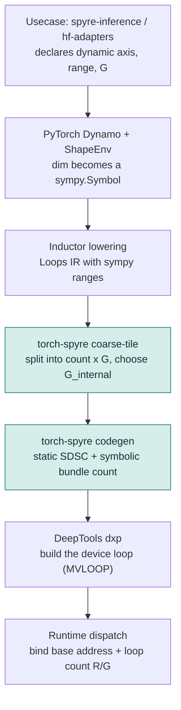
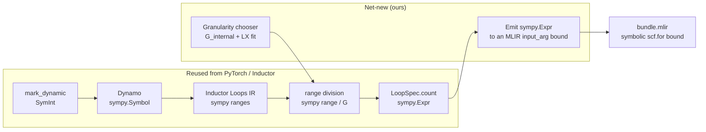
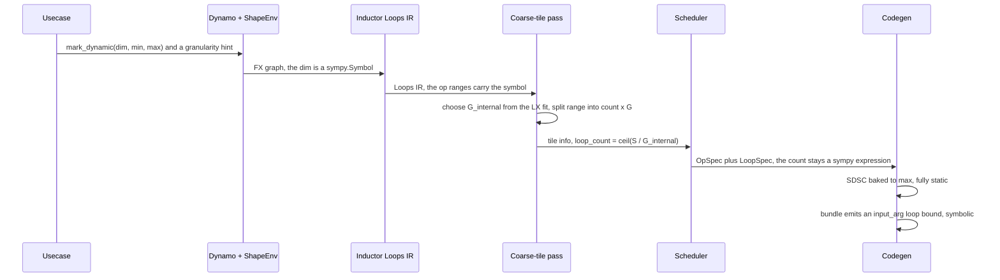
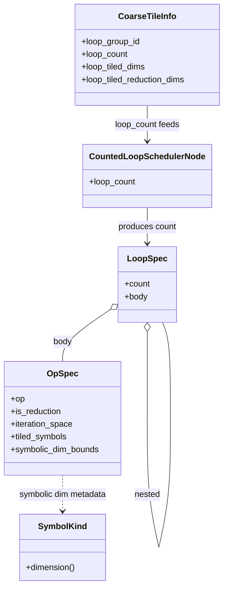
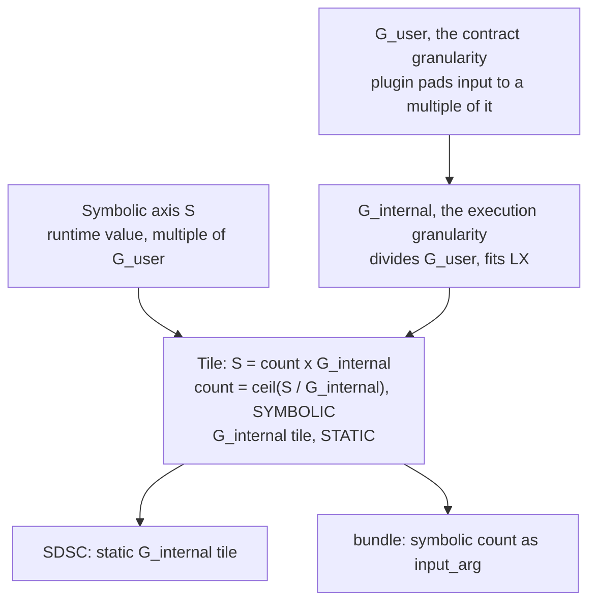
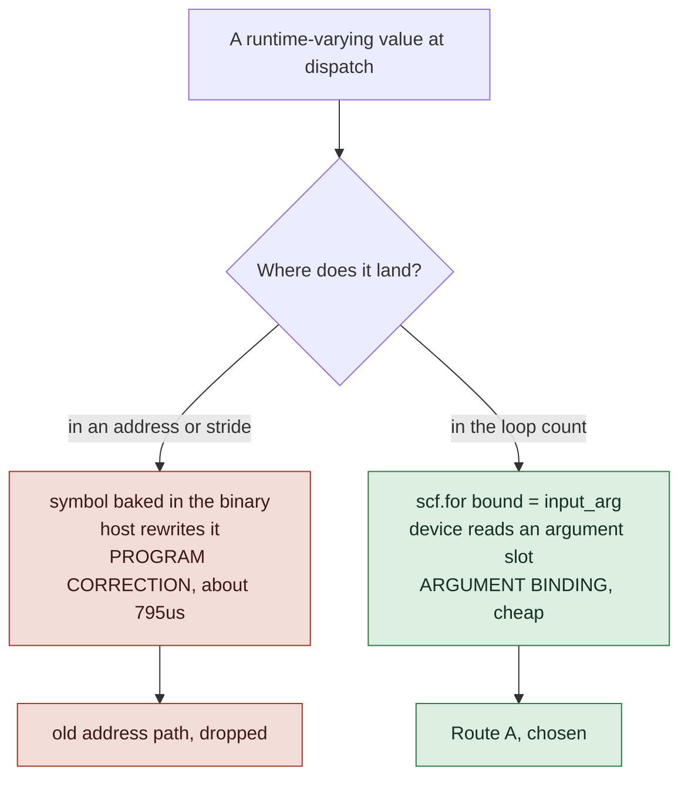
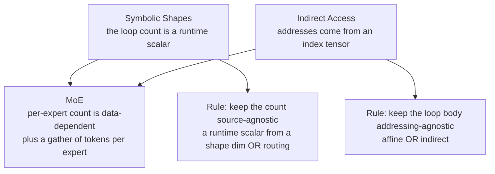
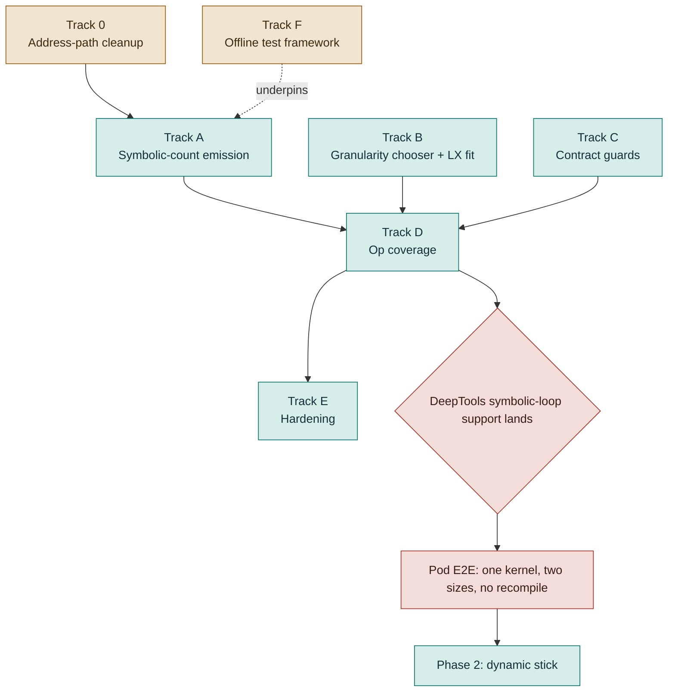

# Symbolic Shapes: High-Level Design

Status: draft for review. Scope: the Inductor compiler path in torch-spyre only, that is FX to SDSC and bundle. Route decision: Route A (symbolic loop count in the bundle, static addresses). This is a design document, not a low-level spec, so it stays at the level of components, flows and contracts. File and line detail lives in the companion notes.

## 1. Why this exists

Today a model with a varying dimension pays for it by compiling a fresh binary for every shape it sees. On a serving box that means a long warmup, a big pile of cached binaries, and a recompile cliff whenever a new shape shows up. Static-only shape handling is the odd one out in the industry, every other stack has some form of dynamic or bounded shapes.

We want one binary to serve a whole range of a dimension. The user declares that a dimension is dynamic, gives its range and a granularity, and the same compiled program runs for any size in that range with no recompile.

The core idea the whole design hangs on is small. A symbol is cheap only when it lives in a loop count. The moment it lands in an address or a stride, the device program has to be rewritten at dispatch, and that host program correction was measured at about 795 microseconds per dispatch. So the entire job is to keep the symbol in the loop count and out of the addresses.

## 2. Goals and non-goals

Goals.
- Phase 1, dynamic batch. A symbolic outer dimension (packed token count for decoders, batch for encoders) through pointwise, reduction and matmul.
- Phase 2, dynamic stick. A symbolic sequence through SDPA, where the symbol also sits on the softmax reduction.
- Reuse PyTorch's symbolic system as much as possible. Our symbol is the same sympy symbol PyTorch already carries, not a parallel invention.
- One binary per model, no host correction, work-proportional compute.
- Compose cleanly with the indirect-access and MoE epics instead of blocking them.

Non-goals.
- The runtime dispatch code and the C++ launch path. That is the runtime team.
- The device loop build in DeepTools. We consume that contract, we do not build it.
- Ownership of the attention op. Paged attention is a custom op owned by the plugin teams. In-graph SDPA lives in the encoder graph.

## 3. Architecture overview

The symbol travels a layered stack. Two layers are ours, the rest we inherit from PyTorch above and hand to DeepTools and the runtime below.

Our owned surface is the coarse-tile decision and the codegen. Everything above is PyTorch and Inductor. Everything below is the DeepTools and runtime contract.

## 4. Reusing PyTorch's symbolic system

This is the design principle we care about most. A dynamic dimension enters as a PyTorch SymInt and stays a sympy expression the whole way down to our loop count. Only the last two stages are new work.

The same story as a table, showing how little is new.

| Stage | Mechanism | Whose |
|---|---|---|
| Mark the dynamic dim | mark_dynamic gives a SymInt | PyTorch |
| Capture as a symbol | Dynamo records a sympy.Symbol | PyTorch |
| Range and guards | ShapeEnv holds min and max | PyTorch, we read it |
| Symbol in loop bounds | Inductor Loops IR ranges are sympy | Inductor |
| Tile the symbolic dim | range division has a symbolic branch already | Inductor, already symbolic-capable |
| Symbolic loop count | the tile info and the loop spec count are sympy expressions | our IR, sympy-typed |
| Choose execution granularity | G_internal plus an LX fit check | ours, net-new |
| Emit the bundle bound | sympy expression to an MLIR input_arg | ours, net-new |

The practical meaning is that we do not keep a side-channel annotation in sync with the graph. The symbol lives where PyTorch already puts it, and we extend that expression into the backend.

## 5. Internal compiler design

### 5.1 The compile-time flow

The important line in that flow is that the split happens at the coarse-tile pass, before stickification and long before scratchpad planning. That is where the loop count is first stamped, and it is where the granularity chooser hooks in.

### 5.2 The IR objects

The tiling decision and the emitted loop nest are separate objects. The tile info holds the decision. The op spec holds the per-op compute. The loop spec is the emitted counted loop, and its count is allowed to be a symbolic expression.

A few notes on these.
- The tile info loop_count is a list of sympy expressions, one per nesting level. This is already the shape we need, a symbolic outer count.
- The loop spec count is typed as an expression and its own definition says it may be symbolic. So the IR is already built to carry a symbolic count end to end.
- The op spec keeps the symbolic dim bounds as metadata, the max and the granularity per symbol. This is what the SDSC uses to bake geometry to max.

### 5.3 Where the split lands

Codegen is a mechanical split of one tiled loop into two artefacts.

- The SDSC describes the static inner tile. Geometry is concretised to the max, and the symbol survives only as metadata. This is correct, the runtime size must not travel through the SDSC.
- The bundle describes the loop. It declares the count as an input argument carrying granularity and max, and it emits the loop bound from that argument.

### 5.4 The two net-new pieces

Everything above is either PyTorch or already present in our IR. Two pieces are genuinely new.

- The symbolic-count emission. Mainline currently refuses a symbolic count at the bundle emission point and coerces the count to an integer. A working symbolic emission already exists on the POC branch. The work is to bring it into the mainline path and make it general.
- The granularity chooser. Today one granularity serves both the contract and the tile, chosen by a bucket-count limit, not by any fit. The new piece separates the two and sizes the execution tile against the on-chip budget.

## 6. Tiling and granularity

### 6.1 The tile

Tiling is what enforces the invariant. Split the symbolic axis into a static tile of extent G and a symbolic count of ceil(S over G). The addresses inside the tile are fixed, only the number of tiles moves.

### 6.2 Two granularities, two owners

There are two granularities and keeping them separate is what makes the design robust.

- G_user, the contract granularity. The plugin owns it, because the plugin pads the runtime input to a multiple of it. It is about padding and alignment.
- G_internal, the execution granularity. We own it, because it is a hardware-fit decision about the LX scratchpad. The user does not need to know LX capacity.

The invariant that keeps this safe is that G_internal divides G_user. Any runtime size that is a multiple of G_user is then a multiple of G_internal, so every tile stays full and the contract is untouched. The only visible effect is the loop count going up by the divisor.

### 6.3 The fit check and the cost model

Because the inner tile is a fixed number, a static fit check is well defined even while the outer count stays symbolic. The check sizes the per-tile working set, which is linear in the tile, as A times G plus B, where A is the bytes per tile row summed over the live buffers and B is the resident set that does not scale with the tile. The fit condition is A times G plus B at most the frontend LX budget.

The selection is simple because the tradeoff collapses. Total compute is roughly the same whatever the tile size, since more tiles of a smaller size do the same work. Loop overhead grows as the tile shrinks. A spill past the LX budget is a cliff. So the rule is to pick the largest stick-aligned divisor of G_user that fits the budget, and if even a single stick will not fit, tile a feature dimension too and try again. One extra constraint from the core-division stage, the chosen granularity must have enough divisors to spread across cores, so a small prime is a poor choice.

## 7. The DeepTools contract

We design against the contract, not against the current DeepTools code, which is changing to add symbolic-loop support. The contract is that a symbolic loop bound is supported with a static SDSC, the runtime supplies the count as R over G, and the device runs it as a loop.

The load-bearing distinction is between two things the host does at dispatch, which are easy to blur.

Route A keeps addresses static by tiling into fixed tiles and looping. So there is nothing symbol-dependent to re-derive, the correction gate never fires, and the loop count is just an argument the device reads. This was checked against the DeepTools source. The one honest caveat is that no in-tree bundle yet feeds a runtime argument into a loop bound, so the claim is proven from the pass logic, not from a shipped golden bundle. That golden bundle is the artefact to get from DeepTools.

## 8. The usecases

Two real serving usecases drive the design. In Phase 1 both have the symbolic dim as the outermost axis, which is the clean case.

- Decoder, Granite on spyre-inference. Packed input of shape num_tokens by hidden, no batch dim. The symbolic axis is num_tokens at dim 0. Attention is a custom-op boundary, the symbol crosses it and we do not compile it.
- Encoder, BERT or RoBERTa on hf-adapters. Dense input of shape batch by padded-sequence by hidden, plus a mask. Two axes vary in serving. Batch at dim 0 is the Phase 1 axis, the same clean case as the decoder. Sequence at dim 1 is the Phase 2 axis, because SDPA is in-graph and the softmax reduces over it.

The real line between the phases is one question, does the symbol sit on a reduction axis that we compile. Decoder num_tokens does not, and encoder batch does not either, so both are Phase 1. Encoder sequence does, so it is Phase 2 and genuinely harder.

## 9. Interaction with other epics

Symbolic shapes should compose with the indirect-access and MoE epics, not force a rebuild when they land. The contracts are clean if we hold two rules.

Indirect access is about addresses that come from a runtime index tensor, a gather or scatter, paged KV being one example. It is orthogonal to us. Symbolic shapes owns how many iterations run, indirect access owns where each iteration reads, and a symbolic-count loop over an indirect body is a valid combination.

MoE is where both meet. The number of tokens per expert is data-dependent and changes every step, and the tokens for an expert are gathered from the packed buffer. So a per-expert count is a symbolic loop count, and the gather is indirect access. The mechanism for the count is identical to Phase 1, a runtime scalar, only the source differs, routing instead of an input shape.

So the two rules for Phase 1 are, keep the count source-agnostic, and keep the loop body addressing-agnostic. If we hold them, MoE support becomes a consumer sitting on top of our count machinery and the indirect-access gather, and the payoff is real, symbolic per-expert counts remove the fixed expert-capacity padding MoE uses today.

## 10. Phase 1 development plan

All of Phase 1 is our-side work that can be built and tested offline against the abstract contract. The on-device proof is a separate gate that waits for DeepTools. The tracks and their dependencies are below.

### Track 0, clean up the address-based path

Route A supersedes the old approach where the symbol went into per-core addresses and forced host correction. That scaffolding is still in the tree, and building the clean loop-count path on top of a competing address path is messier. So we clear it first.

- 0.1 Retire the address-in-bundle POC. Its learning is captured, it is not the chosen path. Done when nothing in the active plan treats it as a way forward.
- 0.2 Remove or gate the mainline symbolic-address emission, the derived-symbolic marker and its address arm, and the SDSC-side per-core derivation only the address path needs. Leave static addressing alone. Done when the symbolic path has a single arm, the loop count.
- 0.3 Prove the static path is untouched. Done when the static-shape suite is green after the removal.

### Track A, symbolic-count emission, the keystone

- A1 Productionize the symbolic-count bundle emission into mainline. Emit the loop bound from an input argument carrying granularity and max, drop the integer coercion, keep it general across op classes. Done when a mark_dynamic pointwise op on main emits a bundle with a symbolic loop bound and static addresses.
- A2 Lock the static-SDSC contract. Confirm geometry bakes to max and the symbol is metadata only, with the count travelling through the bundle. Done when the SDSC for all three op classes is fully static.

### Track B, the granularity chooser

- B1 Separate the contract granularity from the execution granularity, with the divides-invariant checked at compile time. Done when the tile size is chosen independently of the contract granularity.
- B2 The LX-fit static check, sizing the per-tile working set against the frontend budget and shrinking the tile to fit, escalating to feature-dim tiling if a single stick will not fit. Done when a region that overflows LX at the contract granularity gets a fitting execution granularity in a unit test.
- B3 Fold in the parallelism constraint, so the chooser does not pick a granularity with too few divisors for core division. Done when the chooser rejects a parallelism-starving value.

### Track C, the contract guards

- C1 Enforce that the runtime size is a multiple of G. Add remainder handling instead of a silent floor division, tie the dynamic-dim minimum to the tile granularity so the two cannot drift, and validate that the max is a multiple of G. Done when a non-multiple size is caught rather than silently dropping rows.

### Track D, op coverage, rides Track A

- D1 Pointwise class. Done when the pointwise ops pass the offline tests under mark_dynamic.
- D2 Reduction class over a static axis, with a reduction over the symbolic axis cleanly deferred to Phase 2. Done when static-axis reductions work symbolically.
- D3 Batched matmul and matmul, symbolic outer dim with a static reduction dim. The static-address half is already verified from the compiled output, this adds the emission and tests. Done when these ops emit a symbolic count with static addresses.
- D4 Encoder SDPA under a symbolic batch, confirming it decomposes to batched matmuls plus a softmax over the static sequence, so it rides D2 and D3. Done when an encoder block with a symbolic batch compiles to static addresses with a symbolic count. Note, whether this is in Phase 1 or drawn at the non-attention line is an open scope call.

### Track E, hardening, later in Phase 1

- E1 Weight-reuse check, confirming a static weight or broadcast operand is staged once and kept resident across iterations, not re-copied per tile. This touches the matmul number we quote. Done when the plan loads the static weight once.
- E2 Multiple symbolic dims, per-op and across a graph. Done when two symbolic dims on one graph compile.
- E3 Guard the un-hinted large dynamic tensor, since the automatic span-overflow path bails on symbolic dims and leaves such a tensor unprotected against the address-span limit. Done when an un-hinted symbolic tensor gets a clean error.

### Track F, the offline test framework

- F1 A repeatable offline test that compiles a mark_dynamic op and asserts four properties at once, a symbolic loop bound from an input argument, static addresses with no divide, an SDSC baked to max, and the execution granularity dividing the contract granularity. Extended per op class. This is how we prove our side with no pod, and every other track reports into it.

### What waits for the pod

The core claim, one compiled kernel serving two different real sizes with no recompile, cannot be proven until DeepTools ships symbolic-loop support. There is also a known watch-item, an empty-SDSC crash we hit against the current pre-support code, which we keep noted but do not plan around, since that code will change. When their support lands we run on the pod, prove the claim, and adjust on whichever side the real results point to.

## 11. Risks and open items

- The golden Route A bundle from DeepTools, one that feeds a runtime argument into a loop bound, is not in-tree yet, and the interface spec still mandates a constant bound. The no-correction claim is proven on paper, not on device.
- The granularity cost model is designed but not yet a finalized spec. The fit check is net-new, not a reuse of the existing span model, which targets a different budget.
- The D4 scope call, whether symbolic-batch SDPA is Phase 1, is open.
- A POC-versus-main diff is needed to tag each Track A and D item as productionize versus build.
- The encoder sequence case, where the symbolic dim sits under the batch dim so the batch stride depends on it, is a Phase 2 design question about keeping addresses static, and it is not yet answered.

## 12. Testing and validation

Two layers.

- Offline, against the abstract contract. The Track F property tests prove the four structural properties for every op class without any hardware. This is the bulk of the de-risk and it can run now.
- On the pod, after DeepTools support lands. One compiled kernel, two different real sizes, both correct, no recompile. This is the claim that turns the design from proven-on-paper to proven-on-device.

The static addressing property is already verified from the real compiled output for pointwise, reduction and batched matmul, which is the single biggest de-risk we have going in.
