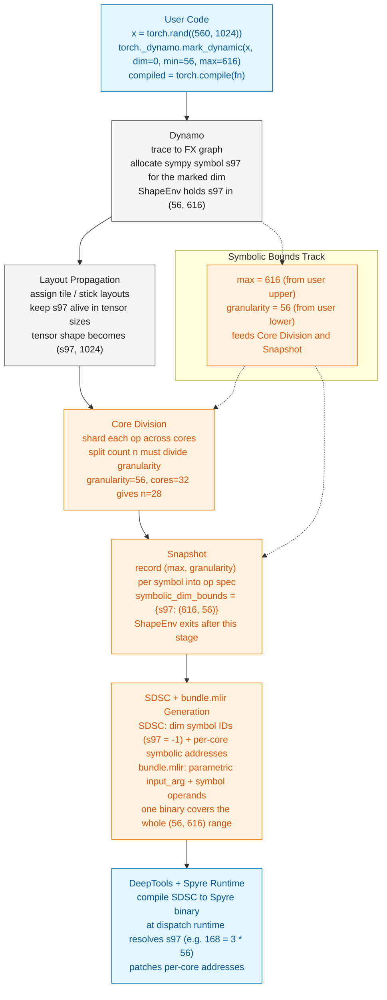

# Symbolic Shapes: High-Level Architecture

Running example: a `(560, 1024)` tensor with dim 0 marked dynamic
between 56 and 616.

## PR references

- Max: [#2003](https://github.com/torch-spyre/torch-spyre/pull/2003)
- Granularity: [#2379](https://github.com/torch-spyre/torch-spyre/pull/2379)
- Symbolic Core Division for pointwise ops:
  [#2499](https://github.com/torch-spyre/torch-spyre/pull/2499)
- Symbolic SDSC generation:
  [#2673](https://github.com/torch-spyre/torch-spyre/pull/2673)
- bundle.mlir + per-core start addresses: in flight (this PR)

