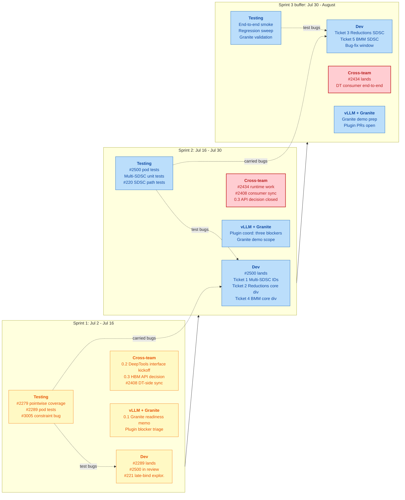

# Symbolic Shapes Roadmap

**Last updated:** 2026-07-02
**Target:** August deadline. Two-week sprints. Development and testing
run in parallel; every dev PR gets a test-plan slice in the same
sprint, with a feedback arrow when bugs surface.

## Quick navigation

- [Already landed](#already-landed)
- [Sprint roadmap](#sprint-roadmap)
- [Risk assessment for the August deadline](#risk-assessment-for-the-august-deadline)
- [Cross-team dependencies with sprint targets](#cross-team-dependencies-with-sprint-targets)
- [Beyond August](#beyond-august)
- [Legend and cross-references](#legend-and-cross-references)

## Already landed

Foundation is closed. Eight issues merged via PRs #2003, #2379, #2499,
#2673: `mark_dynamic` extraction, symbolic OpSpec, bucketing
invariant, work division, SDSC JSON emission with dim-symbol metadata.
See the [GitHub Issues Compendium](Symbolic_Shapes_GitHub_Issues.md)
for the verbatim record.

## Sprint roadmap

Left to right is time. Vertical rows inside each sprint are the four
parallel tracks. Dotted arrows carry the test-fix loop back into dev.

**Reading the diagram**

- **Yellow** cells are in flight this sprint.
- **Blue** cells are queued for this sprint or the next.
- **Red-bordered** cells are at risk of slipping the deadline (see the
  risk table below).
- **Dotted arrows** carry the test-fix feedback loop. A bug found in
  Sprint 1 testing either flows back into Sprint 1 dev (fixed same
  sprint) or is carried into Sprint 2 dev (fixed next sprint). Bugs
  found in Sprint 3 consume the bug-fix window; anything past the
  cut-off becomes a follow-up PR, not a milestone blocker.
- Solid `-->` arrows show sprint order; individual node dependencies
  within a sprint are implicit in the row grouping.

## Risk assessment for the August deadline

| Risk | Impact | Likelihood | Mitigation |
|---|---|---|---|
| DeepTools symbolic SDSC consumer (#2408) late | HIGH | MEDIUM | Kick off in Sprint 1 via JIRA 0.2. Get commitment on landing dates from DeepTools by end of Sprint 1. If consumer slips past Sprint 2, defer Granite demo to a follow-up milestone and ship the torch-spyre side as a documented handoff. |
| HBM allocation API decision (JIRA 0.3) late | HIGH | LOW | Force a decision meeting in Sprint 1 week 1. The three options are on the table. Recommend the max-at-`.to("spyre")` API to the runtime team early so #2434 can start. |
| Matmul cost model harder than scoped (ticket 4) | HIGH | MEDIUM | Do the design spike in Sprint 1 alongside #2289 review. If the spike shows more than one sprint of work, split ticket 4 into a refactor-then-symbolic pair and defer the second half to a follow-up. |
| Test bugs surfaced late in Sprint 3 | HIGH | MEDIUM | Reserve the last 3-4 days of Sprint 3 as an explicit bug-fix window with no new feature work. Set a cut-off after which new bugs get deferred to a follow-up PR rather than blocking the milestone. Testing team publishes daily bug summary in Sprint 3 so triage stays visible. |
| spyre-inference plugin blockers not resolved | MEDIUM | MEDIUM | JIRA 0.1 produces a go/no-go memo in Sprint 1 with the three specific blockers (`dynamic=False`, `mark_dynamic` call, attention closure constants). If plugin team cannot commit by end of Sprint 2, the Granite demo becomes a "torch-spyre + DeepTools ready, plugin follow-up" narrative. |
| Concurrent refactor collision (PR #2914) | MEDIUM | MEDIUM | Coordinate landing order with dgrove-oss in Sprint 1. Recommendation: land #2289 first and rebase #2914 on top. See the workitems doc callout. |
| vLLM upstream shape-contract shift | LOW | LOW | Monitor via JIRA 0.1. No mitigation beyond visibility; contract drift there is out of our control. |

## Cross-team dependencies with sprint targets

- **DeepTools**: symbolic SDSC consumer per #2408 owned by @lupalby.
  Sprint 1: contract ratification via JIRA 0.2. Sprint 2: consumer
  code in review. Sprint 3: end-to-end smoke on Pod.
- **Runtime team**: HBM sized at max plus stride derivation per #2434.
  Sprint 1: HBM API decision via JIRA 0.3. Sprint 2: implementation
  in progress. Sprint 3: lands.
- **spyre-inference plugin team**: three plugin-side blockers listed
  in JIRA 0.1 (`dynamic=False` hard-coded, no `mark_dynamic` call,
  attention closure constants). Sprint 1: commit dates. Sprint 2:
  PR opened. Sprint 3: merges alongside end-to-end demo.
- **FMS team**: `mark_dynamic` on `input_ids` and KV-cache. Not
  needed to hit the August torch-spyre deliverable, but flagged
  for follow-up so FMS-batched serving unlocks after August.

## Beyond August

Out of scope for the August deadline, captured so nothing is lost:

- **Symbolic stick dim** (torch-spyre-side): scaffolds middle-dim
  work; low direct value alone.
- **Middle and multi-dim symbolic** (torch-spyre-side): unlocks the
  FMS seq-dim marking already present in FMS code today.
- **Reduction along a symbolic axis** (torch-spyre-side): required
  for FMS-style decode attention against a non-paged variable-length
  cache.
- **Performance tuning and recompile policy** (torch-spyre-side):
  formalise the out-of-range behaviour and perf targets vs the
  concrete-shape baseline.

## Legend and cross-references

Colour coding:

- **Yellow**: in flight this sprint.
- **Blue**: queued this sprint or next.
- **Red border**: at risk of slipping the deadline.
- **Green**: already landed (see the "Already landed" section).

Related docs:

- [Symbolic_Shapes_Design_Document.md](Symbolic_Shapes_Design_Document.md)
  for the engineering HLD.
- [Symbolic_Shapes_Next_Workitems.md](Symbolic_Shapes_Next_Workitems.md)
  for per-ticket scope of the 8 workitems referenced above.
- [Symbolic_Shapes_GitHub_Issues.md](Symbolic_Shapes_GitHub_Issues.md)
  for the verbatim issue compendium including #220, #221, #2279,
  #3005, and #2408.
- [Symbolic_Shapes_Readout_Script.md](Symbolic_Shapes_Readout_Script.md)
  for the team-facing communication artefact.
- [Symbolic_Shapes_Phasewise_Usecases.md](Symbolic_Shapes_Phasewise_Usecases.md)
  for the workload-to-scope mapping.
