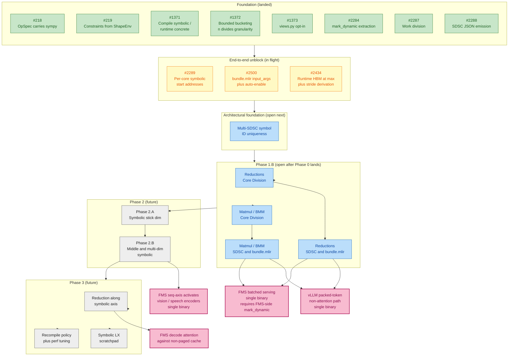

# Symbolic Shapes Roadmap

A single-glance view of where the work is, what is in flight, and what
is queued. Status colours: green = landed, yellow = in flight,
blue = next to open, grey = future.

## Legend

- **Green (Foundation)**: landed via PRs #2003, #2379, #2499, #2673. Closed issues.
- **Yellow (In flight)**: open issues on the critical path for end-to-end dispatch.
- **Blue (Next)**: queued to open immediately after the in-flight three land.
- **Grey (Future)**: scoped for later phases; no concrete issue yet.
- **Pink (Workload milestones)**: where real users see value.

## Reading the diagram

The vertical layering shows the dependency order: foundation enables the
in-flight unblock, which enables Phase 1.B, which delivers the first
workload milestones. Phases 2 and 3 follow.

The architectural foundation (Multi-SDSC ID uniqueness) lands between
the in-flight three and Phase 1.B because Phase 1.B's SDSC work assumes
bundle-global symbol IDs from day one. Landing it after Phase 1.B would
require ID rework inside #2/#4 above.

Phase 2.A is sequenced before Phase 2.B because it isolates stick-dim
mechanics from the broader middle-dim work; it does not unlock a
workload on its own.

Phase 3 is the only path to FMS-style decode attention against a
non-paged variable-length cache, because that workload reduces along
a symbolic axis.

## Cross-team dependencies (not shown on the dependency graph)

- **DeepTools**: symbolic SDSC consumer, JIT Program Correction at
  dispatch.
- **Runtime team**: #2434 implementation.
- **FMS team**: `mark_dynamic` calls on `input_ids` and KV-cache batch
  dim once Phase 1.B lands.
- **vLLM (spyre-inference)**: padding to `granularity` multiples at
  runtime; no code change for Phase 1.A.
