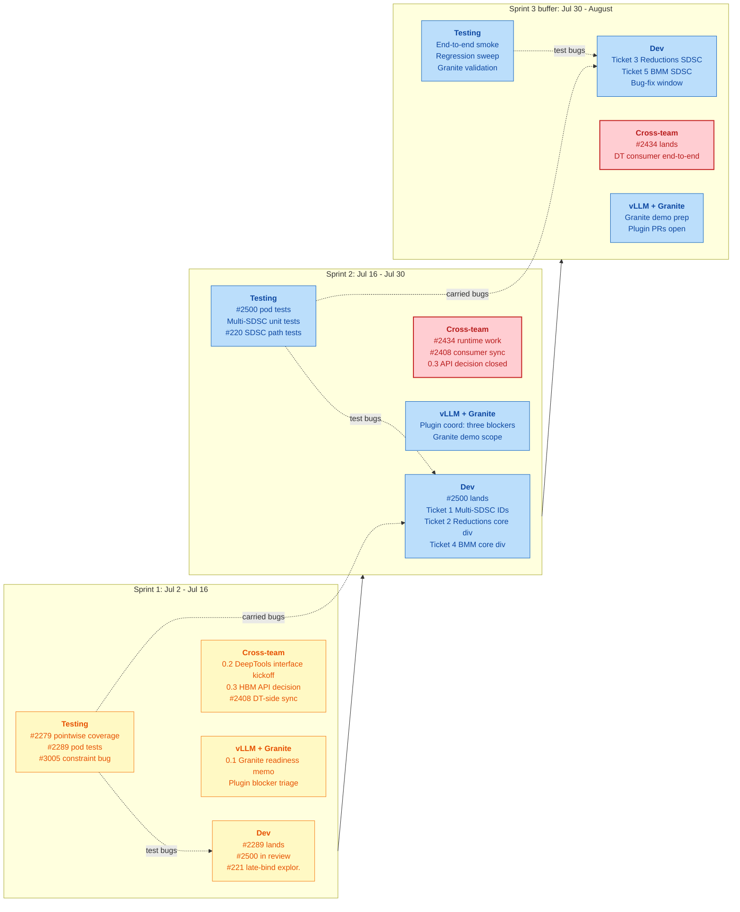

# Symbolic Shapes Roadmap

**Last updated:** 2026-07-02
**Target:** August deadline. Two-week sprints. Development and testing
run in parallel; every dev PR gets a test-plan slice in the same
sprint, with a feedback arrow when bugs surface.

## Quick navigation

- [Already landed](#already-landed)

## Already landed

Foundation is closed. Eight issues merged via PRs #2003, #2379, #2499,
#2673: `mark_dynamic` extraction, symbolic OpSpec, bucketing
invariant, work division, SDSC JSON emission with dim-symbol metadata.
See the [GitHub Issues Compendium](Symbolic_Shapes_GitHub_Issues.md)
for the verbatim record.

## Sprint roadmap

Left to right is time. Vertical rows inside each sprint are the four
parallel tracks. Dotted arrows carry the test-fix loop back into dev.

md](Symbolic_Shapes_Phasewise_Usecases.md)
  for the workload-to-scope mapping.
