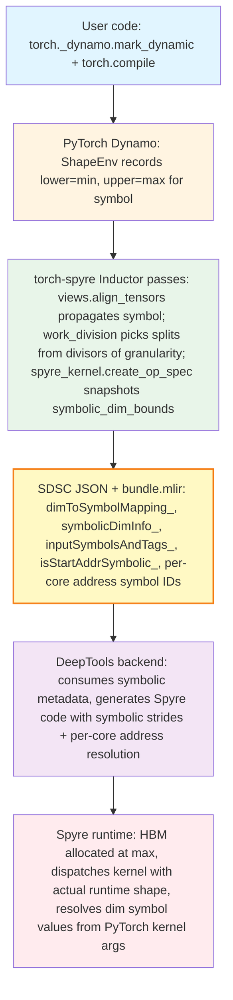
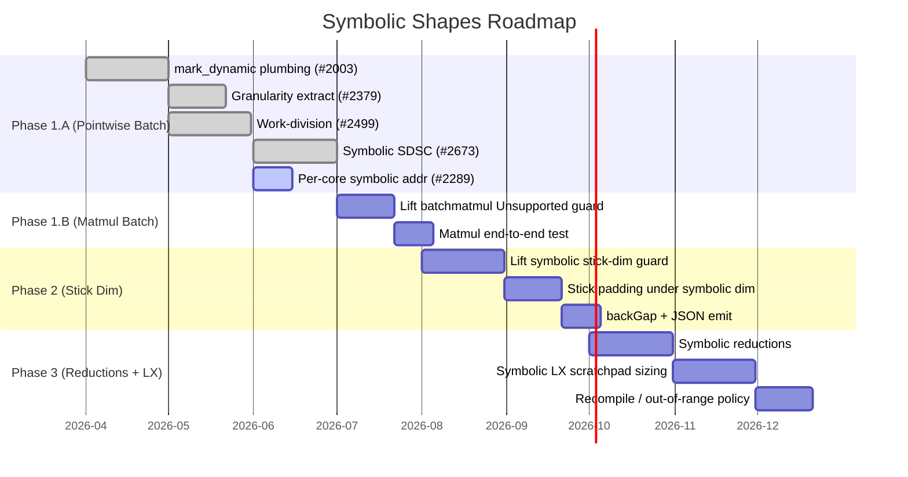
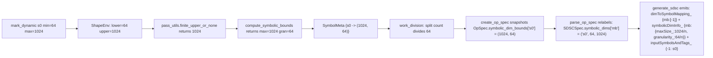
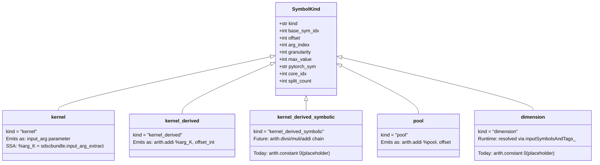

# Torch-Spyre Dynamic Shapes Support 
---

This page describes how the Torch-Spyre front-end compiler enables dynamic shape support in the AI model compilation pipeline. 

---

## 1. What is Dynamic Shapes Support

**Static shapes (today's baseline)** — torch-spyre's compiler bakes every tensor shape into the SDSC at compile time. When the user calls the compiled function with a different shape, the entire compilation pipeline reruns. The compile cache grows as `O(distinct shapes seen)`.

**Dynamic shapes** — the user marks specific dimensions as variable, declaring their bounds:

```python
x = torch.randn((1024, 128), dtype=torch.float16)
torch._dynamo.mark_dynamic(x, dim=0, min=64, max=1024)
compiled = torch.compile(model)
out = compiled(x.to("spyre"))   # the runtime size can be 64, 128, 256, ..., 1024
```

PyTorch's Dynamo registers a sympy symbol (e.g. `s0`) with `ShapeEnv` bounds `lower=64, upper=1024`. The compiled artifact accepts any shape in that range that is a multiple of `min`. — **no recompilation**.

### The bounded bucketing model

The Spyre compiler does not support arbitrary symbolic computation. Instead, the runtime values a dimension may take are restricted to:

```
admissible = { granularity, 2·granularity, 3·granularity, ..., max }
```

where `granularity = min` (the value passed via `mark_dynamic(min=...)`) and `max = max`. For example, `mark_dynamic(x, 0, min=64, max=1024)` yields admissible runtime values `{64, 128, 192, ..., 1024}`.

This is enforced by the **correctness invariant** `n | granularity`: the compile-time work-division split count `n` for a symbolic dimension must divide its granularity. Since every admissible runtime value `R = granularity · k` for some integer `k`, the per-core chunk `R / n` is guaranteed integer-valued **for every `k`** iff `n` divides `granularity`. This means a single compiled plan is valid for the entire declared range — no runtime fallback, no rebalancing.

The model is **bounded**  because HBM allocation needs a worst-case footprint — sized at `max` and work-division must pick a split that is valid for all runtime values — driven by `granularity`. 

---

## 2. Dynamic Shapes challenges

### Why it is needed

Real-world inference workloads frequently operate on variable-length inputs. Without dynamic shape compilation support, inference servers must either pad inputs to a fixed shape or generate specialized kernels through runtime recompilation.

Excessive padding wastes compute and memory bandwidth by performing work on artificial tokens or elements, while runtime recompilation introduces compilation overhead directly into the critical inference path. Together, these limitations reduce hardware efficiency, increase tail latency, and hinder the ability of the serving system to scale efficiently under diverse production workloads.

| Today (static-only) | With dynamic shapes |
|---|---|
| One SDSC per shape; cache grows unbounded with serving traffic. | One SDSC per `(min, max)` range; cache is `O(buckets)`. |
| Per-shape recompile latency on every new input size. | Compile-once, dispatch-many. |


### Five structural challenges:

1. **Symbol propagation through torch-spyre's pipeline (compile-time).** PyTorch Inductor natively encodes iteration spaces as sympy expressions, but the same symbols must flow through torch-spyre's own passes — views.align_tensors, work_division, spyre_kernel.create_op_spec, and the codegen stride helpers — and ultimately surface in the SDSC JSON.

2. **Correctness invariant `n | granularity` (compile-time, work-division)**. Work-division must pick split counts from `divisors(granularity)`, not `divisors(maxSize)`. A naive port of the static planner picks splits from `divisors(maxSize)` and silently produces non-divisible chunks at runtime.

3. **Per-core start addresses depend on runtime size (compile-time emit, runtime resolution).** For a symbolic dim split across `n > 1` cores, core `c`'s start address is `base + c · (S/n) · inner_stride` where S is the runtime value. Baking c · (max/n) · inner_stride at compile time causes silent miscompute on every core after core 0 for any runtime value < max — each core reads from the wrong region of its max-sized HBM buffer. This needs symbolic address handling with Dimension symbol IDs and address symbol IDs handling in the same bundle. 

4. **Stick-padded memory layouts (compile-time)**. Spyre's 128-byte aligned stick layout adds padding padded = ((size + epp − 1) // epp) · epp. For symbolic size, this arithmetic must be sympy-safe — the static int(...) casts in stride helpers like `_tiled_byte_stride` fault on symbolic inputs.

5. **256 MB HBM-span constraint (compile-time check)**. The SDSC spec mandates "The span of addresses accessed from DDR for any given tensor must not exceed 256MB". The span check must use the worst-case footprint (max), not the warmup value — otherwise a runtime shape near max exceeds the limit silently once the binary ships.

6. **Runtime HBM allocation and stride derivation at max (runtime — issue #2434)**. DeepTools' contract for a symbolic-dim tensor [d0=64, d1=symbolic, d2=8] with d1.max=1024, d1.granularity=16: at any runtime d1 (e.g. 32), the tensor lives in memory as if d1 = max — stride(d0)=1, stride(d1)=64, stride(d2)=64·1024=65536. Strides are constant; HBM is sized at max; only the actual d1=32 elements are written/read. The runtime today sizes HBM and emits strides from the runtime input shape. The hard part: dynamic compilation runs after .to("spyre"), so neither side knows max at HBM-allocation time. Resolution requires either propagating max from the user annotation through to the runtime allocator (statically), or deferring allocation until the first compiled dispatch sees max.

## 3. Prior Arts 

| Accelerator | Approach | Trade-offs |
|---|---|---|
| **Google XLA/TPU** | **Bounded Dynamic + Bucketing**. User specifies max shape; runtime pads to max or nearest bucket. | Simple compile-time model; padding overhead for inputs much smaller than max. |
| **SambaNova RDU** | **Runtime Reconfiguration**. Fully symbolic SDSC + DCI; backend resolves shapes at dispatch. | Maximum flexibility; very heavy compiler complexity; full symbolic semantics. |
| **Cerebras WSE** | **Bounded Dynamic, Compiler-Optimised**. Compiler knows max shape; processes only valid data at runtime. | Like XLA but with smarter masking instead of padding. |
| **Graphcore IPU** | **Fully Static + Recompile**. No symbolic support — recompile per shape. | Simplest backend; unworkable for variable-input serving workloads. |
| **Spyre (today)** | Fully static (Graphcore-style baseline). | Same trade-offs as Graphcore. |
| **Spyre (target — this doc)** | **Bounded Dynamic + Bucketing** — closest to XLA/Cerebras. | Avoids the full-symbolic complexity of SambaNova while unblocking vLLM/FSM. |

---

## 4. Dynamic Shape Challenges Specific to Data-Flow Accelerators

GPU dynamic shapes (the upstream PyTorch / CUDA path) handle most of these implicitly because GPUs dispatch element-by-element and resize at the kernel level. Data-flow accelerators like Spyre commit to a **per-core static work distribution at compile time** — every challenge below stems from that commitment.

1. **Compile-time work-division must be valid for *all* admissible runtime sizes**, not just the warmup. The `n | granularity` invariant ensures this. Spec line 182-183: *"if a symbolic dimension is divided across cores: number of slices must be a divisor of granularity."*

2. **Per-core start addresses cannot be baked**. Spec line 184-186: *"start addresses per core will need to be symbolic; in AllocateNode fill `FoldManager<int64_t> startAddressCoreCorelet_` with VariableSymbol entries; set `bool isStartAddrSymbolic_`."*

3. **Stick-padded memory layouts** turn linear math into floor-division. Symbolic `((s + epp − 1) // epp) · epp` requires sympy expressions throughout, not Python `int`. The current stick adjustment raises `Unsupported` for symbolic stick dims today.

4. **HBM allocation must size to `max`**, not warmup shape: *"HBM must be sized at max along symbolic dim; device strides must derive from max (not per-call runtime value) to remain constant."*

5. **256 MB DDR-span constraint** (spec line 355) interacts with max-sized buffers — the planner must reject splits where the worst-case per-core span exceeds the limit, even if the warmup shape would fit.

6. **Bundle-scope symbol ID uniqueness**. Spec line 68: *"symbols_ids must be unique in the bundle i.e., symbols ids cannot be recycled across sdscs that are part of the same bundle (unless they take the same value)."* Both dimension symbols and address symbols are allocated from the same negative-ID space within a bundle.

---

## 5. Use Cases & Benefits

### Primary use cases

- **vLLM (spyre-inference)** — *primary driver*. vLLM serves LLMs with **continuous batching**: incoming requests are aggregated into a single batched call per step, and the batch dimension varies request-to-request. vLLM also uses packed-token inputs of shape `(num_tokens, hidden_size)` rather than `(batch, seq_len, hidden_size)`; vLLM itself owns runtime padding, presenting tensors padded to the nearest `granularity` multiple. Without dynamic shapes, every batch size produces a recompile.

- **FSM (Foundation Model Serving) for Granite** — IBM production inference path for Granite models. Per-request batch sizes; same dynamic-batch story as vLLM.

- **Triton Inference Server** — dynamic batching aggregates concurrent client requests into variable batch sizes per dispatch.

### Realised gains (once Phase 1.A consumer-side support lands at DeepTools)

- **Compile cache footprint**: `O(distinct (min, max) ranges)` instead of `O(distinct shapes seen in production)` — typically a 10–100× reduction for serving workloads.
- **HBM right-sizing**: one buffer per tensor sized to `max`, dispatched with `runtime_size`. Today's worst-case buffers replicate per shape.
- **No per-shape recompile latency**: serving requests below `max` dispatch immediately; today they pay the full compile cost on every cache miss.
- **Worked example from issue #2287**: `[s97, 128]` fp16 with `s97 ∈ [64, 1024]`, `granularity=64`, splits as `{mb: 32, out: 1}` — batch absorbs all 32 cores. Same plan handles any of the 16 admissible runtime values (`64, 128, …, 1024`).

**Source**: epic doc lines 61-81 (vLLM packed-token contract), 123; issue [#2287](https://github.com/torch-spyre/torch-spyre/issues/2287) worked example.

---

## 6. High-Level Architecture

The data flow spans five layers, each with explicit contract boundaries:



### Layer responsibilities

- **User code**: declares which dimensions are dynamic, with `(min, max)` bounds. Idiomatic PyTorch; no Spyre-specific API.
- **PyTorch Dynamo**: produces an FX graph with sympy symbols (e.g. `s0`); ShapeEnv records bounds. This layer is upstream PyTorch — we adopt it, we do not own it.
- **torch-spyre Inductor**: the heart of the work. Propagates symbols through view/layout passes; picks split counts that divide granularity; snapshots `(max, granularity)` into `OpSpec.symbolic_dim_bounds` *before* the ShapeEnv goes out of scope; emits SDSC JSON + bundle.mlir.
- **SDSC JSON + bundle.mlir**: the **contract surface** with DeepTools. Once these are emitted, torch-spyre's responsibility ends.
- **DeepTools backend**: consumes the symbolic metadata, generates Spyre executable code that resolves dim symbols and per-core addresses at dispatch.
- **Spyre runtime**: allocates HBM sized to `max`, dispatches each kernel call with the actual runtime shape, plumbs the dim symbol values into the SDSC's resolution path.

### Contract boundaries

1. **PyTorch ↔ torch-spyre**: the FX graph + ShapeEnv bounds. Standard PyTorch interface.
2. **torch-spyre ↔ DeepTools**: SDSC JSON fields (`dimToSymbolMapping_`, `symbolicDimInfo_`, `inputSymbolsAndTags_`, `isStartAddrSymbolic_`, `startAddressCoreCorelet_.data_`) + bundle.mlir (`sdsc_execute` operands, `symbol_ids`).
3. **DeepTools ↔ Spyre runtime**: opaque to torch-spyre. DeepTools owns this.
4. **torch-spyre ↔ Spyre runtime (host side)**: HBM allocation, dim symbol value plumbing at dispatch 

---

## 7. Phase Plan



### Phase 1.A — Symbolic batch dim for pointwise ops 

Covers `mark_dynamic` propagation, granularity-based work division, SDSC JSON emission of dim metadata, and per-core symbolic addresses (#2289 in flight).

PRs:
- **[#2003](https://github.com/torch-spyre/torch-spyre/issues/2284)** — `compute_max_size` utility for `mark_dynamic` upper bounds.
- **#2379** — granularity extraction and bucket validation.
- **#2499** — symbolic work division (planner).
- **#2673** — symbolic SDSC JSON emission (`dimToSymbolMapping_`, `symbolicDimInfo_`, `inputSymbolsAndTags_`).
- **#2289** — per-core symbolic start addresses (in flight on `symbolic_sdsc` branch).

### Phase 1.B — Symbolic batch dim for matmul

Today work_division raises `Unsupported` for symbolic-dim batchmatmul ([work_division.py:1249-1255](../Nethra_PR_Review/torch-spyre/torch_spyre/_inductor/work_division.py#L1249-L1255)). Lift the guard. The downstream SDSC + per-core address logic is op-type-agnostic and fires automatically.

### Phase 2 — Symbolic stick dim 🔜

Today raises `Unsupported` for symbolic stick dimensions ([work_division.py:304-308](../Nethra_PR_Review/torch-spyre/torch_spyre/_inductor/work_division.py#L304-L308)). Requires:
- Sympy-safe stick padding `((s + epp − 1) // epp) · epp`.
- `backGap` computation under symbolic stick size.
- `primaryDsInfo_.stickSize_` / `stickDimOrder_` JSON emit for symbolic stick.

### Phase 3 — Complex symbolic 🔜

- Symbolic reduction axes (no `SDSCSpec.is_reduction` flag threaded today).
- Symbolic LX scratchpad sizing.
- Out-of-range runtime input handling and recompile policy.

**Source**: epic doc lines 84-108; current state derived from PR / branch reads in this document.

---

## 8. Technical Implementation in torch-spyre

### Compile-time vs Runtime Responsibilities

```mermaid
flowchart LR
    subgraph CT [Compile Time]
        CT1[mark_dynamic min/max declared]
        CT2[ShapeEnv records bounds]
        CT3[work_division picks n | granularity]
        CT4[OpSpec.symbolic_dim_bounds snapshot]
        CT5[SDSC JSON + bundle.mlir emitted]
    end

    subgraph RT [Runtime]
        RT1[PyTorch dispatches kernel with actual tensor shape]
        RT2[HBM sized to max; strides derived from max]
        RT3[DeepTools resolves dim symbols from runtime shape]
        RT4[Per-core addresses computed: c · S/n · inner_stride]
        RT5[Spyre cores execute on correct regions]
    end

    CT5 -.contract.-> RT3

    style CT fill:#e8f5e9
    style RT fill:#fff4e1
```

### 8.1 Symbolic Core Division


**The opt-in gate** — `finite_upper_or_none(expr)` ([pass_utils.py:131]). Returns the ShapeEnv upper bound for `expr` if it's a finite `sympy.Integer`, else `None`. This is the **single most important architectural invariant** of the design — every layer that consumes a symbolic iteration var must skip when this returns `None`. Mirroring it uniformly across `views.py`, `work_division.py`, and `spyre_kernel.py` is load-bearing: it prevents auto-dynamic symbols (Dynamo-promoted shapes the user *didn't* mark) from leaking into the symbolic path.

**Bound computation**:
- `compute_max_size(expr)` ([pass_utils.py:252] — returns the finite upper bound or falls back to `size_hint` for unbounded.
- `compute_granularity(expr, max_size)` ([pass_utils.py:143]) — returns the user-supplied `min` if it divides `max`, else picks the smallest divisor of `max` ≥ `min_default_granularity` such that `max / d ≤ max_buckets`.
- `compute_symbolic_bounds(expr)` ([pass_utils.py:273]) — composes the above into `(max, granularity)`.

**The planner**:
- `_collect_symbol_metadata(it_space)` ([work_division.py:82] walks the iteration space, applies the opt-in gate, returns `SymbolMeta: dict[Symbol, tuple[max, granularity]]` ([work_division.py:79]).
- `_valid_divisor_basis(v, it_space, meta)` ([work_division.py:128]) returns *granularity* for symbolic dims (so the chosen split divides every admissible runtime size) and the concretised size for concrete dims.

**Active `Unsupported` guards in core division**:
- Symbolic stick dim: [work_division.py:304-308] *"symbolic stick dim {stick_var} is not supported yet"*.
- Symbolic batchmatmul: [work_division.py:1249-1255] — *"symbolic dim(s) on batchmatmul ... are not supported yet"*.

### 8.2 Symbolic SDSC Generation



**Snapshot the bounds** — `create_op_spec` in [spyre_kernel.py:591](../Nethra_PR_Review/torch-spyre/torch_spyre/_inductor/spyre_kernel.py#L591) captures `(max, granularity)` from the still-live ShapeEnv into `OpSpec.symbolic_dim_bounds: dict[str, tuple[int, int]]` (keyed by `str(size_expr)`). This is critical: by the time codegen runs, the ShapeEnv is gone — we serialise the bounds as plain ints.

**Relabel to SDSC namespace** — `parse_op_spec` in [superdsc.py:696](../Nethra_PR_Review/torch-spyre/torch_spyre/_inductor/codegen/superdsc.py#L696) converts `OpSpec → SDSCSpec`:
- Iteration sizes are resolved via `_resolve_sdsc_size(expr, symbolic_dim_bounds)` ([superdsc.py:600](../Nethra_PR_Review/torch-spyre/torch_spyre/_inductor/codegen/superdsc.py#L600)) — returns `max` for symbolic, concretised value for concrete.
- `SDSCSpec.symbolic_dims: dict[str, tuple[str, int, int]]` (mapping SDSC dim name → `(pytorch_sym, granularity, max)`) is built.

**Emit JSON** — `generate_sdsc` in [compute_ops.py:385](../Nethra_PR_Review/torch-spyre/torch_spyre/_inductor/codegen/compute_ops.py#L385):
- Register dim symbols first ([compute_ops.py:282](../Nethra_PR_Review/torch-spyre/torch_spyre/_inductor/codegen/compute_ops.py#L282) `_per_core_symbolic_dim_info`).
- Emit `dimToSymbolMapping_: {sdsc_dim_name: [negative_id]}`.
- Emit `symbolicDimInfo_` in both `ss_` and `el_` blocks of `dataStageParam_` with `maxSize_ = max / wk_slices`, `granularity_ = max(1, granularity / wk_slices)`.
- Emit `inputSymbolsAndTags_: {str(negative_id): pytorch_sym_name}` at the top level.
- Set `isStartAddrSymbolic_: 1` on every non-LX tensor when `use_symbols=True`.

**Concrete example** — the agreed-upon "golden" SDSC ([Golden_SDSC_symbolic_mb.json](Golden_SDSC_symbolic_mb.json)) shows the field shapes verbatim:

```json
"dimToSymbolMapping_": {
  "mb": [ -6 ]
},
"dataStageParam_": {
  "0": {
    "ss_": {
      "mb_": 128,
      "symbolicDimInfo_": { "mb": { "maxSize_": 128, "granularity_": 16 } },
      ...
    },
    "el_": {
      "mb_": 128,
      "symbolicDimInfo_": { "mb": { "maxSize_": 128, "granularity_": 16 } },
      ...
    }
  }
},
...
"inputSymbolsAndTags_": { "-6": "s0" }
```

The negative ID `-6` is the SDSC-local symbol ID for the symbolic batch dim `mb`, which the runtime resolves to PyTorch symbol `s0`.

### 8.3 Symbolic Addresses and bundle.mlir



**The `SymbolKind` taxonomy** ([compute_ops.py:23](../Nethra_PR_Review/torch-spyre/torch_spyre/_inductor/codegen/compute_ops.py#L23)) classifies every entry in the bundle's symbol table. Five variants today (post-#2289):
- `kernel(arg_index)` — base HBM address of a kernel tensor arg; becomes a bundle function parameter.
- `kernel_derived(base_sym_idx, offset, arg_index)` — per-core derived address = base + concrete offset.
- `kernel_derived_symbolic(base_sym_idx, arg_index, core_idx, pytorch_sym, split_count)` — **new in #2289** — per-core address whose value depends on the runtime size of a symbolic dim.
- `pool()` — pool-allocated tensor; derived from `%pool`.
- `dimension(granularity, max_value, pytorch_sym)` — dimension symbol from `mark_dynamic`; metadata-only today.

**ID layout invariant** (from #2673): dimension symbols are registered **before** address symbols. IDs are `-(offset+1)..-(offset+n_dim_syms)` for dim symbols, then `-(offset+n_dim_syms+1)..` for address symbols. This guarantees their negative IDs never collide within a bundle (spec line 68).

**Per-core symbolic addresses (#2289)** — when the work-division planner splits a symbolic dim across `n > 1` cores, the predicate `_tensor_has_symbolic_split(tensor, work_slices, symbolic_dims)` fires for each tensor that uses that dim. Core 0 is registered as `kernel(arg_index)`; cores 1..N-1 each get a unique `kernel_derived_symbolic` entry with a distinct negative ID. The SDSC's `startAddressCoreCorelet_.data_` map carries these IDs:

```json
"startAddressCoreCorelet_": {
  "data_": {
    "[0, 0, 0]": "-2",   // x core 0 — kernel base
    "[1, 0, 0]": "-3",   // x core 1 — symbolic per-core
    "[2, 0, 0]": "-4",
    ...
  }
},
"isStartAddrSymbolic_": 1
```

**bundle.mlir today (#2289 in flight)** — the symbol declaration loop in [bundle.py:242](../Nethra_PR_Review/torch-spyre/torch_spyre/_inductor/codegen/bundle.py#L242) emits:
- `kernel` → skipped (already a function param).
- `kernel_derived` → `arith.addi %arg_K, concrete_offset`.
- `kernel_derived_symbolic` → **placeholder** `arith.constant 0 : index`. DeepTools resolves the actual per-core address from the SDSC's `startAddressCoreCorelet_` + `dimToSymbolMapping_` metadata + the runtime dim size from the kernel arg. The placeholder operand value is ignored.
- `pool` → `arith.addi %pool, offset`.
- `dimension` → placeholder `arith.constant 0 : index`. Resolved from `inputSymbolsAndTags_`.

**Open follow-up**: replace the `arith.constant 0` placeholders with a real `arith.divsi %S, %cN` → `arith.muli` → `arith.addi %arg_K, ...` chain once dim symbols are wired as MLIR SSA values via a new bundle parameter type. The `kernel_derived_symbolic` variant already carries `base_sym_idx`, `arg_index`, `core_idx`, `split_count`, `pytorch_sym` — every piece the future chain needs.

**Source**: [compute_ops.py:23](../Nethra_PR_Review/torch-spyre/torch_spyre/_inductor/codegen/compute_ops.py#L23), [bundle.py:242](../Nethra_PR_Review/torch-spyre/torch_spyre/_inductor/codegen/bundle.py#L242); spec lines 57-68, 124-128, 181-186; issue [#2289](https://github.com/torch-spyre/torch-spyre/issues/2289); issue [#2500](https://github.com/torch-spyre/torch-spyre/issues/2500).

---

## 9. Dependencies — DeepTools + Runtime

### 9.1 DeepTools backend

DeepTools owns the consumer side of the SDSC + bundle.mlir contract. For symbolic shapes to work end-to-end, DeepTools needs:

- **Symbolic-args bundle compilation**. The `bundle_symbolic_args=True` path emits kernel base addresses as `!sdscbundle.input_arg<index>` parameters. Foundation PRs **#2628, #2645, #2652** (open) are landing this.
- **Consumption of symbolic SDSC fields** (issue [#2288](https://github.com/torch-spyre/torch-spyre/issues/2288)): DeepTools must read `dimToSymbolMapping_`, `symbolicDimInfo_`, and `inputSymbolsAndTags_` to construct Spyre code that respects symbolic strides.
- **Per-core address resolution** (issue [#2289](https://github.com/torch-spyre/torch-spyre/issues/2289), ratified contract): for each tensor with `isStartAddrSymbolic_: 1`, DeepTools resolves the per-core address from `startAddressCoreCorelet_` symbol IDs + the runtime dim size, using the formula `base + c · (S/n) · inner_stride`.

**Open with DeepTools** (issue [#2500](https://github.com/torch-spyre/torch-spyre/issues/2500)):
- **Source-of-truth for symbolic metadata** — when both `bundle.mlir` and SDSC JSON carry `symbolicDimInfo_`, which wins on conflict?
- **Symbol-ID scoping** — are dimension symbol IDs and address symbol IDs drawn from a shared bundle-global space (collision avoidance required across all SDSCs + input_args), or scoped per-SDSC?

### 9.2 Runtime HBM + dim symbol plumbing

Issue [#2434](https://github.com/torch-spyre/torch-spyre/issues/2434) — **open**, prerequisite for any symbolic kernel to execute on device:

- **HBM must be sized at `maxSize`**, not the warmup shape. Today the runtime sizes HBM from the shape seen at compile time — making it too small if a runtime shape exceeds warmup.
- **Device strides must derive from `maxSize`**, not the per-call runtime value. Strides are baked into the SDSC; they must remain constant across dispatches. Today they encode per-call runtime `N` instead of `N_max`, breaking on non-warmup calls.
- **Dim symbol value plumbing** — at dispatch, the runtime needs to pass the actual dim value (read from the PyTorch kernel arg's tensor shape) to DeepTools, which substitutes it into `inputSymbolsAndTags_` and resolves `startAddressCoreCorelet_` IDs.

**Open**: dynamic compilation runs after `.to("spyre")`, leaving both the runtime and the frontend ignorant of `max` at HBM allocation time. Resolution requires cross-team alignment on whether `max` is known statically (via user annotation propagated through the kernel cache) or must be handled at runtime.

---

## 10. Current Limitations

What does NOT yet work, where the gate lives, and which phase will close it:

| Limitation | Gate (file:line or condition) | Resolution phase |
|---|---|---|
| Symbolic stick dim | `Unsupported` raised in [work_division.py:304-308](../Nethra_PR_Review/torch-spyre/torch_spyre/_inductor/work_division.py#L304-L308) | Phase 2 |
| Symbolic batchmatmul | `Unsupported` raised in [work_division.py:1249-1255](../Nethra_PR_Review/torch-spyre/torch_spyre/_inductor/work_division.py#L1249-L1255) | Phase 1.B |
| Symbolic reductions | `SDSCSpec` has no `is_reduction` flag to thread (defensive `getattr` returns False); no explicit guard, behaviour undefined for symbolic-dim reductions | Phase 3 |
| Symbolic dim inside `LoopSpec` (tiled loop) | `Unsupported` raised by guard added in #2289 (`tiled_symbols` non-empty + `symbolic_dims` non-empty) | Phase 3 follow-up |
| Pool tensors with symbolic-dim split | Defensively skipped in `generate_sdsc` predicate (`tensor.arg_index >= 0`) — falls through to concrete path (silent miscompute risk) | Phase 1.B / 2 |
| `mark_dynamic(min=2)` indistinguishable from PyTorch default | `_user_min_or_none` returns `None` for `lower == _SHAPE_ENV_DEFAULT_LOWER` (=2); no user-min hook from upstream PyTorch | Phase 3 (needs upstream PyTorch RFC) |
| Cross-SDSC dim-symbol ID uniqueness | Not validated in `generate_bundle`; relies on torch-spyre's allocation order being consistent across SDSCs | Hardening (post-Phase 1) |
| End-to-end runtime validation on Spyre device | DeepTools consumer-side support in flight; no on-device test possible yet | Once DeepTools symbolic-args lands |
| `_bounded_or_hint` double-application in `views.py` | Helper called twice in `align_tensors`; no-op for already-concretised dims, redundant call still | Hardening |
| MLIR operand spec compliance for `kernel_derived_symbolic` | Today emits `arith.constant 0` placeholder; spec line 66 says operand IS the resolved address value | Follow-up to #2289 (dim symbols as MLIR SSA values) |

### What about other dataflow concerns?

- **`isStartAddrSymbolic_` flag is set on every non-LX tensor under `use_symbols=True`** ([compute_ops.py:696-699](../Nethra_PR_Review/torch-spyre/torch_spyre/_inductor/codegen/compute_ops.py#L696-L699)), regardless of whether the tensor actually has a symbolic-dim split. This is conservative — DeepTools should ignore the symbolic-resolution path for tensors where the per-core addresses happen to be all-concrete. Verify with DeepTools.
- **`primaryDsInfo_.stickSize_` baked at `max`** — when stick size depends on a symbolic dim, this is incorrect; Phase 2 prerequisite.

---

## References

### Documents
- [Symbolic_Shapes_Epic_Updates [Autosaved] (1).md](Symbolic_Shapes_Epic_Updates%20%5BAutosaved%5D%20%281%29.md) — prior epic-update doc (PPT-style narrative).
- [Golden_SDSC_symbolic_mb.json](Golden_SDSC_symbolic_mb.json) — ratified SDSC JSON example for symbolic batch dim `mb`.

### Specs
- [interface-specs/0248-SdscBundleSpec/SuperDSC-Bundle.md](../interface-specs/0248-SdscBundleSpec/SuperDSC-Bundle.md) — SDSC bundle interface (load-bearing lines: 57-68 symbol IDs, 124-128 isStartAddrSymbolic_, 174-186 symbolic information, 352-358 work-division constraints).
- [interface-specs/0277-SpyreCode](../interface-specs/0277-SpyreCode) — SpyreCode interface (referenced by SDSC spec).
- [interface-specs/ProgramExecution](../interface-specs/ProgramExecution) — runtime program execution interface.

### Issues
- [#2284](https://github.com/torch-spyre/torch-spyre/issues/2284) — Enable `torch._dynamo.mark_dynamic` API (open).
- [#2287](https://github.com/torch-spyre/torch-spyre/issues/2287) — Work-division strategy for pointwise ops (closed).
- [#2288](https://github.com/torch-spyre/torch-spyre/issues/2288) — Generate SDSC with symbolic values (open).
- [#2289](https://github.com/torch-spyre/torch-spyre/issues/2289) — Per-core symbolic start addresses in SDSC (open, in flight).
- [#2434](https://github.com/torch-spyre/torch-spyre/issues/2434) — Runtime HBM/stride support (open).
- [#2500](https://github.com/torch-spyre/torch-spyre/issues/2500) — Emit symbolic `input_args` in bundle.mlir (open).

### PRs (Phase 1.A)
- #2003 — `compute_max_size` for `mark_dynamic` upper bounds.
- #2379 — Granularity extraction.
- #2499 — Work-division for symbolic batch dim.
- #2673 — SDSC JSON emission (`dimToSymbolMapping_`, `symbolicDimInfo_`, `inputSymbolsAndTags_`).
- #2289 (branch: `symbolic_sdsc`) — Per-core symbolic start addresses.

### Foundation PRs (symbolic-args infrastructure)
- #2628 — Enable SDSCBundles with symbolic args by default.
- #2645 — Fix bundle signature bugs with symbolic args and multiple SDSCs.
- #2652 — Enable SpyreCode + SuperDSC Bundles with fake symbols by default.

### Code (under `Nethra_PR_Review/torch-spyre/torch_spyre/_inductor/`)
- [`pass_utils.py`](../Nethra_PR_Review/torch-spyre/torch_spyre/_inductor/pass_utils.py) — `finite_upper_or_none`, `compute_max_size`, `compute_granularity`, `compute_symbolic_bounds`.
- [`work_division.py`](../Nethra_PR_Review/torch-spyre/torch_spyre/_inductor/work_division.py) — `_collect_symbol_metadata`, `SymbolMeta`, `_valid_divisor_basis`, `adjust_it_space_for_sticks`, planner.
- [`spyre_kernel.py`](../Nethra_PR_Review/torch-spyre/torch_spyre/_inductor/spyre_kernel.py) — `create_op_spec` symbolic snapshot.
- [`op_spec.py`](../Nethra_PR_Review/torch-spyre/torch_spyre/_inductor/op_spec.py) — `OpSpec.symbolic_dim_bounds` field.
- [`views.py`](../Nethra_PR_Review/torch-spyre/torch_spyre/_inductor/views.py) — `align_tensors`, `_bounded_or_hint`.
- [`codegen/superdsc.py`](../Nethra_PR_Review/torch-spyre/torch_spyre/_inductor/codegen/superdsc.py) — `SDSCSpec.symbolic_dims`, `parse_op_spec`, `_resolve_sdsc_size`.
- [`codegen/compute_ops.py`](../Nethra_PR_Review/torch-spyre/torch_spyre/_inductor/codegen/compute_ops.py) — `SymbolKind` taxonomy, `_per_core_symbolic_dim_info`, `generate_sdsc`.
- [`codegen/bundle.py`](../Nethra_PR_Review/torch-spyre/torch_spyre/_inductor/codegen/bundle.py) — `generate_bundle`, symbol declaration loop, `_extract_symbol_ids`.

---

*This is a living document. Update the "Last updated" date and the phase-plan status whenever a phase ships or a new limitation is found.*
