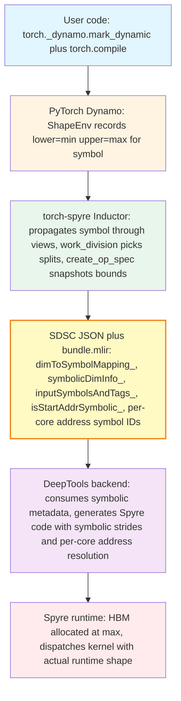
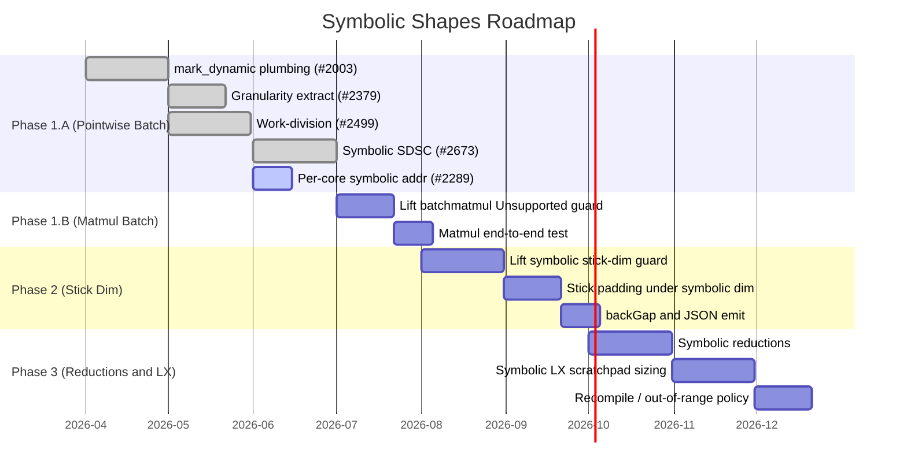
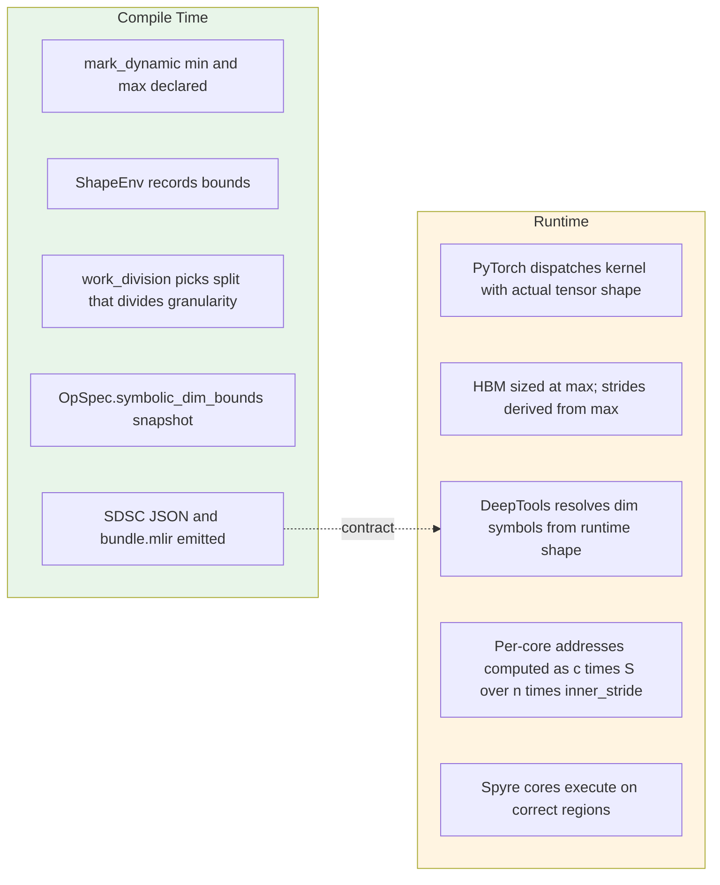
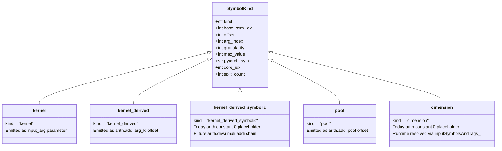

# Torch-Spyre Dynamic Shapes Support
---

This page describes how the Torch-Spyre front-end compiler enables dynamic shape support in the AI model compilation pipeline.

---

## 1. What is Dynamic Shapes Support

**Static shapes (today's baseline).** Torch-spyre's compiler bakes every tensor shape into the SDSC at compile time. When the user calls the compiled function with a different shape, the entire compilation pipeline reruns. The compile cache grows as `O(distinct shapes seen)`.

**Dynamic shapes.** The user marks specific dimensions as variable, declaring their bounds:

```python
x = torch.randn((1024, 128), dtype=torch.float16)
torch._dynamo.mark_dynamic(x, dim=0, min=64, max=1024)
compiled = torch.compile(model)
out = compiled(x.to("spyre"))   # the runtime size can be 64, 128, 256, ..., 1024
```

PyTorch's Dynamo registers a sympy symbol (e.g. `s0`) with `ShapeEnv` bounds `lower=64, upper=1024`. The compiled artifact accepts any shape in that range that is a multiple of `min`, with **no recompilation**.

### The bounded bucketing model

The Spyre compiler does not support arbitrary symbolic computation. Instead, the runtime values a dimension may take are restricted to:

```
admissible = { granularity, 2·granularity, 3·granularity, ..., max }
```

where `granularity = min` (the value passed via `mark_dynamic(min=...)`) and `max = max`. For example, `mark_dynamic(x, 0, min=64, max=1024)` yields admissible runtime values `{64, 128, 192, ..., 1024}`.

This is enforced by the **correctness invariant** `n | granularity`: the compile-time work-division split count `n` for a symbolic dimension must divide its granularity. Since every admissible runtime value `R = granularity · k` for some integer `k`, the per-core chunk `R / n` is guaranteed integer-valued **for every `k`** iff `n` divides `granularity`. A single compiled plan is valid for the entire declared range, with no runtime fallback and no rebalancing.

The model is **bounded** because HBM allocation needs a worst-case footprint (sized at `max`) and work-division must pick a split that is valid for all runtime values (driven by `granularity`).

---

## 2. Dynamic Shapes Challenges

### Why it is needed

Real-world inference workloads frequently operate on variable-length inputs. Without dynamic shape compilation support, inference servers must either pad inputs to a fixed shape or generate specialized kernels through runtime recompilation.

Excessive padding wastes compute and memory bandwidth by performing work on artificial tokens or elements, while runtime recompilation introduces compilation overhead directly into the critical inference path. Together, these limitations reduce hardware efficiency, increase tail latency, and hinder the ability of the serving system to scale efficiently under diverse production workloads.

| Today (static-only) | With dynamic shapes |
|---|---|
| One SDSC per shape; cache grows unbounded with serving traffic. | One SDSC per `(min, max)` range; cache is `O(buckets)`. |
| Per-shape recompile latency on every new input size. | Compile-once, dispatch-many. |

### Six structural challenges

1. **Symbol propagation through torch-spyre's pipeline (compile-time).** PyTorch Inductor natively encodes iteration spaces as sympy expressions, but the same symbols must flow through torch-spyre's own passes (views.align_tensors, work_division, spyre_kernel.create_op_spec, and the codegen stride helpers) and ultimately surface in the SDSC JSON.

2. **Correctness invariant `n | granularity` (compile-time, work-division).** Work-division must pick split counts from `divisors(granularity)`, not `divisors(maxSize)`. A naive port of the static planner picks splits from `divisors(maxSize)` and silently produces non-divisible chunks at runtime.

3. **Per-core start addresses depend on runtime size (compile-time emit, runtime resolution).** For a symbolic dim split across `n > 1` cores, core `c`'s start address is `base + c · (S/n) · inner_stride` where `S` is the runtime value. Baking `c · (max/n) · inner_stride` at compile time causes silent miscompute on every core after core 0 for any runtime value `< max`, because each core reads from the wrong region of its max-sized HBM buffer. This needs symbolic address handling with dimension symbol IDs and address symbol IDs sharing the same bundle pool.

4. **Stick-padded memory layouts (compile-time).** Spyre's 128-byte aligned stick layout adds padding `padded = ((size + epp − 1) // epp) · epp`. For symbolic `size`, this arithmetic must be sympy-safe, because the static `int(...)` casts in stride helpers like `_tiled_byte_stride` fault on symbolic inputs.

5. **256 MB HBM-span constraint (compile-time check).** The SDSC spec mandates *"The span of addresses accessed from DDR for any given tensor must not exceed 256MB"*. The span check must use the worst-case footprint (`max`), not the warmup value, otherwise a runtime shape near `max` exceeds the limit silently once the binary ships.

6. **Runtime HBM allocation and stride derivation at `max` (runtime, issue #2434).** DeepTools' contract for a symbolic-dim tensor `[d0=64, d1=symbolic, d2=8]` with `d1.max=1024`, `d1.granularity=16`: at any runtime `d1` (e.g. `32`), the tensor lives in memory as if `d1 = max`. Strides are `stride(d0)=1, stride(d1)=64, stride(d2)=64·1024=65536`. Strides are constant; HBM is sized at max; only the actual `d1=32` elements are written and read. The runtime today sizes HBM and emits strides from the runtime input shape. The hard part: dynamic compilation runs after `.to("spyre")`, so neither side knows `max` at HBM-allocation time. Resolution requires either propagating `max` from the user annotation through to the runtime allocator (statically), or deferring allocation until the first compiled dispatch sees `max`.

---

## 3. Prior Art

The table below summarises how other accelerator software stacks handle variable input shapes, based on each project's public documentation. The intent is to compare mechanisms, not capability or performance.

| Stack | Approach for dynamic shapes |
|---|---|
| **NVIDIA GPU (PyTorch Inductor + Triton)** | Native symbolic-shape support throughout the compilation pipeline. Kernels are parameterised on sympy expressions; no bucketing needed at the compiler layer. This is the reference behaviour that `torch.compile(dynamic=True)` targets upstream. |
| **Google XLA / TPU** | Shape polymorphism via JAX (`jax.export` with `polymorphic_shapes`) and TensorFlow SavedModel signatures. The user declares shape constraints; the compiler can either emit a single executable that spans the range or specialise per bucket, depending on configuration. |
| **SambaNova RDU (SambaFlow)** | Dataflow-graph compilation with runtime support for varying input dimensions. |
| **Cerebras WSE (Cerebras Software Platform)** | Wafer-scale dataflow with primarily static-graph compilation; dynamic-shape support for inference is an evolving area. |
| **Graphcore IPU (Poplar SDK)** | Graph compilation per input geometry; recent Poplar releases have added incremental dynamic-shape capabilities. |
| **Torch-Spyre (this document)** | Bounded bucketing. The user declares `(min, max)` via `torch._dynamo.mark_dynamic`; the compiler picks a per-core work distribution that is valid for the entire `{granularity, 2·granularity, …, max}` range, and emits SDSC metadata so the backend can resolve per-core addresses and dim sizes at dispatch. |

### Where torch-spyre fits

Torch-Spyre commits to a per-core static work distribution at compile time. This is a property of the Spyre dataflow architecture, not a software choice. Combined with the goal of unblocking variable-input serving workloads such as vLLM and FSM, this motivates the bounded bucketing approach: a single compiled binary covers an entire declared range, and the planner can still reason about splits and HBM spans using compile-time constants (`max` and `granularity`).

A fully symbolic GPU-style approach would require lifting the static work-distribution constraint, which is out of scope for the current Spyre hardware generation. A fully static recompile-per-shape approach would not meet the latency requirements of online serving. Bounded bucketing is the trade-off that fits both the hardware and the target workloads.

---

## 4. Use Cases

Dynamic shape support is driven by inference serving workloads where batch sizes and sequence lengths vary across requests.

- **vLLM.** Continuous batching with packed-token inputs. Each step aggregates concurrent requests into one batched call, with batch and sequence length varying per step. vLLM pads inputs to a multiple of `granularity` and presents them as a single bounded-symbolic dimension.
- **FSM (Foundation Model Serving) for Granite.** IBM's production inference path for Granite models. Per-request batch sizes follow the same dynamic-batch shape as vLLM.
- **Triton Inference Server.** Dynamic batching that aggregates concurrent client requests into variable batch sizes per dispatch.

**Worked example.** Consider `[s97, 128]` fp16 with `s97 ∈ [64, 1024]` and `granularity=64`. The planner picks `splits = {mb: 32, out: 1}`, so the batch dimension absorbs all 32 cores. The same compiled plan handles every admissible runtime value (`64, 128, 192, …, 1024`, 16 buckets) without recompilation.

---

## 5. High-Level Architecture

Dynamic shape support spans five layers, each with explicit contract boundaries:



### Layer responsibilities

- **User code** declares which dimensions are dynamic via `torch._dynamo.mark_dynamic(tensor, dim, min, max)`. No torch-spyre-specific API.
- **PyTorch Dynamo** produces an FX graph carrying sympy symbols and records bounds in `ShapeEnv`.
- **Torch-spyre Inductor** propagates symbols through view and layout passes, picks split counts that divide `granularity`, and snapshots `(max, granularity)` into the OpSpec before the `ShapeEnv` goes out of scope. It emits SDSC JSON and bundle.mlir.
- **SDSC JSON and bundle.mlir** form the contract surface with DeepTools.
- **DeepTools backend** consumes the symbolic metadata and generates Spyre executable code that resolves dim symbols and per-core addresses at dispatch.
- **Spyre runtime** allocates HBM at `max`, dispatches kernels with the actual runtime shape, and supplies the runtime dim value to DeepTools.

### Contract boundaries

1. **PyTorch to torch-spyre.** FX graph and ShapeEnv bounds. Standard PyTorch interface.
2. **Torch-spyre to DeepTools.** SDSC JSON fields (`dimToSymbolMapping_`, `symbolicDimInfo_`, `inputSymbolsAndTags_`, `isStartAddrSymbolic_`, `startAddressCoreCorelet_.data_`) plus bundle.mlir (`sdsc_execute` operands and `symbol_ids`). Codified in the SDSC Bundle interface spec.
3. **DeepTools to Spyre runtime.** Opaque to torch-spyre.
4. **Torch-spyre to Spyre runtime (host).** HBM allocation and dim-symbol value plumbing at dispatch.

---

## 6. Integration with the Existing Torch-Spyre Pipeline

Torch-spyre is implemented as a PyTorch Inductor extension that registers itself as the compiler for the `spyre` device. It plugs into Inductor through six extension points (`CustomPreGradPasses`, `CustomPrePasses`, `CustomPostPasses`, `CustomPreFusionPasses`, `CustomPostFusionPasses`, and `CustomPreSchedulingPasses`) and adds its own LoopLevelIR passes that drive layout propagation, work division, coarse tiling, scratchpad planning, and codegen.

The dynamic shapes work is **purely additive**. No existing pass was redesigned, and the static-binary path remains byte-identical when no dimension is marked dynamic. Each stage that needed change received an opt-in branch gated by the `finite_upper_or_none(expr)` predicate. The table below maps each pipeline stage to what dynamic shapes adds:

| Existing pipeline stage | Owns | Symbolic-shape addition |
|---|---|---|
| FX graph + ShapeEnv (upstream PyTorch) | Sympy symbols for shapes; ShapeEnv records `(lower, upper)` bounds. | None. Torch-spyre consumes the symbols and bounds as-is. |
| `views.align_tensors` (LoopLevelIR) | Coordinate translation for view ops; co-simplifies the iteration space. | `_bounded_or_hint` keeps user-marked symbols alive instead of concretising to a size hint. |
| `coarse_tile` (LoopLevelIR) | Hint-derived loop wrapping for tiled execution. | Defensive `Unsupported` guard for symbolic dim inside a tiled loop (Phase 3 follow-up). |
| Pass 1: `span_reduction` (work division) | 256 MB per-core span check; commits minimum splits when violated. | `_effective_size(v, meta)` returns `max` for symbolic dims so the worst-case span is checked, not just the warmup. |
| Pass 2: `cost_model_matmul_division` | Picks the lowest-cost split for matmul/bmm ops. | Raises `Unsupported` for symbolic batchmatmul today; lifted in Phase 1.B. |
| Pass 3: `work_distribution` | Greedy core distribution across output and reduction dims. | `_valid_divisor_basis(v, meta)` returns `granularity` for symbolic dims so the chosen split divides every admissible runtime value. |
| `adjust_it_space_for_sticks` | Converts iteration vars from elements to sticks before planning. | Raises `Unsupported` for symbolic stick dim today; lifted in Phase 2. |
| `spyre_kernel.create_op_spec` | Builds the `OpSpec` from LoopLevelIR. | Snapshots `(max, granularity)` into `OpSpec.symbolic_dim_bounds` while the ShapeEnv is still live. |
| `superdsc.parse_op_spec` | Converts `OpSpec` to `SDSCSpec`, relabels iteration vars to SDSC names. | `_resolve_sdsc_size` returns `max` for symbolic dims; populates `SDSCSpec.symbolic_dims`. |
| `compute_ops.generate_sdsc` | Emits the SuperDSC JSON file per kernel. | Emits `dimToSymbolMapping_`, `symbolicDimInfo_` (in `ss_` and `el_`), `inputSymbolsAndTags_`, `isStartAddrSymbolic_`, and per-core address symbol IDs in `startAddressCoreCorelet_.data_`. |
| `bundle.generate_bundle` | Emits `bundle.mlir` describing kernel sequencing and inputs. | New `SymbolKind.dimension` and `SymbolKind.kernel_derived_symbolic` variants slot into the existing symbol declaration loop. |
| LX scratchpad planning | Plans tensor placement in the 2 MB LX scratchpad. | No change. Scratchpad planning sees per-core sizes as concrete (computed from `max`), so its decisions remain stable across runtime values within a bucket. |
| `wrapper.py` host code generation | Generates the Python wrapper for kernel dispatch. | No frontend change. The runtime side requires HBM allocation at `max` and stride derivation at `max` (issue #2434). |

### Key design properties of the integration

- **Single opt-in predicate.** `finite_upper_or_none(expr)` is the only place that decides whether a symbol enters the symbolic path. Mirroring it uniformly across views, work_division, and spyre_kernel prevents auto-dynamic symbols (those Dynamo promoted on its own without a user `mark_dynamic`) from leaking in.
- **Static-binary path preserved.** When `symbolic_dim_bounds` is empty, every SDSC field and bundle.mlir op emits exactly as before. The only new JSON fields appear under guards that are inert when no dim is symbolic.
- **Three-pass planner respects the bucketing invariant uniformly.** Pass 1 (span reduction) uses `max` so worst-case footprint is checked. Pass 3 (work distribution) uses `granularity` so chosen splits are valid across the range. Pass 2 (cost-model matmul) defers via `Unsupported` until Phase 1.B.
- **Cleanly extends into KTIR.** SuperDSC is being transitioned to the MLIR-based KTIR specification ([RFC 0682](https://github.com/torch-spyre/rfcs/blob/main/0682-KtirSpec/0682-KtirSpecRFC.md)). The symbolic-shape fields modelled here (`dimToSymbolMapping_`, `symbolicDimInfo_`, `isStartAddrSymbolic_`, address symbol IDs) carry directly into KTIR; no rework needed at the contract level.

---

## 7. Phase Plan



### Phase 1.A. Symbolic batch dim for pointwise ops

Covers `mark_dynamic` propagation, granularity-based work division, SDSC JSON emission of dim metadata, and per-core symbolic addresses. Landed across PRs #2003, #2379, #2499, #2673; per-core symbolic addresses (#2289) are in flight.

### Phase 1.B. Symbolic batch dim for matmul

Today `work_division` raises `Unsupported` for symbolic-dim batchmatmul. Lifting the guard is the main change; the downstream SDSC and per-core address logic is op-type-agnostic and fires automatically once the guard is removed.

### Phase 2. Symbolic stick dim

Today raises `Unsupported` for symbolic stick dimensions. Requires:

- Sympy-safe stick padding `((s + epp − 1) // epp) · epp`.
- `backGap` computation under symbolic stick size.
- `primaryDsInfo_.stickSize_` and `stickDimOrder_` JSON emission for symbolic stick.

### Phase 3. Reductions and LX scratchpad

- Symbolic reduction axes (requires threading a reduction flag through `SDSCSpec`).
- Symbolic LX scratchpad sizing.
- Out-of-range runtime input handling and recompile policy.

---

## 8. Technical Implementation in torch-spyre

### Compile-time vs runtime responsibilities



### 8.1 Symbolic core division

The opt-in gate is `finite_upper_or_none(expr)` in `pass_utils.py`. It returns the `ShapeEnv` upper bound for `expr` if that bound is a finite `sympy.Integer`, otherwise `None`. Every layer that consumes a symbolic iteration var checks this predicate and skips when it returns `None`. Applying it uniformly across `views.py`, `work_division.py`, and `spyre_kernel.py` prevents auto-dynamic symbols (those Dynamo promoted on its own without a user `mark_dynamic`) from leaking into the symbolic path.

**Bound computation:**

- `compute_max_size(expr)` returns the finite upper bound, or falls back to `size_hint` when no finite bound exists.
- `compute_granularity(expr, max_size)` returns the user-supplied `min` if it divides `max`; otherwise the smallest divisor of `max` that is `≥ min_default_granularity` and yields `max / d ≤ max_buckets`.
- `compute_symbolic_bounds(expr)` composes these into `(max, granularity)`.

**Planner:**

- `_collect_symbol_metadata(it_space)` walks the iteration space, applies the opt-in gate, and returns `SymbolMeta: dict[Symbol, (max, granularity)]`.
- `_valid_divisor_basis(v, it_space, meta)` returns `granularity` for symbolic dims (so the chosen split divides every admissible runtime size) and the concretised size for concrete dims.

**Active `Unsupported` guards:**

- Symbolic stick dim, raised in `adjust_it_space_for_sticks`.
- Symbolic dims on batchmatmul ops, raised in the matmul cost-model path.

### 8.2 Symbolic SDSC generation

```mermaid
flowchart LR
    A[mark_dynamic s0 min=64 max=1024] --> B[ShapeEnv: lower=64 upper=1024]
    B --> C["finite_upper_or_none returns 1024"]
    C --> D["compute_symbolic_bounds returns max=1024 gran=64"]
    D --> E["SymbolMeta s0 maps to 1024 and 64"]
    E --> F["work_division picks split count that divides 64"]
    F --> G["create_op_spec snapshots OpSpec.symbolic_dim_bounds for s0"]
    G --> H["parse_op_spec relabels SDSCSpec.symbolic_dims mb maps to s0 64 1024"]
    H --> I["generate_sdsc emits dimToSymbolMapping_, symbolicDimInfo_, inputSymbolsAndTags_"]
```



**Snapshot the bounds.** `create_op_spec` in `spyre_kernel.py` captures `(max, granularity)` from the still-live `ShapeEnv` into `OpSpec.symbolic_dim_bounds: dict[str, tuple[int, int]]`, keyed by `str(size_expr)`. By the time codegen runs the `ShapeEnv` is gone, so the bounds must be serialised as plain ints.

**Relabel to the SDSC namespace.** `parse_op_spec` in `superdsc.py` converts `OpSpec` to `SDSCSpec`:

- Iteration sizes are resolved via `_resolve_sdsc_size(expr, symbolic_dim_bounds)`, which returns `max` for symbolic dims and the concretised value for concrete dims.
- `SDSCSpec.symbolic_dims: dict[str, tuple[str, int, int]]` is built, mapping SDSC dim name to `(pytorch_sym, granularity, max)`.

**Emit JSON.** `generate_sdsc` in `compute_ops.py`:

- Registers dim symbols first, so their negative IDs precede address symbol IDs within a bundle (avoiding collision).
- Emits `dimToSymbolMapping_: {sdsc_dim_name: [negative_id]}`.
- Emits `symbolicDimInfo_` in both the `ss_` and `el_` blocks of `dataStageParam_`, with `maxSize_ = max / wk_slices` and `granularity_ = max(1, granularity / wk_slices)`.
- Emits `inputSymbolsAndTags_: {str(negative_id): pytorch_sym_name}` at the top level.
- Sets `isStartAddrSymbolic_: 1` on every non-LX tensor under `use_symbols=True`.

**Example.** For a symbolic batch dim `mb`:

```json
"dimToSymbolMapping_": {
  "mb": [ -6 ]
},
"dataStageParam_": {
  "0": {
    "ss_": {
      "mb_": 128,
      "symbolicDimInfo_": { "mb": { "maxSize_": 128, "granularity_": 16 } }
    },
    "el_": {
      "mb_": 128,
      "symbolicDimInfo_": { "mb": { "maxSize_": 128, "granularity_": 16 } }
    }
  }
},
"inputSymbolsAndTags_": { "-6": "s0" }
```

`-6` is the SDSC-local symbol ID for `mb`; the runtime resolves it to PyTorch symbol `s0` via `inputSymbolsAndTags_`.

### 8.3 Symbolic addresses and bundle.mlir



`SymbolKind` in `compute_ops.py` classifies every entry in the bundle's symbol table:

- **kernel.** Base HBM address of a kernel tensor arg; becomes a bundle function parameter.
- **kernel_derived.** Per-core derived address = base + concrete offset.
- **kernel_derived_symbolic.** Per-core address whose value depends on the runtime size of a symbolic dim (new in #2289).
- **pool.** Pool-allocated tensor; derived from `%pool`.
- **dimension.** Dimension symbol from `mark_dynamic`; metadata-only today.

**ID layout invariant.** Dimension symbols are registered before address symbols. Within one SDSC, dim symbol IDs occupy `-(offset+1)..-(offset+n_dim_syms)` and address symbol IDs follow at `-(offset+n_dim_syms+1)..`. The bundle-wide ID space is shared between the two, so this ordering is what prevents collisions.

**Per-core symbolic addresses (#2289).** When work-division splits a symbolic dim across `n > 1` cores, the predicate `_tensor_has_symbolic_split` fires for every tensor that uses that dim. Core 0 is registered as `kernel(arg_index)`; cores `1..N-1` each get a unique `kernel_derived_symbolic` entry with a distinct negative ID. The SDSC's `startAddressCoreCorelet_.data_` carries these IDs:

```json
"startAddressCoreCorelet_": {
  "data_": {
    "[0, 0, 0]": "-2",
    "[1, 0, 0]": "-3",
    "[2, 0, 0]": "-4"
  }
},
"isStartAddrSymbolic_": 1
```

**bundle.mlir today.** The symbol declaration loop in `bundle.py` emits:

- **kernel** is skipped (already a function parameter).
- **kernel_derived** emits `arith.addi %arg_K, concrete_offset`.
- **kernel_derived_symbolic** emits the placeholder `arith.constant 0 : index`. DeepTools resolves the actual per-core address from the SDSC metadata (`startAddressCoreCorelet_`, `dimToSymbolMapping_`) using the runtime dim size.
- **pool** emits `arith.addi %pool, offset`.
- **dimension** emits the placeholder `arith.constant 0 : index`. Resolved at runtime via `inputSymbolsAndTags_`.

**Follow-up.** Once dim symbols are wired as MLIR SSA values via a new bundle parameter type, the `arith.constant 0` placeholders for `kernel_derived_symbolic` are replaced with a real arith chain (`arith.divsi %S, %cN`, then `arith.muli`, then `arith.addi %arg_K, ...`). The variant already carries the data needed to construct that chain.

---

## 9. Dependencies

### 9.1 DeepTools backend

For symbolic shapes to work end-to-end, the DeepTools backend needs:

- **Symbolic-args bundle compilation.** The `bundle_symbolic_args=True` path emits kernel base addresses as `!sdscbundle.input_arg<index>` parameters. Foundation PRs #2628, #2645, and #2652 land this.
- **Consumption of symbolic SDSC fields.** DeepTools reads `dimToSymbolMapping_`, `symbolicDimInfo_`, and `inputSymbolsAndTags_` to generate Spyre code that respects symbolic strides.
- **Per-core address resolution.** For each tensor with `isStartAddrSymbolic_: 1`, DeepTools resolves the per-core address from the SDSC symbol IDs and the runtime dim size, using `base + c · (S/n) · inner_stride`.

**Open with DeepTools (issue #2500):**

- Source of truth for symbolic metadata when both `bundle.mlir` and SDSC JSON carry `symbolicDimInfo_`.
- Symbol-ID scoping: shared bundle-global pool vs per-SDSC scoping.

### 9.2 Spyre runtime

Issue #2434 is a prerequisite for any symbolic kernel to execute on device. Today the runtime sizes HBM and computes strides from the warmup-time shape, but DeepTools' symbolic SDSC requires:

- **HBM sized at `maxSize`** along the symbolic dim, not the warmup shape.
- **Device strides derived from `maxSize`** so they remain constant across dispatches.
- **Dim-symbol value plumbing.** At dispatch, the runtime passes the actual tensor shape, and DeepTools substitutes it into the symbol resolution path.

**Open design question.** Dynamic compilation runs after `.to("spyre")`, so neither the runtime nor the frontend knows `max` at HBM allocation time. Resolution requires either propagating `max` from the user annotation through to the runtime allocator (static), or deferring HBM allocation until the first compiled dispatch (dynamic).

---

## 10. Current Limitations

| Limitation | Resolution phase |
|---|---|
| Symbolic stick dim (`Unsupported` in work_division). | Phase 2 |
| Symbolic batchmatmul (`Unsupported` in work_division). | Phase 1.B |
| Symbolic reductions (no `SDSCSpec.is_reduction` flag threaded). | Phase 3 |
| Symbolic dim inside a tiled loop (`LoopSpec`). | Phase 3 follow-up |
| Pool tensors with symbolic-dim split (currently skipped). | Phase 1.B or 2 |
| `mark_dynamic(min=2)` indistinguishable from PyTorch default (no user-min hook upstream). | Phase 3, requires upstream PyTorch change |
| Cross-SDSC dim-symbol ID uniqueness not validated. | Hardening |
| End-to-end runtime validation on Spyre device. | Once DeepTools consumer-side support lands |
| MLIR operand spec compliance for `kernel_derived_symbolic` (`arith.constant 0` placeholder today). | Follow-up to #2289 |

Two additional notes:

- The `isStartAddrSymbolic_` flag is currently set on every non-LX tensor under `use_symbols=True`, regardless of whether the tensor has a symbolic-dim split. DeepTools should ignore the symbolic-resolution path for tensors whose per-core addresses are all concrete.
- `primaryDsInfo_.stickSize_` is baked at `max` today. When stick size depends on a symbolic dim, this is incorrect; a Phase 2 prerequisite.
