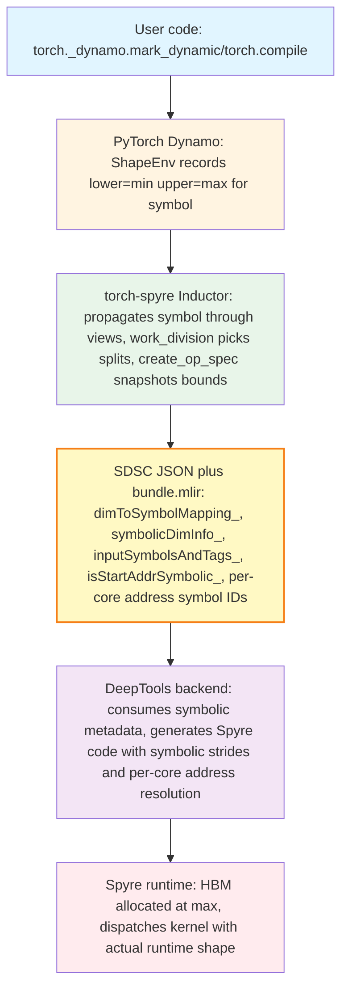
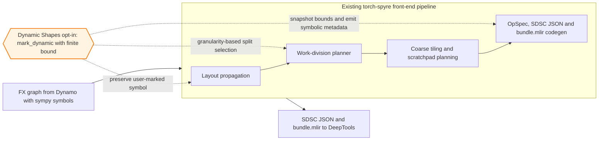
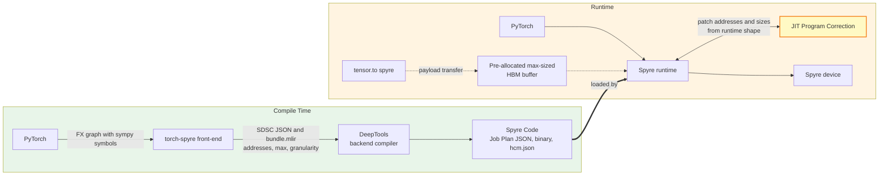

# Torch-Spyre Dynamic Shapes Support
---

This page describes how the Torch-Spyre front-end compiler enables dynamic shape support in the AI model compilation pipeline.

## Quick navigation

- [1. What is Dynamic Shapes Support](#1-what-is-dynamic-shapes-support)
- [2. Dynamic Shapes Challenges](#2-dynamic-shapes-challenges)
- [3. Prior Art](#3-prior-art)
- [4. Use Cases](#4-use-cases)
- [5. High-Level Architecture](#5-high-level-architecture)
- [6. Integration with the Existing Torch-Spyre Pipeline](#6-integration-with-the-existing-torch-spyre-pipeline)
- [7. Phase Plan](#7-phase-plan)
- [8. Technical Implementation in torch-spyre](#8-technical-implementation-in-torch-spyre)
- [9. End-to-End Worked Example](#9-end-to-end-worked-example)
- [10. Dependencies](#10-dependencies)

---

## 1. What is Dynamic Shapes Support

**Static shapes (today's baseline).** Torch-spyre's compiler bakes every tensor shape into the SDSC at compile time. When the user calls the compiled function with a different shape, the entire compilation pipeline reruns. The compile cache grows as `O(distinct shapes seen)`.

**Dynamic shapes.** The user marks specific dimensions as variable, declaring their bounds:

```python
x = torch.randn((1024, 128), dtype=torch.float16)
torch._dynamo.mark_dynamic(x, dim=0, min=64, max=1024)
compiled = torch.compile(model)
out = compiled(x.to("spyre"))   # the runtime size can be 64, 128, 256, ..., 1024
```

PyTorch's Dynamo registers a sympy symbol (e.g. `s0`) with `ShapeEnv` bounds `lower=64, upper=1024`. The compiled artifact accepts any shape in that range that is a multiple of `min`, with **no recompilation**.

### The bounded bucketing model

The Spyre compiler does not support arbitrary symbolic computation. Instead, the runtime values a dimension may take are restricted to:

```
admissible = { granularity, 2·granularity, 3·granularity, ..., max }
```

where `granularity = min` (the value passed via `mark_dynamic(min=...)`) and `max = max`. For example, `mark_dynamic(x, 0, min=64, max=1024)` yields admissible runtime values `{64, 128, 192, ..., 1024}`.

This is enforced by the **correctness invariant** `n | granularity`: the compile-time work-division split count `n` for a symbolic dimension must divide its granularity. Since every admissible runtime value `R = granularity · k` for some integer `k`, the per-core chunk `R / n` is guaranteed integer-valued **for every `k`** iff `n` divides `granularity`. A single compiled plan is valid for the entire declared range, with no runtime fallback and no rebalancing.

The model is **bounded** because HBM allocation needs a worst-case footprint (sized at `max`) and work-division must pick a split that is valid for all runtime values (driven by `granularity`).

---

## 2. Dynamic Shapes Challenges

### Why it is needed

Real-world inference workloads frequently operate on variable-length inputs. Without dynamic shape compilation support, inference servers must either pad inputs to a fixed shape or generate specialized kernels through runtime recompilation.

Excessive padding wastes compute and memory bandwidth, while runtime recompilation introduces compilation overhead directly into the critical inference path. Together, these limitations reduce hardware efficiency, increase tail latency, and hinder the ability of the serving system to scale efficiently under diverse production workloads.

| Today (static-only) | With dynamic shapes |
|---|---|
| One SDSC per shape; cache grows unbounded with serving traffic. | One SDSC per `(min, max)` range; cache is `O(buckets)`. |
| Per-shape recompile latency on every new input size. | Compile-once, dispatch-many. |

### Six structural challenges

1. **Symbol propagation through torch-spyre's pipeline (compile-time).** PyTorch Inductor natively encodes iteration spaces as sympy expressions, but the same symbols must flow through torch-spyre's own passes (views.align_tensors, work_division, spyre_kernel.create_op_spec, and the codegen stride helpers) and ultimately surface in the SDSC JSON.

2. **Correctness invariant `n | granularity` (compile-time, work-division).** Work-division must pick split counts from `divisors(granularity)`, not `divisors(maxSize)`. A naive port of the static planner picks splits from `divisors(maxSize)` and silently produces non-divisible chunks at runtime.

3. **Per-core start addresses depend on runtime size (compile-time emit, runtime resolution).** For a symbolic dim split across `n > 1` cores, core `c`'s start address is `base + c · (S/n) · inner_stride` where `S` is the runtime value. Baking `c · (max/n) · inner_stride` at compile time causes silent miscompute on every core after core 0 for any runtime value `< max`, because each core reads from the wrong region of its max-sized HBM buffer. This needs symbolic address handling with dimension symbol IDs and address symbol IDs sharing the same bundle pool.

4. **Stick-padded memory layouts (compile-time).** Spyre's 128-byte aligned stick layout adds padding `padded = ((size + epp − 1) // epp) · epp`. For symbolic `size`, this arithmetic must be sympy-safe, because the static `int(...)` casts in stride helpers like `_tiled_byte_stride` fault on symbolic inputs.

5. **256 MB HBM-span constraint (compile-time check).** The SDSC spec mandates *"The span of addresses accessed from DDR for any given tensor must not exceed 256MB"*. The span check must use the worst-case footprint (`max`), not the warmup value, otherwise a runtime shape near `max` exceeds the limit silently once the binary ships.

6. **Runtime HBM allocation and stride derivation at `max` (runtime, issue #2434).** DeepTools' contract for a symbolic-dim tensor `[d0=64, d1=symbolic, d2=8]` with `d1.max=1024`, `d1.granularity=16`: at any runtime `d1` (e.g. `32`), the tensor lives in memory as if `d1 = max`. Strides are `stride(d0)=1, stride(d1)=64, stride(d2)=64·1024=65536`. Strides are constant; HBM is sized at max; only the actual `d1=32` elements are written and read. The runtime today sizes HBM and emits strides from the runtime input shape. The hard part: dynamic compilation runs after `.to("spyre")`, so neither side knows `max` at HBM-allocation time. 

---

## 3. Prior Art

The table below summarises how other accelerator software stacks handle variable input shapes, based on each project's public documentation. The intent is to compare mechanisms, not capability or performance.

| Stack | Approach for dynamic shapes |
|---|---|
| **NVIDIA GPU (PyTorch Inductor + Triton)** | Native symbolic-shape support throughout the compilation pipeline. Kernels are parameterised on sympy expressions; no bucketing needed at the compiler layer. This is the reference behaviour that `torch.compile(dynamic=True)` targets upstream. |
| **Google XLA / TPU** | Shape polymorphism via JAX (`jax.export` with `polymorphic_shapes`) and TensorFlow SavedModel signatures. The user declares shape constraints; the compiler can either emit a single executable that spans the range or specialise per bucket, depending on configuration. |
| **SambaNova RDU (SambaFlow)** | Dataflow-graph compilation with runtime support for varying input dimensions. |
| **Cerebras WSE (Cerebras Software Platform)** | Wafer-scale dataflow with primarily static-graph compilation; dynamic-shape support for inference is an evolving area. |
| **Graphcore IPU (Poplar SDK)** | Graph compilation per input geometry; recent Poplar releases have added incremental dynamic-shape capabilities. |
| **Torch-Spyre (this document)** | Bounded bucketing. The user declares `(min, max)` via `torch._dynamo.mark_dynamic`; the compiler picks a per-core work distribution that is valid for the entire `{granularity, 2·granularity, …, max}` range, and emits SDSC metadata so the backend can resolve per-core addresses and dim sizes at dispatch. |

### Where torch-spyre fits

Torch-Spyre commits to a per-core static work distribution at compile time. This is a property of the Spyre dataflow architecture, not a software choice. Combined with the goal of unblocking variable-input serving workloads such as vLLM and FSM, this motivates the bounded bucketing approach: a single compiled binary covers an entire declared range, and the planner can still reason about splits and HBM spans using compile-time constants (`max` and `granularity`).

---

## 4. Use Cases

Dynamic shape support is driven by inference serving workloads where batch sizes and sequence lengths vary across requests.

- **vLLM on Spyre (`spyre-inference` plugin).** vLLM serves LLMs with continuous batching and a PagedAttention KV cache. Each scheduling iteration processes a mix of prefill and decode tokens, so both batch and sequence dimensions vary per step.
- **Foundation Model Stack (FMS).** FMS is a collection of PyTorch-native components for development, inference, training, and tuning of foundation models. It provides reimplementations of model families (LLaMA, GPT-BigCode, RoBERTa, and others via `fms-extras`) that are designed to compile cleanly with `torch.compile` and to integrate with downstream serving stacks such as TGIS. Dynamic shapes lets FMS-based inference paths compile once per `(min, max)` range instead of once per shape.

Other inference servers implementing Dynamic batching ( such as Triton Inference Server ) aggregate concurrent client requests into variable batch sizes per dispatch. Dynamic shapes lets the same compiled binary serve every aggregated batch size within the declared bucket.

**Worked example.** Consider `[s97, 128]` fp16 with `s97 ∈ [64, 1024]` and `granularity=64`. The planner picks `splits = {mb: 32, out: 1}`, so the batch dimension absorbs all 32 cores. The same compiled plan handles every admissible runtime value (`64, 128, 192, …, 1024`, 16 buckets) without recompilation.

---

## 5. High-Level Architecture

Dynamic shape support spans five layers, each with explicit contract boundaries:



### Layer responsibilities

- **User code** declares which dimensions are dynamic via `torch._dynamo.mark_dynamic(tensor, dim, min, max)`. No torch-spyre-specific API.
- **PyTorch Dynamo** produces an FX graph carrying sympy symbols and records bounds in `ShapeEnv`.
- **Torch-spyre Inductor** propagates symbols through view and layout passes, picks split counts that divide `granularity`, and snapshots `(max, granularity)` into the OpSpec before the `ShapeEnv` goes out of scope. It emits SDSC JSON and bundle.mlir.
- **SDSC JSON and bundle.mlir** form the contract surface with DeepTools.
- **DeepTools backend** consumes the symbolic metadata and generates Spyre executable code (Spyre Code: Job Plan JSON, binary, hcm.json) that carries per-core address placeholders to be patched at dispatch.
- **Spyre runtime** allocates HBM at `max` and dispatches kernels with the actual runtime shape. A **JIT Program Correction** step patches the per-core addresses and per-core sizes in the Spyre Code from the runtime tensor shape on every dispatch.

### Contract boundaries

1. **PyTorch to torch-spyre.** FX graph and ShapeEnv bounds. Standard PyTorch interface.
2. **Torch-spyre to DeepTools.** SDSC JSON fields (`dimToSymbolMapping_`, `symbolicDimInfo_`, `inputSymbolsAndTags_`, `isStartAddrSymbolic_`, `startAddressCoreCorelet_.data_`) plus bundle.mlir (`sdsc_execute` operands and `symbol_ids`). Codified in the SDSC Bundle interface spec.
3. **Torch-spyre to Spyre runtime (host).** HBM allocation and dim-symbol value plumbing at dispatch.

---

## 6. Integration with the Existing Torch-Spyre Pipeline

Torch-spyre is a PyTorch Inductor extension that registers itself as the compiler for the `spyre` device. It adds its own pipeline stages on top of Inductor: layout propagation, the work-division planner, coarse tiling, scratchpad planning, and SDSC plus bundle.mlir codegen.

Dynamic shapes is **purely additive**. No existing pipeline stage was redesigned, and the static-binary path remains unchanged when no dimension is marked dynamic. A single opt-in predicate determines whether a given symbol enters the symbolic path: only symbols a user declared via `mark_dynamic` with a finite upper bound are kept symbolic. Auto-dynamic symbols that Dynamo promotes on its own remain on the static path.



At a logical level, dynamic shapes hooks into three stages:

- **Layout propagation** receives an opt-in branch so user-marked symbols survive coordinate translation instead of being concretised to a size hint.
- **The work-division planner** adopts a granularity-aware split selection. The chosen per-core distribution is valid across the entire declared `(min, max)` range, not just the warmup shape. The worst-case footprint check (256 MB per-core span) is evaluated against `max` so a runtime value near the upper bound never violates the limit silently.
- **OpSpec and codegen** snapshot `(max, granularity)` into the OpSpec before the `ShapeEnv` goes out of scope, then emit a small set of additional SDSC JSON fields and bundle.mlir symbols that carry the symbol identity, bounds, and per-core symbolic addresses through to the backend.

Coarse tiling and scratchpad planning are unchanged. They see per-core sizes computed from `max`, so their decisions remain stable across every runtime value within a declared bucket.

### Key design properties of the integration

- **Single opt-in predicate.** One predicate gates every dynamic-shape addition. This prevents Dynamo-promoted symbols (those the user did not opt into) from leaking into the symbolic path.
- **Static-binary path preserved.** When no dimension is marked dynamic, every SDSC field and bundle.mlir op emits exactly as before. The new JSON fields appear under guards that are inert when no symbolic dim is present.
- **Bucketing invariant respected uniformly.** The planner uses `max` for worst-case footprint checks and `granularity` for split selection, so any chosen plan is valid for the entire declared range with no runtime fallback.
- **Cleanly extends into KTIR.** SuperDSC is being transitioned to the MLIR-based KTIR specification ([RFC 0682](https://github.com/torch-spyre/rfcs/blob/main/0682-KtirSpec/0682-KtirSpecRFC.md)). The symbolic-shape concepts modelled here (per-dim symbol mapping, max and granularity metadata, per-core symbolic addresses) carry directly into KTIR; no rework needed at the contract level.

---

## 7. Phase Plan

The feature is delivered in four phases. Each phase widens the set of operators and dimensions that accept a user-declared `mark_dynamic` annotation.

### Phase 1.A. Symbolic batch dim for pointwise ops

Covers `mark_dynamic` propagation through Dynamo and the torch-spyre passes, granularity-based work division, SDSC JSON emission of dim metadata, and per-core symbolic addresses.

**Use cases enabled.** Pointwise ops in serving paths run without per-shape recompilation. The compiled artifact accepts any admissible runtime value of the batch dimension. This is the path most LLM-serving prologue and epilogue ops take (activations, normalisation steps, biases).

### Phase 1.B. Symbolic batch dim for matmul

Today the work_division planner raises `Unsupported` for symbolic-dim batchmatmul. Lifting this guard is the main change; the downstream SDSC and per-core address logic is op-type-agnostic and fires automatically.

**Use cases enabled.** Matmul-heavy LLM serving (attention projections, MLP linears) runs with a single compiled binary across variable batch sizes. This is what unblocks vLLM continuous batching and FSM Granite serving end-to-end, because the matmul cost dominates the inference step.

### Phase 2. Symbolic stick dim

Today raises `Unsupported` for symbolic stick dimensions. Requires sympy-safe stick padding (`((s + epp − 1) // epp) · epp`), `backGap` computation under symbolic stick size, and `primaryDsInfo_.stickSize_` / `stickDimOrder_` JSON emission for symbolic stick.

**Use cases enabled.** Variable hidden-size and variable sequence-length-stick patterns become symbolic at compile time. Models with non-uniform tile-aligned inner dimensions are no longer restricted to bucket-aligned padding by the user upfront.

### Phase 3. Reductions, LX scratchpad, and recompile policy

Symbolic reduction axes (requires threading a reduction flag through `SDSCSpec`), symbolic LX scratchpad sizing, and an explicit policy for runtime values outside the declared range.

**Use cases enabled.** Reductions along symbolic axes (softmax over symbolic sequence length, mean over symbolic batch) compile cleanly. Symbolic LX sizing makes the scratchpad planner respect bucketed worst-case footprints rather than warmup-only. The recompile policy gives serving systems a defined behaviour when a request arrives outside the declared `(min, max)` range, rather than silent failure.

---

## 8. Technical Implementation in torch-spyre

### Symbolic SDSC compilation flow

The diagram below shows how a symbolic kernel flows from PyTorch through compile time and runtime. The compile-time half produces a single binary parameterised on `max` and `granularity`. The runtime half patches per-core addresses with concrete values using **JIT Program Correction** once the actual tensor shape is known at dispatch.



The compile-time artifacts (SDSC JSON, bundle.mlir, Spyre Code) are produced once per `(min, max)` range. At runtime, every dispatch reuses the same Spyre Code; only JIT Program Correction adapts the per-core addresses and the per-core sizes to the actual tensor shape supplied through PyTorch. No backend recompilation happens per shape.

### 8.1 Symbolic core division

The opt-in gate is `finite_upper_or_none(expr)` in `pass_utils.py`. It returns the `ShapeEnv` upper bound for `expr` if that bound is a finite `sympy.Integer`, otherwise `None`. Every layer that consumes a symbolic iteration var checks this predicate and skips when it returns `None`. Applying it uniformly across `views.py`, `work_division.py`, and `spyre_kernel.py` prevents auto-dynamic symbols (those Dynamo promoted on its own without a user `mark_dynamic`) from leaking into the symbolic path.

**Bound computation:**

- `compute_max_size(expr)` returns the finite upper bound, or falls back to `size_hint` when no finite bound exists.
- `compute_granularity(expr, max_size)` returns the user-supplied `min` if it divides `max`; otherwise the smallest divisor of `max` that is `≥ min_default_granularity` and yields `max / d ≤ max_buckets`.
- `compute_symbolic_bounds(expr)` composes these into `(max, granularity)`.

**Planner:**

- `_collect_symbol_metadata(it_space)` walks the iteration space, applies the opt-in gate, and returns `SymbolMeta: dict[Symbol, (max, granularity)]`.
- `_valid_divisor_basis(v, it_space, meta)` returns `granularity` for symbolic dims (so the chosen split divides every admissible runtime size) and the concretised size for concrete dims.

**Active `Unsupported` guards:**

- Symbolic stick dim, raised in `adjust_it_space_for_sticks`.
- Symbolic dims on batchmatmul ops, raised in the matmul cost-model path.

### 8.2 Symbolic SDSC generation

```mermaid
flowchart LR
    A[mark_dynamic s0 min=64 max=1024] --> B[ShapeEnv: lower=64 upper=1024]
    B --> C["finite_upper_or_none returns 1024"]
    C --> D["compute_symbolic_bounds returns max=1024 gran=64"]
    D --> E["SymbolMeta s0 maps to 1024 and 64"]
    E --> F["work_division picks split count that divides 64"]
    F --> G["create_op_spec snapshots OpSpec.symbolic_dim_bounds for s0"]
    G --> H["parse_op_spec relabels SDSCSpec.symbolic_dims mb maps to s0 64 1024"]
    H --> I["generate_sdsc emits dimToSymbolMapping_, symbolicDimInfo_, inputSymbolsAndTags_"]
```



**Snapshot the bounds.** `create_op_spec` in `spyre_kernel.py` captures `(max, granularity)` from the still-live `ShapeEnv` into `OpSpec.symbolic_dim_bounds: dict[str, tuple[int, int]]`, keyed by `str(size_expr)`. By the time codegen runs the `ShapeEnv` is gone, so the bounds must be serialised as plain ints.

**Relabel to the SDSC namespace.** `parse_op_spec` in `superdsc.py` converts `OpSpec` to `SDSCSpec`:

- Iteration sizes are resolved via `_resolve_sdsc_size(expr, symbolic_dim_bounds)`, which returns `max` for symbolic dims and the concretised value for concrete dims.
- `SDSCSpec.symbolic_dims: dict[str, tuple[str, int, int]]` is built, mapping SDSC dim name to `(pytorch_sym, granularity, max)`.

**Emit JSON.** `generate_sdsc` in `compute_ops.py`:

- Registers dim symbols first, so their negative IDs precede address symbol IDs within a bundle (avoiding collision).
- Emits `dimToSymbolMapping_: {sdsc_dim_name: [negative_id]}`.
- Emits `symbolicDimInfo_` in both the `ss_` and `el_` blocks of `dataStageParam_`, with `maxSize_ = max / wk_slices` and `granularity_ = max(1, granularity / wk_slices)`.
- Emits `inputSymbolsAndTags_: {str(negative_id): pytorch_sym_name}` at the top level.
- Sets `isStartAddrSymbolic_: 1` on every non-LX tensor under `use_symbols=True`.

### 8.3 Symbolic addresses and bundle.mlir


`SymbolKind` in `compute_ops.py` classifies every entry in the bundle's symbol table:

- **kernel.** Base HBM address of a kernel tensor arg; becomes a bundle function parameter.
- **kernel_derived.** Per-core derived address = base + concrete offset.
- **kernel_derived_symbolic.** Per-core address whose value depends on the runtime size of a symbolic dim (new in #2289).
- **pool.** Pool-allocated tensor; derived from `%pool`.
- **dimension.** Dimension symbol from `mark_dynamic`; metadata-only today.

**ID layout invariant.** Dimension symbols are registered before address symbols. Within one SDSC, dim symbol IDs occupy `-(offset+1)..-(offset+n_dim_syms)` and address symbol IDs follow at `-(offset+n_dim_syms+1)..`. The bundle-wide ID space is shared between the two, so this ordering is what prevents collisions.

**Per-core symbolic addresses (#2289).** When work-division splits a symbolic dim across `n > 1` cores, the predicate `_tensor_has_symbolic_split` fires for every tensor that uses that dim. Core 0 is registered as `kernel(arg_index)`; cores `1..N-1` each get a unique `kernel_derived_symbolic` entry with a distinct negative ID. The SDSC's `startAddressCoreCorelet_.data_` carries these IDs:

```json
"startAddressCoreCorelet_": {
  "data_": {
    "[0, 0, 0]": "-2",
    "[1, 0, 0]": "-3",
    "[2, 0, 0]": "-4"
  }
},
"isStartAddrSymbolic_": 1
```

**bundle.mlir today.** The symbol declaration loop in `bundle.py` emits:

- **kernel** is skipped (already a function parameter).
- **kernel_derived** emits `arith.addi %arg_K, concrete_offset`.
- **kernel_derived_symbolic** emits the placeholder `arith.constant 0 : index`. The runtime's JIT Program Correction patches the actual per-core address into the Spyre Code at dispatch, using the SDSC metadata (`startAddressCoreCorelet_`, `dimToSymbolMapping_`) and the runtime dim size.
- **pool** emits `arith.addi %pool, offset`.
- **dimension** emits the placeholder `arith.constant 0 : index`. Resolved at runtime via `inputSymbolsAndTags_`.

**Follow-up.** Once dim symbols are wired as MLIR SSA values via a new bundle parameter type, the `arith.constant 0` placeholders for `kernel_derived_symbolic` are replaced with a real arith chain (`arith.divsi %S, %cN`, then `arith.muli`, then `arith.addi %arg_K, ...`). The variant already carries the data needed to construct that chain.

---

## 9. End-to-End Worked Example

This section traces a single symbolic-batch `add` through the entire pipeline, from user code to the emitted SDSC JSON and bundle.mlir. The example uses an output of shape `[s0, 128]` fp16 with `s0 ∈ [64, 1024]` and `granularity = 64`, on a card with `SENCORES = 32`.

### Step 0. User code

```python
import torch

x = torch.randn((1024, 128), dtype=torch.float16)
y = torch.randn_like(x)

torch._dynamo.mark_dynamic(x, dim=0, min=64, max=1024)
torch._dynamo.mark_dynamic(y, dim=0, min=64, max=1024)

compiled = torch.compile(torch.add)
out = compiled(x.to("spyre"), y.to("spyre"))
```

### Step 1. PyTorch Dynamo

Dynamo registers a symbol (call it `s0`) for dim 0 and records `ShapeEnv` bounds `lower=64, upper=1024`. The traced FX graph is:

```
add(f16[s0, 128], f16[s0, 128]) -> f16[s0, 128]
```

### Step 2. Inductor lowering

The graph reaches the Spyre Inductor backend. LoopLevelIR represents the iteration space as `{p0: s0, p1: 128}` with index expression `index0 = 128*p0 + p1` for all three tensors.

### Step 3. `views.align_tensors` (LoopLevelIR pass)

For each iteration variable, `_bounded_or_hint(expr, size_hint)` is called. For `s0`:

- `finite_upper_or_none(s0)` returns `1024` (the user-declared upper bound).
- The function therefore returns `s0` unchanged (it does not fall back to the size hint).

The iteration space stays symbolic: `{p0: s0, p1: 128}`.

### Step 4. Work division (Pass 1: span reduction)

`_collect_symbol_metadata` returns `SymbolMeta = {s0: (1024, 64)}`. Pass 1 checks the per-core span using `_effective_size(p0, meta) = 1024`:

```
worst-case span = 1024 (p0) * 128 (p1) * 2 bytes (fp16) = 256 KB per core (unsplit)
```

256 KB is well under the 256 MB limit, so no minimum split is committed.

### Step 5. Work division (Pass 3: work distribution)

Pass 3 ranks output dimensions by size: `p0` (size 1024) first, `p1` (size 128) second. For `p0`:

- `_valid_divisor_basis(p0, meta)` returns `64` (the granularity, not the max).
- Divisors of 64 are `{1, 2, 4, 8, 16, 32, 64}`. `core_split(64, 32) = 32` picks the largest divisor `≤ SENCORES`.

`p0` absorbs all 32 cores. `p1` gets 1. Final split: `{p0: 32, p1: 1}`.

### Step 6. `create_op_spec` snapshot

Before the `ShapeEnv` goes out of scope, `create_op_spec` snapshots the bounds into the OpSpec:

```python
OpSpec(
    op="add",
    is_reduction=False,
    iteration_space={p0: (s0, 32), p1: (Integer(128), 1)},
    args=[TensorArg(arg_index=0, ...), TensorArg(arg_index=1, ...), TensorArg(arg_index=2, ...)],
    op_info={},
    symbolic_dim_bounds={"s0": (1024, 64)},
)
```

### Step 7. `parse_op_spec` -> `SDSCSpec`

`parse_op_spec` relabels iteration vars to SDSC dim names (`p0` -> `mb`, `p1` -> `out`) and resolves sizes:

- `_resolve_sdsc_size(s0, {"s0": (1024, 64)})` returns `1024`.
- `SDSCSpec.iteration_space = {Symbol("mb"): 1024, Symbol("out"): 128}`.
- `SDSCSpec.work_slices = {Symbol("mb"): 32, Symbol("out"): 1}`.
- `SDSCSpec.symbolic_dims = {"mb": ("s0", 64, 1024)}`.

### Step 8. `generate_sdsc` emits JSON

The emitted `sdsc_0.json` carries the following symbolic-shape fields (other fields shown elided for brevity):

```json
{
  "0_add": {
    "numCoresUsed_": 32,
    "numWkSlicesPerDim_": { "mb": 32, "out": 1 },
    "dscs_": [
      {
        "add": {
          "N_": { "mb_": 1024, "out_": 128 },
          "dimToSymbolMapping_": { "mb": [-1] },
          "dataStageParam_": {
            "0": {
              "ss_": {
                "mb_": 32,
                "out_": 128,
                "symbolicDimInfo_": {
                  "mb": { "maxSize_": 32, "granularity_": 2 }
                }
              },
              "el_": {
                "mb_": 32,
                "out_": 128,
                "symbolicDimInfo_": {
                  "mb": { "maxSize_": 32, "granularity_": 2 }
                }
              }
            }
          },
          "scheduleTree_": [
            {
              "nodeType_": "allocate",
              "name_": "allocate-Tensor0_hbm",
              "isStartAddrSymbolic_": 1,
              "startAddressCoreCorelet_": {
                "data_": {
                  "[0, 0, 0]": "-2",
                  "[1, 0, 0]": "-3",
                  "...":       "...",
                  "[31, 0, 0]": "-33"
                }
              }
            }
          ]
        }
      }
    ],
    "inputSymbolsAndTags_": { "-1": "s0" }
  }
}
```

Key points:

- Dim symbol `s0` gets the first negative ID (`-1`), recorded in `dimToSymbolMapping_` for dim `mb` and in `inputSymbolsAndTags_` for runtime resolution.
- Per-core `symbolicDimInfo_` carries `maxSize_ = 1024 / 32 = 32` and `granularity_ = max(1, 64 / 32) = 2`, so the backend knows each core handles at most 32 elements along `mb`, in steps of 2.
- For each tensor, 32 per-core entries in `startAddressCoreCorelet_.data_` hold distinct negative symbol IDs (`-2..-33` for tensor 0, then continuing for tensors 1 and 2). Each ID resolves at runtime to `base + c · (s0_runtime / 32) · 128 · 2` bytes.
- `isStartAddrSymbolic_: 1` on every HBM allocate node tells DeepTools to use the symbolic-resolution path.

### Step 9. `bundle.mlir`

`generate_bundle` emits a per-bundle MLIR file that wires kernel base addresses as function parameters and references the SDSC by name:

```mlir
module {
  func.func @sdsc_bundle(%arg_0_base_addr: !sdscbundle.input_arg<index>,
                         %arg_1_base_addr: !sdscbundle.input_arg<index>,
                         %arg_2_base_addr: !sdscbundle.input_arg<index>) {
    %arg_0 = sdscbundle.input_arg_extract value from %arg_0_base_addr : !sdscbundle.input_arg<index> -> index
    %arg_1 = sdscbundle.input_arg_extract value from %arg_1_base_addr : !sdscbundle.input_arg<index> -> index
    %arg_2 = sdscbundle.input_arg_extract value from %arg_2_base_addr : !sdscbundle.input_arg<index> -> index

    // Dim symbol s0 placeholder. Patched by JIT Program Correction at dispatch via inputSymbolsAndTags_.
    %sym_1 = arith.constant 0 : index

    // kernel_derived_symbolic placeholders, one per (tensor, core c >= 1).
    %sym_3 = arith.constant 0 : index
    // ... per-core placeholders for tensor 0 (cores 1..31), tensor 1, tensor 2 ...

    sdscbundle.sdsc_execute (%sym_1, %arg_0, %sym_3, /* ... */, %arg_1, /* ... */, %arg_2, /* ... */)
        {sdsc_filename="sdsc_0.json", symbol_ids=[-1, -2, -3, /* ... */]}
    return
  }
}
```

The operand value for `kernel_derived_symbolic` and `dimension` symbols is `arith.constant 0` today. At dispatch, JIT Program Correction patches the actual per-core address into the Spyre Code using the SDSC metadata (`startAddressCoreCorelet_` + `dimToSymbolMapping_`) and the runtime dim size, ignoring the placeholder operand. The follow-up described in Section 8.3 replaces these placeholders with a real arith chain once dim symbols are wired as MLIR SSA values.

### Step 10. Runtime dispatch (illustrative)

When the compiled function is later invoked with a different shape, for example `x_runtime.shape[0] = 256`:

1. PyTorch dispatches the kernel through the standard host wrapper.
2. The Spyre runtime reads the actual tensor shape and invokes JIT Program Correction.
3. JIT Program Correction reads `s0 = 256` from the runtime shape and patches the per-core addresses in the Spyre Code using the SDSC metadata. The per-core slice along the batch dim is `256 / 32 = 8` elements, so the per-core start address for tensor 0 core `c` is `base + c · 8 · 128 · 2 bytes = base + c · 2048`.
4. Each Spyre core executes on its correct 8-batch slice.

No backend recompilation is needed for any admissible runtime value in `{64, 128, 192, ..., 1024}`; only the JIT Program Correction step runs per dispatch.

---

## 10. Dependencies

### 10.1 DeepTools backend

For symbolic shapes to work end-to-end, the DeepTools backend needs:

- **Symbolic-args bundle compilation.** The `bundle_symbolic_args=True` path emits kernel base addresses as `!sdscbundle.input_arg<index>` parameters. Foundation PRs #2628, #2645, and #2652 land this.
- **Consumption of symbolic SDSC fields.** DeepTools reads `dimToSymbolMapping_`, `symbolicDimInfo_`, and `inputSymbolsAndTags_` to generate Spyre code that respects symbolic strides.
- **Per-core address resolution path.** For each tensor with `isStartAddrSymbolic_: 1`, the generated Spyre Code carries per-core address placeholders. The runtime's JIT Program Correction patches them at dispatch from the SDSC symbol IDs and the runtime dim size, using `base + c · (S/n) · inner_stride`.

**Open with DeepTools (issue #2500):**

- Source of truth for symbolic metadata when both `bundle.mlir` and SDSC JSON carry `symbolicDimInfo_`.
- Symbol-ID scoping: shared bundle-global pool vs per-SDSC scoping.

### 10.2 Spyre runtime

Issue #2434 is a prerequisite for any symbolic kernel to execute on device. Today the runtime sizes HBM and computes strides from the warmup-time shape, but DeepTools' symbolic SDSC requires:

- **HBM sized at `maxSize`** along the symbolic dim, not the warmup shape.
- **Device strides derived from `maxSize`** so they remain constant across dispatches.
- **Dim-symbol value plumbing.** At dispatch, the runtime reads the actual tensor shape and JIT Program Correction substitutes it into the symbol-keyed addresses and sizes carried in the Spyre Code.

**Open design question.** Dynamic compilation runs after `.to("spyre")`, so neither the runtime nor the frontend knows `max` at HBM allocation time. Resolution requires either propagating `max` from the user annotation through to the runtime allocator (static), or deferring HBM allocation until the first compiled dispatch (dynamic).
