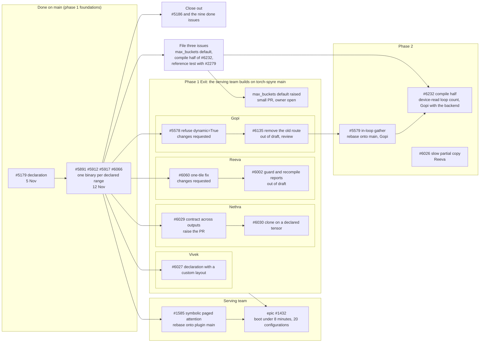

```mermaid
flowchart LR
    subgraph done["Done on main (phase 1 foundations)"]
        A["#5179 declaration<br/>5 Nov"] --> B["#5891 #5912 #5917 #6066<br/>one binary per declared range<br/>12 Nov"]
    end

    B --> C["Close out<br/>#5186 and the nine done issues"]
    B --> D["File three issues<br/>max_buckets default,<br/>compile half of #6232,<br/>reference test with #2279"]

    subgraph p1["Phase 1 Exit: the serving team builds on torch-spyre main"]
        direction LR
        subgraph gopi1["Gopi"]
            G1["#5578 refuse dynamic=True<br/>changes requested"] --> G2["#6135 remove the old route<br/>out of draft, review"]
        end
        subgraph reeva1["Reeva"]
            R1["#6060 one-tile fix<br/>changes requested"] --> R2["#6002 guard and recompile reports<br/>out of draft"]
        end
        subgraph nethra1["Nethra"]
            N1["#6029 contract across outputs<br/>raise the PR"] --> N2["#6030 clone on a declared tensor"]
        end
        subgraph vivek1["Vivek"]
            V1["#6027 declaration with a custom layout"]
        end
            X["max_buckets default raised<br/>small PR, owner open"]
    end

    subgraph serving["Serving team"]
        S1["#1585 symbolic paged attention<br/>rebase onto plugin main"] --> S2["epic #1432<br/>boot under 8 minutes, 20 configurations"]
    end

    subgraph p2["Phase 2"]
        G3["#5579 in-loop gather<br/>rebase onto main, Gopi"] --> G4["#6232 compile half<br/>device-read loop count, Gopi with the backend"]
        R3["#6026 slow partial copy<br/>Reeva"]
    end

    B --> G1
    B --> R1
    B --> N1
    B --> V1
    B --> S1
    D --> X
    D --> G4
    G2 --> G3
    p1 --> S2

```
