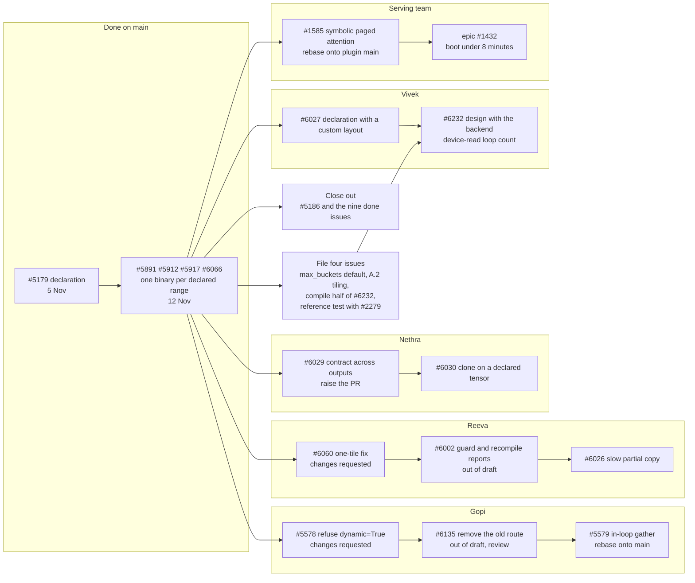

```mermaid
flowchart LR
    subgraph done["Done on main"]
        A["#5179 declaration<br/>5 Nov"] --> B["#5891 #5912 #5917 #6066<br/>one binary per declared range<br/>12 Nov"]
    end

    B --> C["Close out<br/>#5186 and the nine done issues"]
    B --> D["File four issues<br/>max_buckets default, A.2 tiling,<br/>compile half of #6232,<br/>reference test with #2279"]

    subgraph gopi["Gopi"]
        G1["#5578 refuse dynamic=True<br/>changes requested"] --> G2["#6135 remove the old route<br/>out of draft, review"] --> G3["#5579 in-loop gather<br/>rebase onto main"]
    end

    subgraph reeva["Reeva"]
        R1["#6060 one-tile fix<br/>changes requested"] --> R2["#6002 guard and recompile reports<br/>out of draft"] --> R3["#6026 slow partial copy"]
    end

    subgraph nethra["Nethra"]
        N1["#6029 contract across outputs<br/>raise the PR"] --> N2["#6030 clone on a declared tensor"]
    end

    subgraph vivek["Vivek"]
        V1["#6027 declaration with a custom layout"] --> V2["#6232 design with the backend<br/>device-read loop count"]
    end

    subgraph serving["Serving team"]
        S1["#1585 symbolic paged attention<br/>rebase onto plugin main"] --> S2["epic #1432<br/>boot under 8 minutes"]
    end

    B --> G1
    B --> R1
    B --> N1
    B --> V1
    B --> S1
    D --> V2
```
