# Symbolic Shapes: High-Level Design

**Status:** draft for review

**Epic:** [#43](https://github.com/torch-spyre/torch-spyre/issues/43)

## 1. Purpose, scope and terms

### 1.1 What this document decides

How torch-spyre compiles a model once and runs it at many input sizes without recompiling for each size. 

### 1.2 Terms

| Term | Meaning |
|---|---|
| Stick | the hardware's unit of layout, 128 bytes, so 64 elements at fp16. The innermost dimension of a tensor's device layout is measured in sticks |
| SDSC | the static description of one compute step that the backend compiler consumes |
| Bundle | the MLIR program around the SDSC steps. It holds the control flow, including our loop |
| LX | the on-chip scratchpad a tile has to fit into |
| Granularity, G | the step between admissible runtime sizes. The runtime size must be a multiple of it |
| Tile | one fixed-size slice of the varying axis, G wide. Always static |
| Trip count | how many tiles run. This is the only thing that varies |
| Planning extent | the maximum size, used for every geometry and allocation decision |
| `for_each_tile` | the WSR 2.0 higher-order op that expresses a tiled loop in the graph |
| Bridge | our pass that turns a marked dynamic dimension into a `for_each_tile`. This is the main new component |
| Phase 1 | the first delivery, where the varying axis is an outer axis and every tile is independent |
| Phase 2 | the second delivery, where the varying axis is also a reduction axis, which is harder. Section 5 explains the line between them |

## 2. Why this exists

### 2.1 The problem

Shapes that reach a serving backend vary, and they vary a lot. Decoder serving varies every iteration, because continuous batching ([Orca](https://www.usenix.org/conference/osdi22/presentation/yu), now standard through [vLLM](https://arxiv.org/abs/2309.06180)) changes the packed token count on almost every dispatch. Encoder serving varies per request, since query and document lengths differ, and inference servers form variable batches from arriving requests to keep the accelerator busy. [Triton's dynamic batching guide](https://docs.nvidia.com/deeplearning/triton-inference-server/user-guide/docs/tutorials/Conceptual_Guide/Part_2-improving_resource_utilization/README.html) is the standard description of that pattern.

torch-spyre today compiles one binary per exact shape. A cold compile of a large-context model takes about an hour at 32k sequence length, most of it in per-SDSC backend optimisation. Covering k shapes means k full compilations, paid again after every stack upgrade.

### 2.2 How other systems absorb a shape change

One question asked of every technique: when the input size changes at runtime, what actually changes in the system?

| Technique | Where the varying size lives | Programs needed | Wasted compute | When the cost is paid | Used by |
|---|---|---|---|---|---|
| Pad to max | nowhere, every input is made max-sized | 1 | the full gap to max | every dispatch | early serving stacks |
| Bucketing | selects a program per size bucket | one per bucket | the gap to the nearest bucket | up front, one compile per bucket | vLLM and TensorRT-LLM captured graphs, DietCode (MLSys 2022) |
| Shape specialisation | baked into the program body | one per distinct shape | none | a fresh compile on every new shape | torch-spyre today |
| Symbolic codegen | loop bounds and address arithmetic inside the program | 1 | none | small per-op overhead at runtime | [Nimble](https://arxiv.org/abs/2006.03031), [DISC](https://arxiv.org/abs/2103.05288), [torch.compile](https://dl.acm.org/doi/10.1145/3620665.3640366) |
| Bounded dynamic shape | a runtime size value carried beside the tensor | 1 | none in compute, memory held at max | one compile | [XLA on TPU](https://docs.pytorch.org/xla/master/learn/dynamic_shape.html) |
| **This design** | the loop trip count, and nothing else | 1 | up to one granularity | one compile | torch-spyre target |

The last two rows are close relatives. The difference is that a Spyre program must be fully static in both its addresses and its per-step description, so the varying size cannot even reach the address arithmetic. It has to be confined to a loop count.

### 2.3 Who consumes this

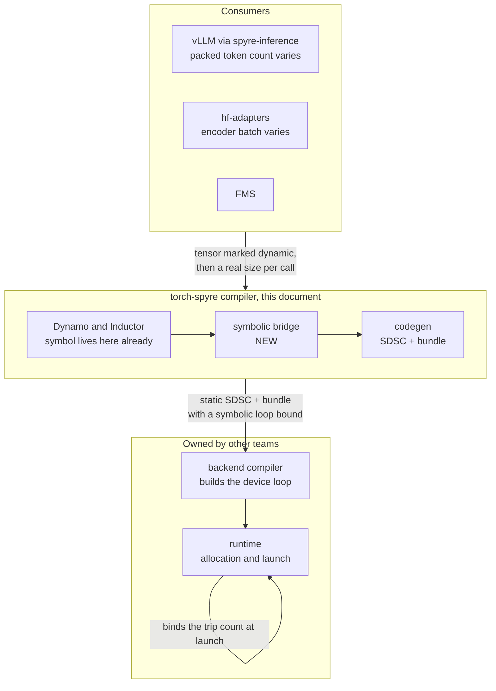

## 3. The core idea

A symbol is cheap only when it lives in a **loop count**. If it reaches an address or a stride, the host rewrites the device program at dispatch, and that correction costs high microseconds per dispatch, per kernel, synchronously.

So the job is to confine the symbol to the trip count.

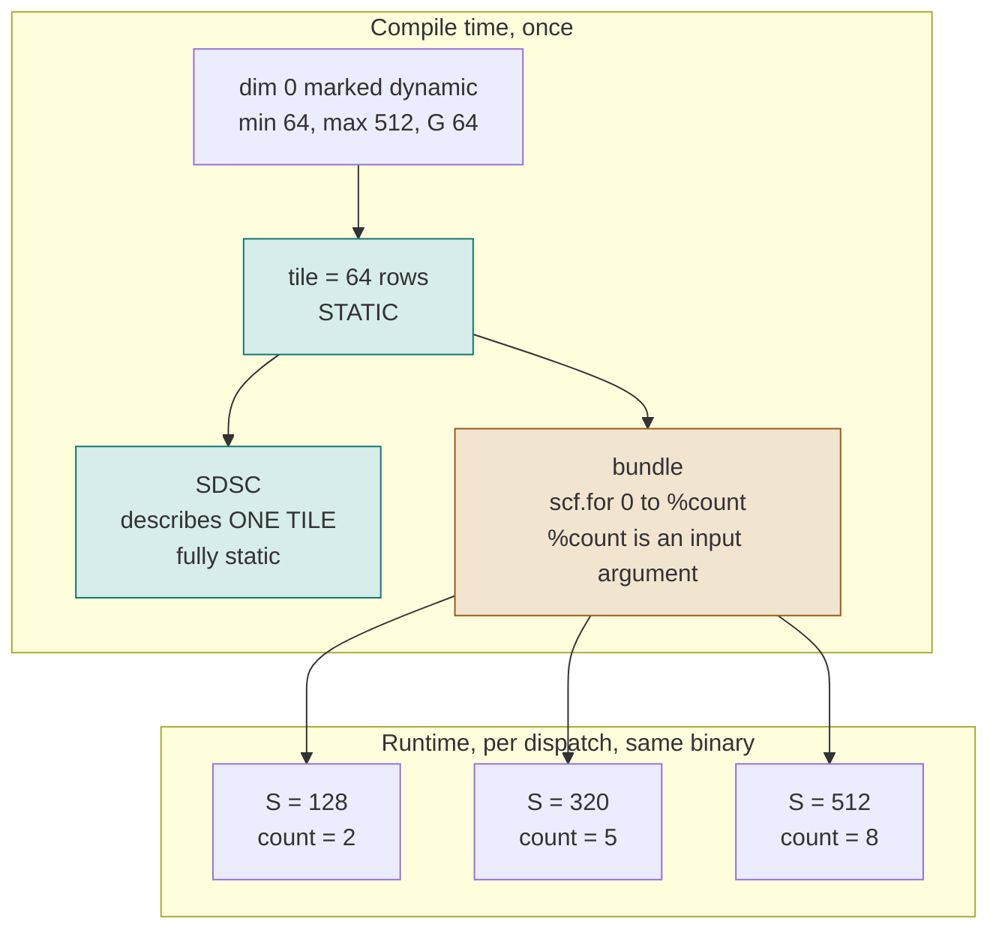

Three consequences, and the rest of the document works them out.

- The tile is static, so the SDSC that describes it is static. Nothing about a tile depends on the runtime size.
- Addresses stay static, because tile `i` sits at `base + i * G * row_stride` and the row stride does not depend on the varying axis.
- Only the trip count changes between dispatches, and it arrives as an argument.

## 4. Reusing PyTorch's symbolic machinery

We do not build a second shape system. A dynamic dimension enters as a PyTorch `SymInt` the moment it is marked and stays a sympy expression the whole way down to our loop count. Everything above codegen is machinery PyTorch already ships and already tests.

| Stage | Mechanism | Whose |
|---|---|---|
| Mark the dimension | the annotation calls `mark_dynamic` underneath, giving a `SymInt` | ours at the surface, PyTorch underneath |
| Capture it | Dynamo records a `sympy.Symbol` | PyTorch |
| Range and guards | `ShapeEnv` holds the min and max and generates the guard | PyTorch, we read it |
| Relate two symbols | `torch._check` on an equality | PyTorch, we call it |
| Carry it through lowering | Inductor's loop-level IR holds ranges as sympy already | Inductor |
| Express the loop | `for_each_tile` reduces to `scan`, which decomposes to the WhileLoop IR | PyTorch higher-order op machinery |
| Keep the count symbolic | `LoopSpec.count` is a sympy expression | our IR, sympy typed |
| Emit the bound | sympy expression to an MLIR input argument | ours, genuinely new |

Only the last row is new work on the symbol itself.

Three consequences follow.

We keep no side-channel annotation. The symbol lives where PyTorch puts it, so there is nothing to keep in sync with the graph and nothing that can drift when a pass rewrites nodes. A private shape table would have been the obvious shortcut and it would have rotted.

We keep no private loop maker. `scan` and the WhileLoop IR preserve loop structure through lowering instead of specialising at a fixed trip count, which is exactly the property this feature needs. When PyTorch improves its symbolic reasoning, its guard handling or its higher-order ops, we inherit that improvement rather than reimplementing it.

And the divergence point is a single, identifiable place. PyTorch is perfectly happy to let a symbol reach an address, because on a CPU or GPU an address is just arithmetic. On Spyre it is not, for the reason in Section 3. So the symbol's journey is identical to any other PyTorch backend right up to codegen, and only there do we insist it lands in a loop bound and nowhere else. Everything upstream of that is stock.

## 5. Scope: which varying axis is supported, and in what order

### 5.1 The question that decides everything: can each tile stand alone

Confining the symbol to a trip count works cleanly only when each tile can be computed on its own. The loop runs tile after tile, and every tile reads its own slice, computes, and writes its own slice. Nothing carries across.

That breaks the moment an operation has to combine values from **different tiles**. A sum along the varying axis is the simple case: tile 0's partial result has to survive into tile 1. Three things then go wrong at once.

- The bundle allows no loop-carried variable, so the running value has to sit in a fixed buffer and be copied every iteration.
- That copy serialises the loop, so the tiles can no longer be spread across cores.
- The number of tiles is symbolic, so anything that needs the true count, like a mean, cannot get it from the geometry. It has to come in as data.

None of that is unsolvable, but it is a different piece of engineering and it carries a performance cost the simple case does not. The line is between "each tile stands alone" and "tiles have to talk to each other".

### 5.2 Phase 1, where the varying axis is an outer axis

The varying axis is outermost and nothing we compile reduces along it. Every tile stands alone, so this is a straight map over tiles.

Driven by two live usecases. Granite decode on vLLM through spyre-inference, where the packed token count at dim 0 changes on nearly every iteration under continuous batching. And encoder dynamic batching on hf-adapters, where the server forms a variable batch from arriving requests, the pattern [Triton](https://docs.nvidia.com/deeplearning/triton-inference-server/user-guide/docs/tutorials/Conceptual_Guide/Part_2-improving_resource_utilization/README.html) documents.

It exercises the whole path, the bridge, the loop production, the SDSC and bundle split, the guards and the launch binding, without any of the cross-tile machinery. If the path does not work here it will not work anywhere.

### 5.3 Phase 2, where the varying axis is a reduction axis

Adds SDPA and the Phase 1 ops on the sequence axis. Sequence length varies per request, and padding it is the dominant waste because attention cost grows with the square of the padded length. [CoRa](https://arxiv.org/abs/2110.10221) measures a 1.6x geomean speedup on a transformer encoder purely from removing that padding.

Technically much deeper. The sequence sits on both axes of the score matrix and on the softmax reduction, so it is a reduction axis and a tiling axis at the same time. Online softmax then carries two running values, not one, and needs a second pass to normalise. The sequence also sits under the batch dimension, so the batch stride depends on it, which brings in the nested allocation question. And the attention decomposition currently divides the sequence by a block size as a plain integer, which has to become symbolic.

## 6. Where a symbol may legally live

A runtime varying value can land in exactly five places, and each has a fixed answer.

| Role | What it means | Status | Why |
|---|---|---|---|
| Outer extent | how many independent pieces of work exist along an axis | **supported, Phase 1** | becomes the loop trip count, the one place a symbol is cheap |
| Reduction extent | how many values fold together into one | **Phase 2** | needs a carry across iterations, a defined pad, and the true length as data |
| Index or table length | the length of an index tensor, or the table it reads | **separate track**, ref [#4382](https://github.com/torch-spyre/torch-spyre/issues/4382) | an index length is an outer extent again, a table length is only a range constraint and needs no loop |
| Innermost stick dimension | the dimension measured in sticks | **deferred, not ruled out** | see below |
| Address or stride component | the value participates in computing where data sits | **ruled out by cost** | see below |

### 6.1 The stick dimension 

With an explicit loop, the varying axis is tiled before anything downstream sees it, so inside the loop body that axis has the fixed extent G. The question is therefore not whether a symbolic dimension can be innermost. It is whether a G-wide tile of the innermost axis lands on stick boundaries. It does, as long as G is a multiple of the elements per stick for the dtype, which is 64 at fp16. That is an alignment condition on the granularity, nothing more.

The backend side is already settled. A dimension that is not outermost in the layout is laid out at its maximum stride, and that rule is written for any dimension, not only for outer ones.

Guards that refuse a symbolic stick dimension belong to the earlier route, where the symbolic dimension stayed inside an operation's iteration space. On the loop route the body's iteration space is a static tile, so they never see a symbol.

The stick axis is out of Phase 1 because our usecases mark the outer axis, not because anything below refuses it.

### 6.2 Symbolic addresses 

The backend does support symbolic addresses. There is an agreed interface for it, and the earlier design went that way, ref [#2289](https://github.com/torch-spyre/torch-spyre/issues/2289). The front end would emit either per-core symbolic start addresses or one base symbol plus formulas for the backend to evaluate.

We are not taking it, for one measured reason. Passing symbols to the execute node puts every dispatch on the host program correction path, which rewrites the binary before each launch at high microseconds per dispatch, per kernel, synchronously. That cost is paid on every call forever, and it is larger than the recompile cost we are trying to remove. Section 17 records this as a rejected alternative rather than an open question.

## 7. The contract

### 7.1 What this design depends on

| Dependency | Owner |
|---|---|
| The dynamic tensor's HBM buffer has capacity for the declared maximum | runtime |
| A dimension that is not outermost in the device layout is laid out at max stride | runtime |
| The device loop takes its bound from an input argument | backend compiler |
| The size supplied at dispatch is within range and a multiple of the granularity | consumer |

Core division is not on that list. Work division operates on the loop body, which is a static tile, so it divides a fixed extent across cores exactly as it does for a static kernel.

### 7.2 The invariants

| # | Invariant | What breaks if violated |
|---|---|---|
| 1 | No symbol reaches an address, a stride, or the execute node's symbol list | the correction path is gated on that list, so every dispatch pays high microseconds |
| 2 | **The SDSC describes one tile and is fully static** | the tile is the loop body, so its geometry is the tile size. The maximum belongs in the bundle argument and in the HBM layout, not in the SDSC |
| 3 | The runtime size is within range and a multiple of the granularity | the tile count floor silently drops the tail and the answer is quietly wrong |
| 4 | One symbolic count per kernel per nesting level | two independently marked operands give two symbols and two counts, which cannot be launched |
| 5 | The caller reads only the real extent of the output | the buffer has capacity for the maximum, so anything past the real extent is whatever was in HBM |
| 6 | A tail that will be read holds the reduction's identity, or is removed by a select | multiplying by a 0/1 mask does not clean it, because NaN times zero is still NaN |

On invariant 2, the earlier symbolic-SDSC route did the opposite: the symbolic dimension stayed inside one op's iteration space and the SDSC was emitted at the maximum. With an explicit loop the body op is tile-sized, so nothing symbolic reaches the SDSC.

### 7.3 The user-facing interface

```python
x = x.to("spyre", dynamic={0: dict(min=32, max=576, granularity=32)})
compiled = torch.compile(model, dynamic=None)
```

`min` and `max` are the range the guard enforces. `granularity` is the step between admissible sizes. If `granularity` is omitted it defaults to `min`, which keeps older call sites working.

`min` and `granularity` are kept separate because one is a range bound and the other is a step. Conflating them means the API has to change the day a model wants a fine step near the bottom of the range and a coarse one at the top. With granularity named, that later change is a list of these same dicts and nothing downstream moves. It also reads correctly to an integrator in hf-adapters or spyre-inference, who should not have to know that `min` secretly controls tiling.

Rules. `max` must be a multiple of `granularity`. `min` must be at least 2, since PyTorch specialises sizes 0 and 1. Phase 1 marks the outer axis, dim 0. Weights are never marked, they do not vary and a symbol on the weight side lands in a stride or a contraction axis. `dynamic` stays `None` on `torch.compile`, because `True` would mark every dimension including the stick dimension.

### 7.4 The machine-facing interfaces

| Interface | Carries | Direction |
|---|---|---|
| Bundle `input_arg` | `granularity` and `max_value` for the symbol, read as the loop bound | us to the backend |
| SDSC | one tile, fully static geometry | us to the backend |
| `sdsc_execute` symbol list | stays empty, see invariant 1 | us to the backend |
| Launch | the trip count bound into an argument slot | runtime, per dispatch |

The single source of truth for granularity and max is the bundle input argument. The backend has confirmed it will derive the SDSC-side values from there rather than requiring us to fill them twice.

## 8. WSR 2.0, and where the symbolic bridge sits

### 8.1 What `for_each_tile` is

WSR 2.0 replaced the WSR 1.0 tiling pass with an explicit construct in the graph. Epic ref [#3965](https://github.com/torch-spyre/torch-spyre/issues/3965).

```python
for_each_tile(body, operands, *, dims, tile_size, init=None, out_dim=None, reverse=False)
```

`body` is `(carry, tiles) -> (next_carry, out_tile)`. It receives tiles that are **already carved**, and it must not slice, because a data-dependent slice does not trace.

Each operand gets a spec in `dims`, and that picks its kind.

| `dims` entry | Kind | Behaviour per step |
|---|---|---|
| `int d` | SLICE | a `tile_size`-wide contiguous view along `d` |
| `None` | INVARIANT | the whole operand, every step, not tiled |
| `Gather(axis, index)` | GATHER | one pool row per step, chosen by the index table |

And there are exactly two modes, picked by which keyword is set.

| Mode | Set | Not set | Meaning |
|---|---|---|---|
| **Map** | `out_dim=d` | `init` | step `i` writes its tile at offset `i * tile_size` along `d`. Tiles are independent |
| **Reduction** | `init=...` | `out_dim` | tiles fold into a carry. Tiles are not independent |

Setting neither is an error. The trip count is derived, not passed: `shape[dim] // tile_size` for each sliced operand, and all operands must agree on it.

### 8.2 How it becomes a device loop

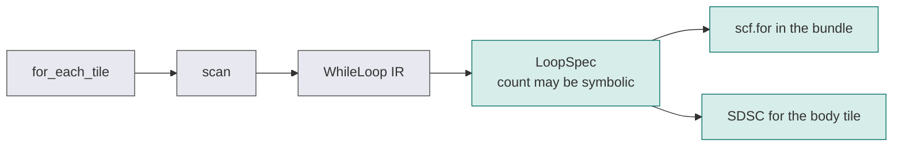

The first three boxes are existing PyTorch machinery. `scan` is a standard higher-order op and the WhileLoop IR already ships with PyTorch. Both WSR 1.0 and 2.0 land on the same `LoopSpec` and the same `scf.for`, so nothing is renegotiated with the backend by this change.

### 8.3 The bridge, which is the new component

**The user never writes a `for_each_tile`.** Requiring model authors to restructure their code would kill portability, and a stock BERT or Granite would stop being stock.

The piece that turns a marked dynamic dimension into a tiled loop is the bridge, and it is the main new component of this design. Ref [#4379](https://github.com/torch-spyre/torch-spyre/issues/4379), prototype in [PR #4136](https://github.com/torch-spyre/torch-spyre/pull/4136).

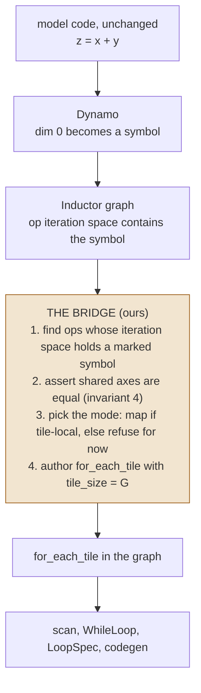

#### What triggers it

Nothing in the model. The trigger comes from the annotation. When a tensor is moved to the device with a dynamic dimension declared, that dimension is marked underneath and Dynamo records it as a symbol with a finite range in the shape environment. A finite range is the signal: a dimension that went dynamic by accident, because Dynamo promoted an integer on a retrace, has no finite maximum and is deliberately left alone.

So the bridge runs inside our compile path, after Inductor has lowered the graph, and it only does anything when at least one marked symbol is present. A fully static model compiles exactly as it does today and never touches this code.

#### What it does, in order

| Step | Action | Why |
|---|---|---|
| 1 | find the operations whose iteration space contains a marked symbol | these are the only ones that need a loop |
| 2 | emit an equality check for every pair of operands that share the varying axis | without it two operands give two symbols and two trip counts, invariant 4 |
| 3 | decide the mode per operation, map if every read stays inside its own tile, otherwise refuse for now | the coverage decision of Section 14, made once and in one place |
| 4 | author the `for_each_tile` with `tile_size` set to the granularity, `dims` set per operand kind, and `out_dim` for map mode | it then lowers through existing machinery |

Step 3 is a single decision point, so when reduction mode lands it becomes a second branch at the same place rather than a second path through the compiler.

#### What it does not do

It does not rewrite model code, it does not require the model to import anything, and it does not run for static shapes. Hand-written `for_each_tile` stays available as a compiler-side escape hatch, the way the attention decomposition uses it today, but it is not a user-facing API.

### 8.4 Working alongside the WSR 2.0 effort

Two contact points stay live. The nesting work and the attention rework both touch the metadata used to carry backend hints, so its replacement needs agreeing, ref [#4551](https://github.com/torch-spyre/torch-spyre/issues/4551). Robustness work on the `for_each_tile` and WhileLoop infrastructure is in flight, ref [PR #4751](https://github.com/torch-spyre/torch-spyre/pull/4751).

## 9. Worked examples

Same setup throughout. Dim 0 varies between 64 and 512 with a granularity of 64, so the tile is 64 rows and the trip count is `S // 64`, between 1 and 8.

```python
x = x.to("spyre", dynamic={0: dict(min=64, max=512, granularity=64)})
```

### 9.1 Add, both operands dynamic

```python
z = x + y            # x, y are (S, 1024)
```

What the bridge authors:

```python
torch._check(x.size(0) == y.size(0))          # invariant 4, see Appendix A

_, z = for_each_tile(
    lambda carry, tiles: (None, tiles[0] + tiles[1]),
    (x, y),
    dims=(0, 0),                              # both SLICE on dim 0
    tile_size=64,                             # G
    out_dim=0,                                # MAP mode
)
```

**Mode: map.** `out_dim` is set and `init` is not, so each step writes its own 64-row slice and nothing carries. Trip count `S // 64`, derived from either operand since the check forced them equal.

Without that `torch._check`, marking `x` and `y` separately gives two different symbols, so two trip counts, and the kernel cannot launch.

### 9.2 Multiply by a weight vector

```python
z = x * w            # x is (S, 1024) dynamic, w is (1024,) static
```

```python
_, z = for_each_tile(
    lambda carry, tiles: (None, tiles[0] * tiles[1]),
    (x, w),
    dims=(0, None),                           # x SLICE, w INVARIANT
    tile_size=64,
    out_dim=0,                                # MAP mode
)
```

**Mode: map.** The interesting part is `dims`. `w` gets `None`, so it is INVARIANT: staged once and handed to every step whole, never tiled and never re-staged. Only `x` walks the loop, so only `x` contributes a trip count.

### 9.3 Multiply-accumulate, which is a linear layer

```python
y = x @ W            # x is (S, 1024) dynamic, W is (1024, 512) static
```

```python
_, y = for_each_tile(
    lambda carry, tiles: (None, tiles[0] @ tiles[1]),
    (x, W),
    dims=(0, None),                           # x SLICE, W INVARIANT
    tile_size=64,
    out_dim=0,                                # MAP mode
)
```

**Mode: map, even though this accumulates.** Look at which axis the accumulation runs on.

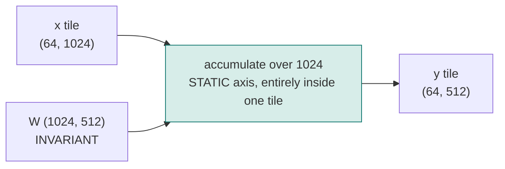

The contraction is over 1024, which is static and sits wholly inside one tile. The varying axis S is only the outer axis. So each step produces its own 64 rows and never looks at another step's data. No carry, `init` stays `None`, map mode.

The rule in one line: **multiply-accumulate is fine as long as the accumulation axis is not the varying one.**

### 9.4 Sum along the varying axis, which is Phase 2

```python
total = x.sum(dim=0)          # reduce ALONG the varying axis
```

```python
total, _ = for_each_tile(
    lambda carry, tiles: (carry + tiles[0].sum(0), None),
    (x,),
    dims=(0,),
    tile_size=64,
    init=torch.zeros(1024),                   # REDUCTION mode
)
```

**Mode: reduction.** `init` is set and `out_dim` is not, so the body returns a carry instead of a tile.

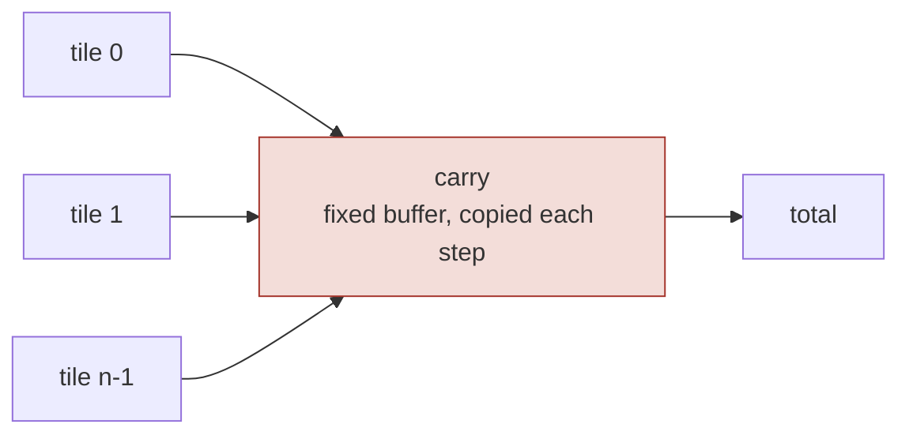

The construct expresses it fine. The cost is what makes it Phase 2: the carry cannot be a loop variable in the bundle so it rides a fixed buffer with a copy per step, that copy serialises the loop and gives up core parallelism, and `mean` would additionally need the true count, which has to arrive as data. Refs [#3062](https://github.com/torch-spyre/torch-spyre/issues/3062) and [#3063](https://github.com/torch-spyre/torch-spyre/issues/3063).

### 9.5 A small network end to end

```python
h = torch.relu(x @ W1 + b1)                   # (S,1024) -> (S,512)
y = torch.softmax(h @ W2 + b2, dim=-1)        # (S,512)  -> (S,10)
```

| Step | Role of the varying axis | Mode | `dims` | Trip count |
|---|---|---|---|---|
| `x @ W1` | outer | map | `(0, None)` | S/64 |
| `+ b1`, `relu` | outer | map | `(0, None)` | S/64 |
| `h @ W2` | outer | map | `(0, None)` | S/64 |
| `softmax(dim=-1)` | not involved, reduces over 10 | map | `(0,)` | S/64 |

Every kernel gets the same trip count, resolved once per dispatch from the same runtime size, so they agree by construction. Softmax is safe here because it normalises over the last axis, which is static. Point the same softmax at the varying axis and it becomes Section 9.4.

## 10. Compile time and runtime

### 10.1 Compile time

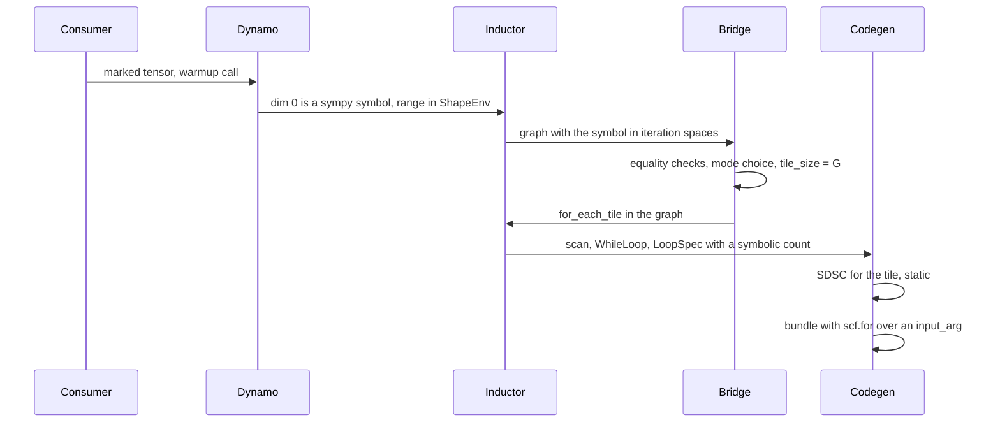

### 10.2 Runtime

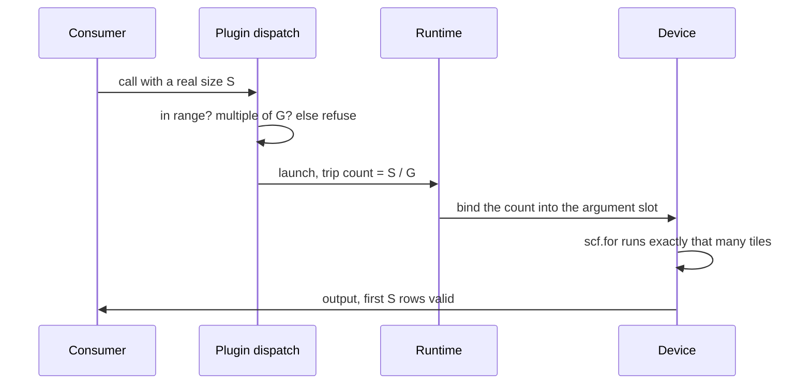

No compile happens on this path.

### 10.3 The IR objects

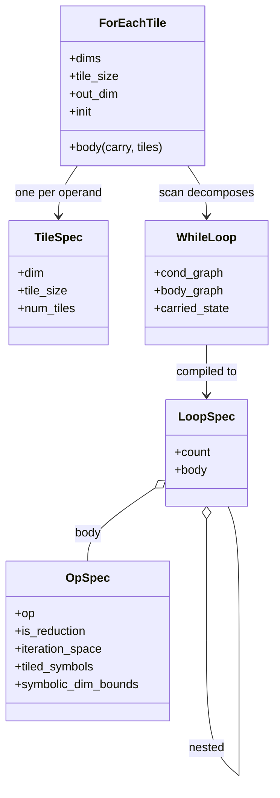
- The loop count is per nesting level, and each level is independently a constant or a symbol. That is already the shape the nested case needs.
- The WhileLoop carried state cannot survive into the bundle, `scf.for` allows none. The carry goes to a fixed buffer moved with copies, which is what Section 9.4 pays for.
- The op spec keeps the symbolic bounds as metadata, the max and granularity per symbol, which is what fills the bundle argument.

### 10.4 The symbol's names along the way

The same value has a different name at every stage.

| Stage | Called | Concrete or symbolic |
|---|---|---|
| User annotation | min, max, granularity | concrete |
| Dynamo | the dimension symbol, range in ShapeEnv | symbolic |
| Inductor | a range expression | symbolic |
| `for_each_tile` | tile extent and tile count | extent static, count symbolic |
| LoopSpec | `count` | symbolic |
| SDSC | tile geometry | concrete, and the max never appears |
| Bundle | `input_arg` with granularity and max, read as the loop bound | symbolic until launch |
| Launch | the bound value in an argument slot | concrete |

## 11. Tiling, granularity and allocation

### 11.1 One granularity for now

The first release uses a single granularity, taken straight from the annotation.

```python
x = x.to("spyre", dynamic={0: dict(min=64, max=512, granularity=64)})
```

One granularity over the whole range, so the tile is 64 rows and any admissible size is a multiple of 64.

Real serving traffic is rarely uniform, though. Sizes often cluster low and thin out high, so a fine step is worth it at the bottom of the range and wasteful at the top. That is what bands are, and the annotation already expresses them as a list of the same dicts.

```python
x = x.to("spyre", dynamic={0: [
    dict(min=64,   max=512,  granularity=64),    # band A, tile 64
    dict(min=512,  max=4096, granularity=256),   # band B, tile 256
]})
```

Two bands means two tile sizes, and the tile size is baked into the SDSC, so every kernel touching the varying axis is compiled twice. N bands is N binaries per kernel. Cold compile time multiplies by N, which is why this is not in the first release: cold compile time is the cost the whole project exists to reduce, so spending it back needs the parallel backend invocation work first.

Dispatch with bands is two steps instead of one. Find the band the size falls in, then check the multiple against that band's granularity. Size 704 shows why both steps are needed. It is inside the global range, and it divides 64, but it falls in band B whose granularity is 256, so it is refused. A single global divisibility check would have let it through.

Everything below the dispatcher is band blind. Each band is an ordinary compiled artifact with a static tile, so nothing in the bridge, the bundle, the backend contract or the runtime changes. Bands cost compile time and program memory, not design.

Choosing a granularity automatically, rather than taking the one the user gave, is a separate optimisation and is covered in Section 13.

The one constraint on G that is live today is the alignment condition of Section 6.1, and it only applies if the stick axis is ever marked.

### 11.2 Why the addresses stay static

Tile `i` sits at `base + i * G * row_stride`, and the row stride does not depend on the varying axis. So every tile address is a compile-time constant and a smaller runtime size does not move anything, it only makes fewer tiles live.

There is a useful distinction the backend guidance draws, and it changes how much memory we hold.

| The varying dim is | Layout requirement | Memory effect |
|---|---|---|
| Outermost in the device layout, the Phase 1 case | nothing strides over it, so no sparse layout is needed. The buffer only needs capacity for the max | data stays dense, no holes |
| An inner dimension, the Phase 2 nested case | every stride above it is computed from its max, so the tensor is stored sparsely at max stride | real holes in HBM, the tensor occupies its max size |

For Phase 1 this means the buffer is sized for the largest batch we might see, but the data in it is contiguous and there are no gaps. It is capacity, not waste. The nested sequence case is the one that genuinely pays, and that is a runtime allocation question, ref [#2434](https://github.com/torch-spyre/torch-spyre/issues/2434).

### 11.3 The tail, and what the caller may read

We do not pad. The caller hands us a size that is already a multiple of the granularity, so the tiles are exact and no partial tile exists.

What does exist is unused buffer. The output has capacity for the maximum, so after a dispatch at a smaller size the rows past the real extent hold whatever was there before.

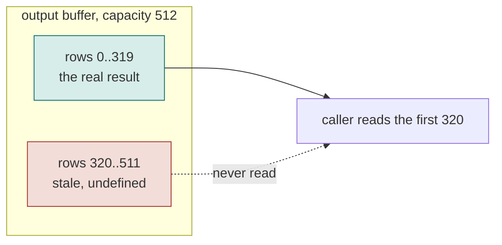

Phase 1 is correct under one condition, that nothing reads those rows. Inside the graph no op does, because every op reads only its own tile. Outside, the caller reads the extent it asked for.

Phase 2 is where this stops being free. Once something reduces along the varying axis, invariant 6 applies: the region has to hold the reduction's identity, or be removed with a select. Not multiplied by a mask, because an uninitialised region can hold a NaN bit pattern and NaN times zero is still NaN. [GSPMD](https://arxiv.org/abs/2105.04663) reaches the same conclusion from production experience.

## 12. Guards and graceful exit

A caller will eventually send a size we cannot serve. What happens then decides whether this is usable in production.

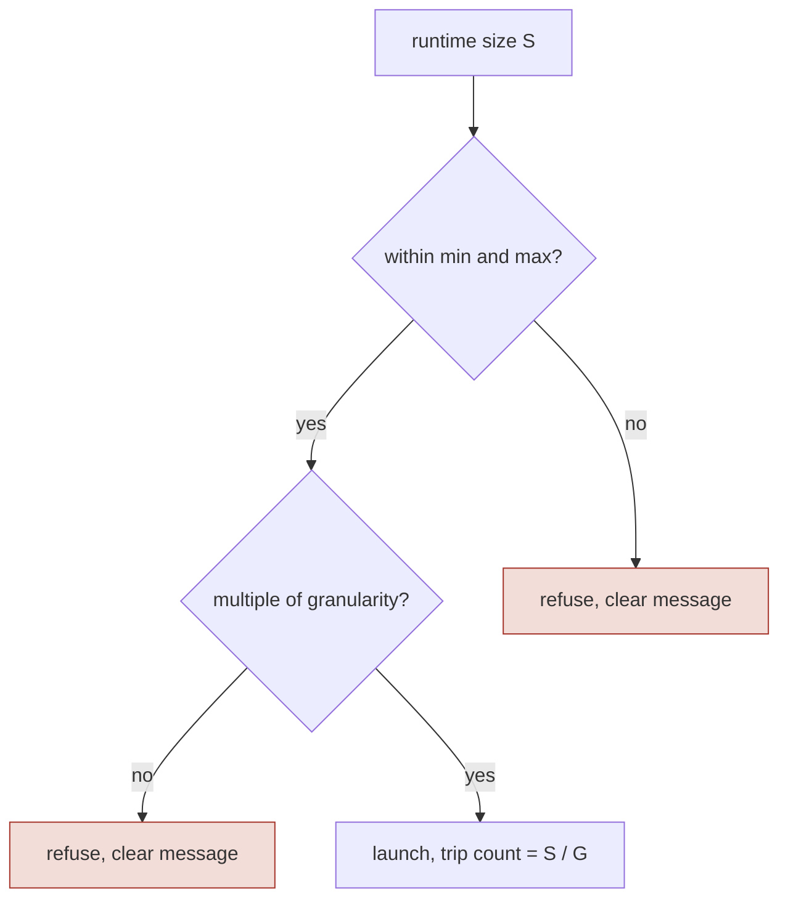

**We do not pad.** A size that is not a multiple of the granularity is refused, with a message naming the size, the granularity and the nearest admissible values. Padding on our side would mean silently changing the caller's data and then silently trimming it back, and the caller is the only party that knows whether a padded row is meaningful. The consumer already pads, because it had to pad for the static path too.

Dynamo holds the range guard and we do not duplicate it. Two PyTorch behaviours limit how far we lean on it. The minimum is not reliably enforced today, so we re-check it. And when a frame exceeds the recompile limit PyTorch marks it skipped and discards every compiled entry for it permanently, which would take the model off the device path entirely. So the design never uses recompilation as a fallback.

The divisibility check has to be ours in any case. A size can sit inside the declared range, look perfectly reasonable, and still not be a multiple of the granularity. Only a check that knows G catches it.

For a graceful stop the public API is the compiler stance that fails on recompile. The stance that falls back to eager must never be used, because eager on this device means off the device path, a silent performance collapse rather than an error. Ticket ref [#4384](https://github.com/torch-spyre/torch-spyre/issues/4384), replacing the raw ConstraintViolationError of [#3005](https://github.com/torch-spyre/torch-spyre/issues/3005).

## 13. Optimisations [ In scope after functional enablement ] 

None of these are needed for the feature to work. They are listed so the first release is not accidentally scoped to include them, and so the follow-on work is visible.

**Choosing the granularity automatically.** The user gives one granularity and we use it. A cost model could instead pick a smaller execution granularity that fits the LX scratchpad better, trading more loop iterations for a tile that fits with room to double buffer. The design exists and is filed as ref [#4381](https://github.com/torch-spyre/torch-spyre/issues/4381). The rule it has to hold when it lands is that the execution granularity divides the contract granularity, so every tile stays full and the user-facing contract does not move. It is not on the critical path and nothing in the first release waits for it.

**More than one granularity over the range.** A model may want a fine step at small sizes and a coarse one at large sizes. The annotation already accepts this shape, since a list of the same range dicts expresses it. The cost is that each granularity is a separate binary for every kernel touching the varying axis, so cold compile time multiplies. Parallelising the per-SDSC backend invocations is a prerequisite before this is worth turning on.

**Keeping static weights resident.** In map mode an invariant operand is handed to every step. It should be staged once and kept resident across iterations rather than re-staged per step. This is a real device-time saving and it currently has no ticket.

**Measuring the device-time cost of a range.** A kernel compiled for a range cannot make shape-specific tiling or residency choices, so some regression against a static kernel at a single shape is expected. Measure it per op class, and use that to decide where the cost model earns its compile time.

## 14. Op and model coverage

An op is safe under a symbolic count when it reads only inside its own tile along the varying axis. That is the whole rule, and it is exactly the map versus reduction mode question from Section 8.1.

| Op class | Along the varying axis | Verdict |
|---|---|---|
| Pointwise, for example gelu, add, multiply | reads only its own element | Phase 1 |
| Reduction across the other axes, for example mean over hidden per row | the varying axis survives into the output | Phase 1 |
| Matmul where the varying axis is the outer axis | contraction is over a static axis | Phase 1 |
| Layer norm over the hidden axis | the normalised axis is static | Phase 1 |
| Elementwise with two independently marked operands | two symbols, two counts | needs the equality assertion of invariant 4 |
| Reduction along the varying axis, for example sum or max over it | folds the tail into the answer | Phase 2 |
| Mean along the varying axis | also needs the true count, which is data and not geometry | Phase 2 |
| Softmax or layer norm over the varying axis | a reduction along it, and softmax needs two carried values | Phase 2 |
| Matmul where the varying axis is the contraction axis | a reduction by another name | Phase 2 |
| Gather or scatter under a symbolic count | the addresses come from data | separate track, issue #4382 |
### 14.1 BERT, checked op by op

| Op | Reduces over | Touches the batch axis? |
|---|---|---|
| embedding lookup | nothing, it is a gather | no |
| layer norm | hidden | no |
| attention scores | head dim | no |
| softmax | key sequence | no |
| attention times V | sequence | no |
| feed forward | hidden | no |
| pooling head | sequence | no |

Mean and max do appear in BERT, but over hidden and over sequence. **Not one reduction runs over the batch axis.** That is why dynamic batch is the clean case. Mark batch dynamic and every reduction in the model is happening on a static axis inside a tile, so map mode covers the whole model. Mark sequence instead and softmax, the value product and the pooling mean all land on the varying axis at once.

The model already handles its own padding the right way. It does not multiply scores by a 0/1 mask, it adds a large negative number to padded positions before softmax so they vanish after the exponent. And mean pooling divides by the sum of the mask, not by the padded length. That is invariant 6, arrived at independently by the model authors.

### 14.2 The three attention shapes

- Paged attention on vLLM is a registered custom op, so it is an opaque boundary. The varying token count crosses it and we never compile inside. This is why decode works in Phase 1.
- Encoder attention on hf-adapters is in graph, already flash style with an online softmax over fixed-width KV tiles. A symbolic sequence has to tile through both axes, and the decomposition currently divides the sequence by a block size as a plain int. This is the core of Phase 2.
- Static dense decode recompiles per cache position and is not a target of this work.

### 14.3 Indirect access

Gather and scatter are a separate track, ref [#4382](https://github.com/torch-spyre/torch-spyre/issues/4382) under epic [#866](https://github.com/torch-spyre/torch-spyre/issues/866). Two shapes: a symbolic dim on the value tensor is only a range constraint on the index values, and a symbolic dim on the index tensor is a dimension symbol with no tiled loop.

One finding worth carrying, from ref [#4581](https://github.com/torch-spyre/torch-spyre/issues/4581): a `for_each_tile` per-iteration tile index and a gather index already flow through the **same** `indirect_sizes` mechanism in codegen. So this is not new plumbing, it is making a shared path symbol-safe. Reproducers already exist, refs [#4346](https://github.com/torch-spyre/torch-spyre/issues/4346), [#4638](https://github.com/torch-spyre/torch-spyre/issues/4638), [#4304](https://github.com/torch-spyre/torch-spyre/issues/4304), and all three are one bug: something calls `int()` on a symbol on the indirect path.

## 15. Integrating with spyre-inference and hf-adapters

Both consumers already pad an input up to a chosen size and already track the real length separately from the padded one, which is the structure this design needs. Integration is mostly replacing a list of sizes with a range.

### 15.1 What changes on the consumer side

| Today | With symbolic shapes |
|---|---|
| a list of buckets, chosen up front | one range with a granularity |
| pad the input up to the nearest bucket | pad the input up to the next multiple of the granularity |
| pick the binary matching that bucket | one binary, the trip count is computed from the size |
| one compile per bucket during warmup | one compile for the whole range |
| a new size outside every bucket is a failure or a fresh compile | a new size inside the range is free, outside it is a clear refusal |

The padding code does not go away, and neither does the logic that remembers the real length. Both stay, they just work against a granularity instead of a bucket table.

### 15.2 The contract you have to hold

Four things, and all four are checkable before a call reaches the device.

- The size is within the declared min and max.
- The size is a multiple of the declared granularity. We check this and refuse, we do not pad on your behalf, for the reason in Section 12.
- You read only the real extent of the output. The buffer has capacity for the maximum, so rows beyond the real extent are stale, not zero.
- Weights are never marked dynamic.

### 15.3 spyre-inference and vLLM

The varying axis is the packed token count at dim 0 of the decoder input, which changes on nearly every iteration under continuous batching.

The pieces you already have map directly. `SpyreAttnBucketer` holds `query_buckets`, `kv_buckets`, `num_seqs_buckets` and `num_blocks_buckets`, and `min_real_query_len(padded_query_len)` already answers "how much of this padded tensor is real". That method is the real-extent tracking this design depends on, so it stays. The change is that the axis being made symbolic stops needing a bucket list at all, while the other axes can keep theirs.

A staged migration works. Make one axis symbolic first, keep the rest bucketed, and compare. Nothing in the design requires all axes to move together.

Paged attention is a registered custom op, so it is an opaque boundary to the compiler. The varying token count crosses it and we never compile inside it. This is the reason the decode path is in the first phase at all, and it means the attention backend needs no change for this feature.

### 15.4 hf-adapters

The varying axis is the batch at dim 0, formed from whatever requests arrived.

`assert_spyre_dimensions` in `hf_common.py` already validates that dimensions are stick multiples and raises a readable error when they are not. A granularity check is the same shape of validation, aimed at a different number, so it belongs next to that one rather than somewhere new. `AutoSpyreModelForCausalLM.from_pretrained` and its siblings are the natural place to surface the declaration, so a caller states the range once when the model is loaded rather than on every call.

The encoder sequence axis is the harder one and is the second phase, because in-graph attention reduces along it. Batch first, sequence later.

### 15.5 What does not change

Model code is untouched. Nobody writes a `for_each_tile` and nobody imports anything from the compiler, per Section 8.3. Weight loading is untouched. Custom ops stay opaque. And a model with no declared dynamic dimension compiles exactly as it does today, on exactly the same path.

### 15.6 Sizing, and one caution

For the batch and token-count axis the buffer needs capacity for the declared maximum, but the data inside it is dense, so this is the same number you already use when choosing your largest bucket. It is capacity, not per-tensor waste. Section 11.2 has the detail and the case where it does cost more.

The caution is that a generous maximum is not free. Declaring a much larger max than you will really serve reserves memory you could have spent on KV cache. Activation memory is not currently accounted for on the vLLM path, so an over-commitment shows up as a crash rather than as a clean out-of-memory error. Pick the max from what you will actually admit.

## 16. Non front end compiler work

### 16.1 Runtime: allocation

The dynamic tensor's buffer needs capacity for the declared maximum, and for an inner symbolic dimension the layout has to be at max stride. Section 11.2 has the distinction. Ref [#2434](https://github.com/torch-spyre/torch-spyre/issues/2434).

### 16.2 Runtime: dispatch and launch

At dispatch the runtime binds base addresses and one loop scalar into the argument slots. Ref [#221](https://github.com/torch-spyre/torch-spyre/issues/221).

### 16.3 Backend: the device loop

The distinction the host makes at dispatch is the whole game.

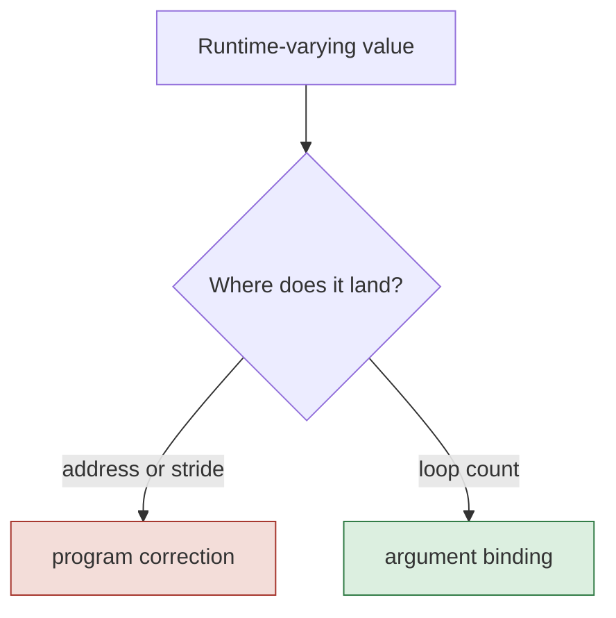

Argument binding fills a value into a slot the program reads at launch, and the body is untouched. Program correction re-derives a value baked into the body and rewrites the binary, at high microseconds per dispatch. Keeping the symbol in the loop count is what keeps us on the first path.

Two facts hold the contract together. The execute node keeps its symbol list empty, because the correction path is gated exactly on that list. And addresses carry no symbols.

One detail is still open and it is small. The bound can arrive as the size with a step of G, or as a precomputed count with a step of one. The WhileLoop iterates a tile index against a ready count, which leans to the second. Either works. The golden example will pin it and then both sides build to that.

Backend loop support is already tracked on the backend side: a parent issue with children for a fixed bound, for looping by repeating programs, and for a **symbolic bound by program looping**, which is the one matching this design and is unassigned. Our ask, ref [#4397](https://github.com/torch-spyre/torch-spyre/issues/4397), describes the same capability from the torch-spyre side plus a request for an example bundle and SDSC pair. The two should be reconciled before the next backend conversation, and ours likely folds into it.

That example is the hard dependency for emission, ref [#4380](https://github.com/torch-spyre/torch-spyre/issues/4380). Until it lands, symbolic emission stays behind a clear not-supported error.

## 17. Alternatives considered and rejected

| Alternative | Why not |
|---|---|
| Symbolic addresses in the SDSC | the backend supports it and an interface exists, ref [#2289](https://github.com/torch-spyre/torch-spyre/issues/2289). But it puts every dispatch on the host correction path at high microseconds per kernel, forever. That is worse than the recompile cost we are removing |
| Bucketing, a binary per size band | multiplies cold compile time and binary count, and still pads. It is the thing this design replaces, not a fallback |
| Specialising the trip count to an integer and compiling a variant per count | works on today's backend with no new support, and is implemented in [PR #4684](https://github.com/torch-spyre/torch-spyre/pull/4684). But it compiles on the dispatch path, the binary count grows with distinct shapes, and it declines map mode with stacked outputs by name, which is our dynamic batch case. It is shape specialisation with extra steps, so it does not reach the goal of one binary for a range |
| Making the granularity structural in the reshape | does not work. Every reshape spelling produces the same divided expression, see Appendix A |
| Requiring model authors to write `for_each_tile` | breaks portability. A stock model would stop being stock |

The PR #4684 work is still useful to us. It splits the planning extent from the runtime count, which is our invariant implemented, and that part is shared regardless of how the count is finally realised.

## 18. Delivery plan

Ordered by dependency. Stage 1 is the only stage where nothing is usable until every part of it exists.

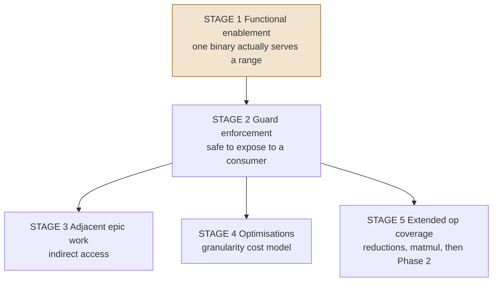

### 18.1 Stage 1, functional enablement

Four parties have to deliver for one binary to serve a range, and until all four are in place none of them delivers any value on its own. This is the gate for the whole project.

| Who | What has to be true | Ticket |
|---|---|---|
| Compiler, us | the bridge turns a marked dimension into a tiled loop, and the emitted bundle carries a symbolic loop bound over a static per-tile SDSC | [#4379](https://github.com/torch-spyre/torch-spyre/issues/4379), [#4380](https://github.com/torch-spyre/torch-spyre/issues/4380) |
| Runtime, allocation | the dynamic tensor's HBM buffer is allocated correctly for the declared maximum, with the right layout | [#2434](https://github.com/torch-spyre/torch-spyre/issues/2434) |
| Runtime, dispatch | the launch passes the correct trip count into the argument slot for that call | [#221](https://github.com/torch-spyre/torch-spyre/issues/221) |
| Backend compiler | a loop whose bound comes from an input argument is accepted and executed | [#4397](https://github.com/torch-spyre/torch-spyre/issues/4397), reconciled with the backend issue |

The compiler side builds and proves offline against the abstract contract, so work does not stall while the backend piece is pending. What cannot be closed offline is the end to end proof, and Section 19 says why a numerical match is not enough evidence.

### 18.2 Stage 2, guard enforcement

Stage 1 makes it work. Stage 2 makes it safe to hand to a consumer, which means an out-of-range or misaligned size produces a clear refusal instead of a crash, a wrong answer, or a permanently skipped frame. Ref [#4384](https://github.com/torch-spyre/torch-spyre/issues/4384), closing [#3005](https://github.com/torch-spyre/torch-spyre/issues/3005).

Nothing should be exposed to vLLM or hf-adapters before this lands.

### 18.3 Stage 3, adjacent epic work

Indirect access, ref [#4382](https://github.com/torch-spyre/torch-spyre/issues/4382) under epic [#866](https://github.com/torch-spyre/torch-spyre/issues/866). Symbolic shapes owns how many iterations run, indirect access owns where each iteration reads, and a symbolic-count loop over an indirect body is a valid combination. Section 14.3 has the concrete starting point, since reproducers are already filed.

MoE is where the two meet, since a per-expert token count is a symbolic loop count whose source is routing rather than an input shape. Keeping the count source-agnostic is what keeps that door open. [MegaBlocks](https://arxiv.org/abs/2211.15841) reports up to 4.35x from removing the expert-capacity padding this would remove. Ref [#3565](https://github.com/torch-spyre/torch-spyre/issues/3565).

### 18.4 Stage 4, optimisations

Section 13. The granularity cost model, ref [#4381](https://github.com/torch-spyre/torch-spyre/issues/4381), more than one granularity over the range, and weight residency. All of these improve a working feature and none of them is required for it to work.

### 18.5 Stage 5, extended op coverage

Reductions and matmul on the varying axis, refs [#3062](https://github.com/torch-spyre/torch-spyre/issues/3062) to [#3065](https://github.com/torch-spyre/torch-spyre/issues/3065), re-scoped from the old address framing to the loop-count route. This is the first real use of reduction mode and the point where the tail rules of Section 11.3 start to bite. Phase 2, dynamic sequence and SDPA, sits on top of it.

## 19. Acceptance, and the false green trap

A binary compiled at the static maximum produces numerically correct results at every smaller size. It passes a CPU comparison, runs clean, and looks exactly like success. It is also the complete absence of the feature.

So acceptance asserts **structure**, not only numbers. Four properties at once:

- a live symbolic loop bound in the emitted bundle, fed from an input argument, not a constant
- static addresses with no authored division
- an SDSC describing the tile, with no symbol in it
- an empty symbol list on the execute node

That runs with no hardware and is how the compiler side is proven before the backend support lands. The on-pod gate is then one compiled kernel, several real sizes, all correct, no recompile.

## 20. Risks and open items

**In the compiler front end.** The tile extent is a sympy expression and not an int, so any integer type check or interval reasoning on it will misbehave. The tail contract depends on the caller reading only what it asked for, and if a caller forgets, the wrong answer is silent, so it needs a test on their side too. The tile advance must stay in static geometry and never become a bundle symbol.

**Elsewhere in torch-spyre.** Automatic tiling is out of scope in the WSR 2.0 first cut, so the bridge and its entry point are settled within the team as part of this work. The hint-carrying metadata is being removed by the attention rework. The symbolic stick dimension gap of Section 6.1 is unticketed.

**Backend and runtime.** The device loop is the hard dependency and the golden example has not landed. Both sides must land before either delivers value.

## 21. References

[Orca](https://www.usenix.org/conference/osdi22/presentation/yu) on continuous batching, [vLLM](https://arxiv.org/abs/2309.06180) on paged attention, [Triton dynamic batching](https://docs.nvidia.com/deeplearning/triton-inference-server/user-guide/docs/tutorials/Conceptual_Guide/Part_2-improving_resource_utilization/README.html), [CoRa](https://arxiv.org/abs/2110.10221) on ragged tensors, [Nimble](https://arxiv.org/abs/2006.03031) and [DISC](https://arxiv.org/abs/2103.05288) on dynamic-shape compilation, the [PyTorch 2 paper](https://dl.acm.org/doi/10.1145/3620665.3640366), [Inductor's define-by-run IR](https://dev-discuss.pytorch.org/t/torchinductor-a-pytorch-native-compiler-with-define-by-run-ir-and-symbolic-shapes/747/3), [GSPMD](https://arxiv.org/abs/2105.04663) on identity padding and select masking, [PyTorch/XLA bounded dynamic shapes](https://github.com/pytorch/xla/issues/3884) and its [docs](https://docs.pytorch.org/xla/master/learn/dynamic_shape.html), [torch.nested](https://docs.pytorch.org/docs/2.8/nested.html), and [MegaBlocks](https://arxiv.org/abs/2211.15841).

Epic [#43](https://github.com/torch-spyre/torch-spyre/issues/43). WSR 2.0 epic [#3965](https://github.com/torch-spyre/torch-spyre/issues/3965).

## Appendix A. Findings from CPU experiments

Measured against the real `for_each_tile` implementation on CPU.

| What | Result | Consequence |
|---|---|---|
| `x + y`, both marked dynamic | two separate symbols, two trip counts | does not compile. `torch._check` on the sizes collapses them to one. Invariant 4 |
| respelling the tile reshape | every spelling gives the same divided expression | making the granularity structural is dead. Static equality still proves the extent |
| tile extent type | sympy expression, not an int, cannot be bounded | never use an integer type check on it |
| reduce along the axis, stale tail | wrong | the tail has to be handled |
| reduce along the axis, identity in the tail | correct | invariant 6 |
| reduce along the axis, multiply by a 0/1 mask with NaN in the tail | **still wrong** | NaN times zero is NaN. Never mask by multiplying |
| reduce along the axis, select | correct for NaN, Inf and 1e30 | invariant 6 |
| one compile, several sizes | served 8, 12, 16 and 40 correctly, refused 10 | the symbolic trip count works, and the divisibility guard is inherited from the reshape |
