# torch-spyre Symbolic Shapes Support: High-Level Design

**Status:** draft for review

**Epic:** [#43](https://github.com/torch-spyre/torch-spyre/issues/43)

## 1. Purpose, scope and terms

### 1.1 What this document decides

How torch-spyre compiles a model once and runs it at many input sizes without recompiling for each size. 

### 1.2 Terms

| Term | Meaning |
|---|---|
| Stick | the hardware's unit of layout, 128 bytes, so 64 elements at fp16. The innermost dimension of a tensor's device layout is measured in sticks |
| SDSC | the static description of one compute step that deeptools consumes |
| Bundle | the MLIR program around the SDSC steps. It holds the control flow, including our loop |
| LX | the on-chip scratchpad a tile has to fit into |
| Granularity, G | the step between admissible runtime sizes. The runtime size must be a multiple of it |
| Tile | one fixed-size slice of the varying axis, G wide. Always static |
| Trip count | how many tiles run. This is the only thing that varies |
| Planning extent | the maximum size, used for every geometry and allocation decision |
| `for_each_tile` | the WSR 2.0 higher-order op that expresses a tiled loop in the graph |
| Bridge | our pass that turns a marked dynamic dimension into a `for_each_tile`. This is the main new work, and it is proposed rather than built |
| Phase 1 | the first delivery, where the varying axis is an outer axis and every tile is independent |
| Phase 2 | the second delivery, where the varying axis is also a reduction axis, which is harder. Section 5 explains the line between them |

## 2. Why this exists

### 2.1 The problem

Shapes that reach a serving backend vary, and they vary a lot. Decoder serving varies every iteration, because continuous batching ([Orca](https://www.usenix.org/conference/osdi22/presentation/yu), now standard through [vLLM](https://arxiv.org/abs/2309.06180)) changes the packed token count on almost every dispatch. Encoder serving varies per request, since query and document lengths differ, and inference servers form variable batches from arriving requests to keep the accelerator busy. [Triton's dynamic batching guide](https://docs.nvidia.com/deeplearning/triton-inference-server/user-guide/docs/tutorials/Conceptual_Guide/Part_2-improving_resource_utilization/README.html) is the standard description of that pattern.

torch-spyre today compiles one binary per exact shape. A cold compile of a large-context model takes about an hour at 32k sequence length, most of it in per-SDSC optimisation inside deeptools. Covering k shapes means k full compilations, paid again after every stack upgrade.

### 2.2 How other systems absorb a shape change

One question asked of every technique: when the input size changes at runtime, what actually changes in the system?

| Technique | Where the varying size lives | Programs needed | Wasted compute | When the cost is paid | Used by |
|---|---|---|---|---|---|
| Pad to max | nowhere, every input is made max-sized | 1 | the full gap to max | every dispatch | early serving stacks |
| Bucketing | selects a program per size bucket | one per bucket | the gap to the nearest bucket | up front, one compile per bucket | vLLM and TensorRT-LLM captured graphs, DietCode (MLSys 2022) |
| Shape specialisation | baked into the program body | one per distinct shape | none | a fresh compile on every new shape | torch-spyre today |
| Symbolic codegen | loop bounds and address arithmetic inside the program | 1 | none | small per-op overhead at runtime | [Nimble](https://arxiv.org/abs/2006.03031), [DISC](https://arxiv.org/abs/2103.05288), [torch.compile](https://dl.acm.org/doi/10.1145/3620665.3640366) |
| Bounded dynamic shape | a runtime size value carried beside the tensor | 1 | none in compute, memory held at max | one compile | [XLA on TPU](https://docs.pytorch.org/xla/master/learn/dynamic_shape.html) |
| **This design** | the loop trip count, and nothing else | 1 | up to one granularity | one compile | torch-spyre target |

The last two rows are close relatives. The difference is that a Spyre program must be fully static in both its addresses and its per-step description, so the varying size cannot even reach the address arithmetic. It has to be confined to a loop count.

### 2.3 Who consumes this

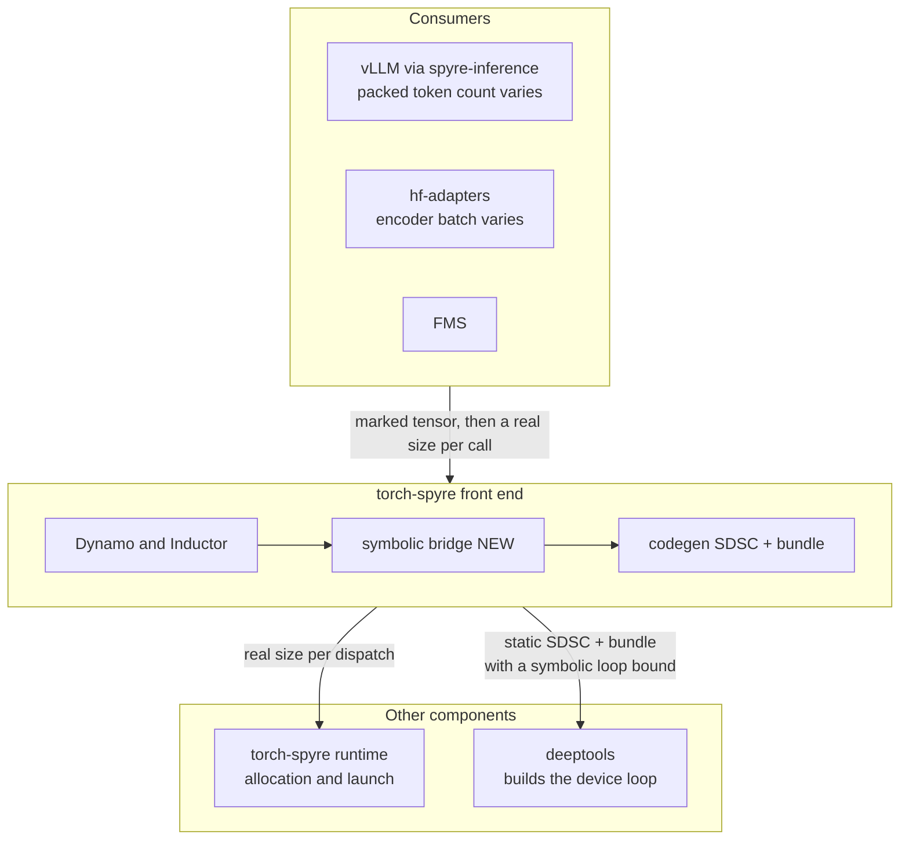
```mermaid
flowchart TB
  subgraph con["Consumers"]
    v["vLLM via spyre-inference<br/>packed token count varies"]
    h["hf-adapters<br/>encoder batch varies"]
    f["FMS"]
  end
  subgraph ours["torch-spyre front end"]
    dyn["Dynamo and Inductor"]
    br["symbolic bridge NEW"]
    cg["codegen SDSC + bundle"]
    dyn --> br --> cg
  end
  subgraph below["Other components"]
    rt["torch-spyre runtime<br/>allocation and launch"]
    dt["deeptools<br/>builds the device loop"]
  end
  con -->|"marked tensor, then a real size per call"| ours
  ours -->|"static SDSC + bundle<br/>with a symbolic loop bound"| dt
  ours -->|"real size per dispatch"| rt
```

## 3. The core idea

The varying size must not reach address arithmetic, and the reason is stronger than it first appears.

Addresses are already runtime symbols, and an earlier version of this document said the host patches
them when the allocation changes, which is rare. That is wrong, and the correction makes the case for
this design rather than weakening it. **There is no per-allocation patching in the pipeline at all.**
Correction is a ComputeOnHost command inside the job plan and it runs on **every dispatch**, in three
pieces: a host patch of the program image, a transfer of the patched tensor to the device, and a
device scatter program with its dummy. Only symbols already constant at the call site are lifted out
at compile time.

So keeping addresses static is not a convenience that avoids an occasional patch, it removes an
unconditional per-dispatch cost. Section 16.3 has the three pieces and the measured figure, with the
caveat that the figure is a slow-path number.

**Be precise about what "static" means here, because the obvious test is the wrong one.** It does
**not** mean the bundle carries no symbols. Section 7.5 has the correct statement and it is worth
reading before using any of this as a review criterion.

One scope note while we are here. The trip count travels on a different channel from the addresses,
so "no correction" is a claim about addresses and says nothing about the count.

So the job is to confine the varying size to the trip count.

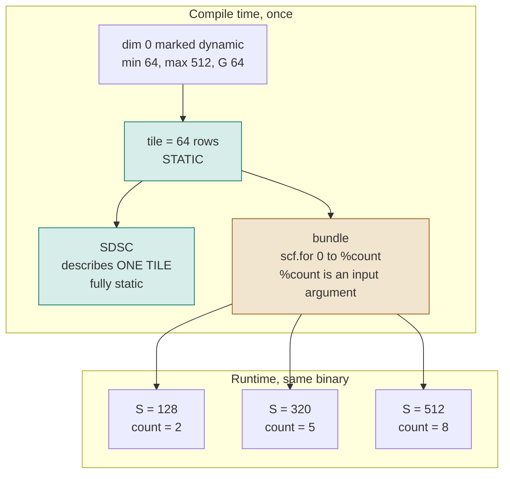
```mermaid
flowchart TB
  subgraph ct["Compile time, once"]
    m["dim 0 marked dynamic<br/>min 64, max 512, G 64"]
    t["tile = 64 rows<br/>STATIC"]
    sd["SDSC<br/>describes ONE TILE<br/>fully static"]
    bu["bundle<br/>scf.for 0 to %count<br/>%count is an input argument"]
    m --> t
    t --> sd
    t --> bu
  end
  subgraph rtm["Runtime, same binary"]
    d1["S = 128<br/>count = 2"]
    d2["S = 320<br/>count = 5"]
    d3["S = 512<br/>count = 8"]
  end
  bu --> d1
  bu --> d2
  bu --> d3
  classDef st fill:#d7ede9,stroke:#0f766e;
  classDef sy fill:#f2e5d0,stroke:#9a5a12;
  class t,sd st
  class bu sy
```

Three consequences, and the rest of the document works them out.

- The tile is static, so the SDSC that describes it is static. Nothing about a tile depends on the runtime size.
- Addresses stay static, because tile `i` sits at `base + i * G * row_stride` and the row stride does not depend on the varying axis.
- Only the trip count changes between dispatches, and it arrives as an argument.

This is measured rather than argued. One binary serves 128, 256, 320, 448 and 512 for pointwise work, for two operands both marked, for a matmul with a varying outer axis, for nested loops, for a reduction inside the tile body, and for a seven-stage `nn.Module` region that includes two matmuls with a tile-sized intermediate, a layer norm and a residual branch. Attention runs on one binary at 256, 384 and 512 with a three-value carry. Weights stay static throughout, and a size that is not a multiple of the granularity is refused rather than quietly truncated.

One correction to how this was first stated, because it affects Phase 2 planning. The constraint is not that the varying axis must be **outermost**. It is that the varying axis must be the one the buffer was **reserved** along, which today is dim 0 only because the reservation wrapper passes 0 as a literal. Section 9.3 has the evidence, a dynamic contraction axis that works when the layout puts it at dim 0 of both operands and emits a binary per size when it does not.

## 4. Reusing PyTorch's symbolic machinery

We do not build a second shape system. A dynamic dimension enters as a PyTorch `SymInt` the moment it is marked and stays a sympy expression the whole way down to our loop count. Everything above codegen is machinery PyTorch already ships and already tests.

| Stage | Mechanism | Whose |
|---|---|---|
| Mark the dimension | the annotation calls `mark_dynamic` underneath, giving a `SymInt` | ours at the surface, PyTorch underneath |
| Capture it | Dynamo records a `sympy.Symbol` | PyTorch |
| Range and guards | `ShapeEnv` holds the min and max and generates the guard | PyTorch, we read it |
| Relate two symbols | `torch._check` on an equality | PyTorch, we call it |
| Carry it through lowering | Inductor's loop-level IR holds ranges as sympy already | Inductor |
| Express the loop | `for_each_tile` reduces to `scan`, which decomposes to the WhileLoop IR | PyTorch higher-order op machinery |
| Keep the count symbolic | `LoopSpec.count` is a sympy expression | our IR, sympy typed |
| Emit the bound | sympy expression to an MLIR input argument | ours, genuinely new |

Only the last row is new work on the symbol itself.

Three consequences follow.

We keep no side-channel annotation. The symbol lives where PyTorch puts it, so there is nothing to keep in sync with the graph and nothing that can drift when a pass rewrites nodes. A private shape table would have been the obvious shortcut and it would have rotted.

We keep no private loop maker. `scan` and the WhileLoop IR preserve loop structure through lowering instead of specialising at a fixed trip count, which is exactly the property this feature needs. When PyTorch improves its symbolic reasoning, its guard handling or its higher-order ops, we inherit that improvement rather than reimplementing it.

And the divergence point is a single, identifiable place. PyTorch is perfectly happy to let a symbol reach an address, because on a CPU or GPU an address is just arithmetic. On Spyre it is not, for the reason in Section 3. So the symbol's journey is identical to any other PyTorch backend right up to codegen, and only there do we insist it lands in a loop bound and nowhere else. Everything upstream of that is stock.

## 5. Scope: which varying axis is supported, and in what order

### 5.1 The question that decides everything: can each tile stand alone

Confining the symbol to a trip count works cleanly only when each tile can be computed on its own. The loop runs tile after tile, and every tile reads its own slice, computes, and writes its own slice. Nothing carries across.

That breaks the moment an operation has to combine values from **different tiles**. A sum along the varying axis is the simple case: tile 0's partial result has to survive into tile 1. Two things then go wrong.

- The bundle allows no loop-carried variable, so the running value has to sit in a fixed buffer and be copied every iteration. That copy is a dependency between trips, so one trip's tail cannot overlap the next trip's head.
- Anything that needs the true count, like the divisor in a mean, cannot read it off the geometry, because the binary is built for a range. It arrives as data instead. Cheapest form is the host passing the reciprocal as a scalar, so the device multiplies and never divides.

The first one is the real cost. The second looks close to free. The line is between "each tile stands alone" and "tiles have to talk to each other".

Two caveats on that paragraph, stated plainly because this is the section the whole Phase 1 and Phase 2 split rests on, and because a reviewer will reasonably ask for the numbers.

Neither cost is measured yet. The carry copy has not been timed against an equivalent unrolled kernel, and nothing has yet tested a host-supplied scalar reaching a tiled body at all, so "close to free" is a comparison between two unmeasured quantities. The host-scalar path should be a Phase 2 entry criterion rather than a sentence here.

And the carry is less restrictive than the first bullet implies. A carry of more than one value works: the attention fixture threads three, a running maximum, a running denominator and an accumulator, and reaches one binary across three sizes. So "the bundle allows no loop-carried variable" is about the mechanism, not about a limit of one value, and the cost is the copy traffic rather than the arity.

### 5.2 Phase 1, where the varying axis is an outer axis

The varying axis is outermost and nothing we compile reduces along it. Every tile stands alone, so this is a straight map over tiles.

Driven by two live usecases. Granite decode on vLLM through spyre-inference, where the packed token count at dim 0 changes on nearly every iteration under continuous batching. And encoder dynamic batching on hf-adapters, where the server forms a variable batch from arriving requests, the pattern [Triton](https://docs.nvidia.com/deeplearning/triton-inference-server/user-guide/docs/tutorials/Conceptual_Guide/Part_2-improving_resource_utilization/README.html) documents.

It exercises the whole path, the bridge, the loop production, the SDSC and bundle split, the guards and the launch binding, without any of the cross-tile machinery. If the path does not work here it will not work anywhere.

### 5.3 Phase 2, where the varying axis is a reduction axis

Adds SDPA and the Phase 1 ops on the sequence axis. Sequence length varies per request, and padding it is the dominant waste because attention cost grows with the square of the padded length.

Technically deeper, and partly already done, so it is worth separating what is hard from what has simply not been attempted.

**Already working.** The flash-style inner loop over a symbolic KV length runs on one binary at 256, 384 and 512, carrying three running values, in a single bundle. That is the piece this section used to call the core of Phase 2, and it was never a design limit: the blocker turned out to be a whole-operand transfer inside the loop that carried the full symbolic extent instead of the declared maximum. So the cross-tile machinery for attention exists and is exercised.

**The real Phase 2 obstacle is allocation, not reduction.** The sequence sits under the batch dimension, so every stride above it is computed from its maximum and the tensor has to be stored sparsely at max stride. That is the nested allocation question, and it is the one thing the reservation layer does not do today: the reservation call takes a dimension to reserve and the wrapper passes 0, so a dynamic dimension anywhere else is simply not reserved and its device geometry tracks the runtime size. A dynamic sequence therefore needs that one parameter plumbed through before anything else in this phase can be judged. Section 9.3 has the same conclusion arrived at from the matmul side.

**Still genuinely open.** The sequence sits on both axes of the score matrix, so one symbol has to tile through two axes of the same operand, and the encoder case is square and therefore harder than the decoder's two independent dimensions. The attention decomposition also computes block counts with plain integer arithmetic, which will silently specialise a symbolic length rather than fail, so every such site has to be found and made symbol-safe.

**Settled, and it is cheaper than this section used to claim.** Online softmax does **not** need a second pass over the data. The working implementation carries a running maximum, a running denominator and an accumulator through the loop, and then divides the accumulator by the denominator **once, after the loop**, on the output tile. That is one elementwise divide on a tile-sized buffer, not a second traversal of the KV data. So the normalisation cost is negligible and the carry copy is the only real cost in this phase.

## 6. Where a symbol may legally live

A runtime varying value can land in three places, and each has a fixed answer.

| Role | What it means | Status | Why |
|---|---|---|---|
| Outer extent | how many independent pieces of work exist along an axis | **supported, Phase 1** | becomes the loop trip count, the one place a symbol is cheap |
| Reduction extent | how many values fold together into one | **Phase 2** | needs a carry across iterations, a defined pad, and the true length as data |
| Index or table length | the length of an index tensor, or the table it reads | **separate track**, ref [#4382](https://github.com/torch-spyre/torch-spyre/issues/4382) | an index length is an outer extent again, a table length is only a range constraint and needs no loop |

### 6.1 Two routes, separated at the symbol kind

There are two ways a varying dimension can reach codegen, they mean different things, and keeping
them apart is the most important structural decision in the implementation.

| Kind | Route | Reaches an SDSC | State |
|---|---|---|---|
| `dimension` | the older symbolic-SDSC route. The symbol stays inside one op's iteration space and lives in the SDSC's `dimToSymbolMapping_` | yes | **gated at the compile boundary** |
| `loop_dimension` | this design. The loop is explicit, the body is a static tile, and the dimension exists only as a bundle parameter | **never** | the route being built |

The gate is a refusal in `execution/async_compile.py` on any bundle carrying a `dimension` symbol,
and its own comment gives the reason: submitting such a bundle would reach the backend with a
mismatched `inputSym_` slot count, because that route's runtime payload was never implemented.

So `loop_dimension` is a distinct variant whose `is_dimension` property is deliberately **False**,
which is what lets the new route through the gate while the old one stays refused.

Three things follow that are easy to get wrong in review.

**The gate stays.** It is what keeps a half-built route from shipping. Removing it to "make the
symbolic path work" is exactly the wrong fix.

**`is_dimension` must not be "simplified" to cover both kinds.** That change passes a casual
reading and refuses the entire feature at the compile boundary. Both the refusal test and its
mirror, asserting a `loop_dimension` gets through, belong side by side so that the simplification
fails a test rather than silently disabling the work.

**The old route's passes still run,** up to the gate. They are exercised rather than dead, and that
is why the cleanup of this area turned out to be comment correction rather than deletion: three of
four removal candidates were live, including the refusal that stands between an untiled symbolic
matmul and a plan built silently from the warm-up hint.

## 7. The contract

### 7.1 What this design depends on

| Dependency | Component | Ticket |
|---|---|---|
| The dynamic tensor's HBM buffer has capacity for the declared maximum | torch-spyre runtime | [#2434](https://github.com/torch-spyre/torch-spyre/issues/2434) |
| A dimension that is not outermost in the device layout is laid out at max stride | torch-spyre runtime | [#2434](https://github.com/torch-spyre/torch-spyre/issues/2434) |
| The real size is bound into an argument slot at dispatch | torch-spyre runtime | [#4964](https://github.com/torch-spyre/torch-spyre/issues/4964) |
| The device loop takes its bound from an input argument | deeptools | [#4397](https://github.com/torch-spyre/torch-spyre/issues/4397), [#1522](https://github.com/torch-spyre/torch-spyre/issues/1522) |
| The size supplied is within range and a multiple of the granularity | caller | [#4384](https://github.com/torch-spyre/torch-spyre/issues/4384) |

Core division is not on that list. Work division operates on the loop body, which is a static tile, so it divides a fixed extent across cores exactly as it does for a static kernel.

### 7.2 The invariants

| # | Invariant | What breaks if violated |
|---|---|---|
| 1 | No address or stride is **computed from** the varying dimension | an address derived from the size has to be recomputed on every call, which is what creates a per-dispatch program correction. Note the invariant is about derivation, not about whether the bundle carries symbols: base addresses are symbolic on every bundle and that is free. Section 7.5 |
| 2 | **The SDSC describes one tile and is fully static** | the tile is the loop body, so its geometry is the tile size. The maximum belongs in the bundle argument and in the HBM layout, not in the SDSC |
| 3 | The runtime size is within range and a multiple of the granularity | the tile count floor silently drops the tail and the answer is quietly wrong |
| 4 | One symbolic count per kernel per nesting level | two independently marked operands give two symbols and two counts, which cannot be launched |
| 5 | The caller reads only the real extent of the output | the buffer has capacity for the maximum, so anything past the real extent is whatever was in HBM |
| 6 | A tail that will be read holds the reduction's identity, or is removed by a select | multiplying by a 0/1 mask does not clean it, because NaN times zero is still NaN |

On invariant 2, the earlier symbolic-SDSC route did the opposite: the symbolic dimension stayed inside one op's iteration space and the SDSC was emitted at the maximum. With an explicit loop the body op is tile-sized, so nothing symbolic reaches the SDSC.

Four more invariants, all read out of the backend source rather than negotiated, and none of them was in earlier versions of this document.

| # | Invariant | Where it comes from |
|---|---|---|
| 7 | **Exactly one symbol per symbolic loop** | the backend asserts it directly. Two symbols on one loop is not a degraded case, it is a check failure |
| 8 | **A symbolic loop may not take part in a loop condition** | an explicit backend refusal. Worth a test against the attention fixture, which has a carry and is currently assumed to be clear of this |
| 9 | **The loop's lower bound is 0 and its step is a constant** | the backend computes `(ub - lb) / step` unconditionally. That is free only in this form; any other lower bound or a non-constant step puts a real division in the lowered program |
| 10 | **The declared minimum is above 8** | the serving plugin's own linear wrapper branches on a row count below 8. Under a symbolic row count that is a branch on the symbol. It is safe today only because our minimum happens to exceed it, and a rule that holds by luck should be written down |

Invariant 3 needs one addition about **who enforces it**, because the two halves have different owners and the document used to blur them. That `max` is a multiple of `G` is checked by the backend at compile time and will fire. That the runtime size is a multiple of `G` is checked by **nobody** downstream: the device evaluates the trip count as a plain truncating integer divide with no remainder check and no diagnostic anywhere on the host or the device. So the host-side check of Section 12 is the only thing standing between a non-conforming size and silent data loss. That makes it a correctness requirement, not an ergonomic one.

### 7.3 The user-facing interface

```python
x = x.to("spyre", dynamic={0: dict(min=32, max=576, granularity=32)})
compiled = torch.compile(model, dynamic=None)
```

`min` and `max` are the range the guard enforces. `granularity` is the step between admissible sizes. If `granularity` is omitted it defaults to `min`, which keeps older call sites working.

`min` and `granularity` stay separate fields. One is a range bound, the other is a step, and more than one granularity over the range is already on the roadmap. Ticket for the API change is drafted.

Rules. `max` must be a multiple of `granularity`. `min` must be above 8, per invariant 10. Phase 1 marks the dimension the buffer was reserved along, which today is dim 0. Weights are never marked, they do not vary and a symbol on the weight side lands in a stride or a contraction axis. `dynamic` stays `None` on `torch.compile`, because `True` would mark every dimension including the stick dimension.

#### The gap that makes this a safety requirement

This interface does not work yet, and the way it fails is the single most important open item in this document, so it belongs here rather than in the risks section.

The call does three things of different kinds. It **allocates** a buffer with capacity for the max, which is genuinely a property of a buffer. It declares a **shape contract**, that this axis varies over a range in steps of G, which is a property of the program and is re-asserted on every call. And implicitly it asserts an **identity**, that this axis is the same symbol as some other tensor's axis, which is a relationship that a per-tensor dictionary cannot express at all.

Today only the first survives. The buffer is reserved at the max and the dimension is marked, and **nothing carries min, max or granularity into the trace**. The reason is structural rather than an oversight: `.to()` runs eagerly, outside the traced region, before the symbol exists, while the contract has to be asserted inside the trace for the `ShapeEnv` to learn it. Something has to bridge those two moments.

The consequence is not a missing refusal. It is a **silent wrong answer**. With the range undeclared, a plain module with a marked dimension compiles, reuses one binary across every size, refuses nothing, warns nothing, and returns a correctly shaped tensor whose rows beyond the warm-up size are garbage. With the same contract declared by hand inside the traced function, the same kernel refuses loudly at compile time with a precise message. Every experiment in this work that looked safe was safe only because a test re-declared the contract by hand, and no real consumer would do that.

So the requirement is three-part:

1. reserve at the max, which already happens,
2. mark the dimension, which already happens,
3. **record the contract where the compiler can read it.** Without this the interface is decorative.

#### How the third part is carried. Settled 5 Oct 2025

The declaration lives in **one** place, a map on the device tensor, written by the transfer call:

```cpp
struct ReservedDimInfo { int64_t min; int64_t max; int64_t granularity; };
std::optional<std::map<int64_t, ReservedDimInfo>> reserved_dims;   // on SpyreTensorImpl
```

The compiler reads it through one accessor, `get_reserved_dims(tensor)`, returning plain ints and
`None` for a tensor with no declaration. Once per compile, during graph lowering, each graph input
is paired with the real tensor it came from and the contract is filed under the **symbol** sitting
in that dimension. From there everything downstream asks by symbol name, because by then the
tensor is gone.

Two things about that choice are load-bearing and were both arrived at the hard way.

**It has to be a field on the tensor, not a side table keyed by the tensor.** A Python dictionary
keyed by object identity was the first design. Dynamo's tensor-guard path goes through `.detach()`,
so the tensor that reaches the compiled function is frequently a derived one. A C++ field
propagates through `shallow_copy_and_detach_core` and `shallow_copy_from`; a dictionary keyed by
the original object does not, and would have missed, leaving the compiler to refuse legitimate
code for a missing contract.

**The per-symbol map is derived, not a second store.** It is rebuilt per compile and discarded
afterwards, so it is a re-keying with a one-compile lifetime rather than a parallel copy that can
drift. The three numbers live in exactly one authoritative place.

The pattern is not new here. `wsr/propagate_named_dims.py` already moves user-declared data across
the same seam, with `zip(graph.graph_input_names, V.get_real_inputs())` inside a lowering pass.

One scope note on what the contract is actually needed **for**, because it is narrower than it
looks and the answer changed once Section 10.3 was settled. The granularity the bundle declares
does **not** come from here, it comes from the loop's own trip count. The contract is needed for
the two things that have to decide a granularity before a loop exists: the region builder choosing
`tile_size`, and the host-side admissibility check. Section 10.3.

A second consequence: marking a dimension dynamic with no declared range should itself be refused, rather than trusted to be caught downstream. Today that configuration silently miscomputes, and the refusal only arrives once a range exists, which is backwards.

#### Where the declaration lives when there is no host tensor

The design constraint raised in review is that this must not be host-tensor-centric: the contract has to be expressible in source, not only as a property carried on a tensor. The eager-versus-traced problem above says the same thing from the implementation side, and both point at separating the **declaration** from the **binding**.

A declaration is program-scoped and names no tensor:

```python
KV = spyre.dim("kv_len", min=256, max=4096, granularity=128)
```

A binding attaches it where allocation happens, and using the same object on two tensors makes them the same symbol **by construction** rather than by an accidental guard:

```python
k = k.to("spyre", dynamic={0: KV})
v = v.to("spyre", dynamic={0: KV})
```

That is what fixes the identity problem, and it is also readable by the bridge at AOT time by identity, which matters because the bridge is a decomposition and cannot call `.to()`. Three carriers, one registry: the transfer interface for graph inputs, a source-level declaration for everything else, and `for_each_tile` taking its tile from the same object instead of a bare literal, which is what would have made the granularity mismatch of Section 10.3 unrepresentable.

Both consumer repositories already have a natural home for the declaration. One has a well-established convention of model-level attributes set during device preparation and read by the drivers, so a load-time keyword that is stashed and read at the compile call is declarative and tensor-free. The other has a single place where every input tensor is converted after host padding and before the compiled call.

Note also that the obvious shortcut does not work. `mark_dynamic(min=, max=)` installs a strict constraint, and adding a divisibility check on top of it raises a constraint violation, so the range cannot be declared that way alongside a granularity. That is the concrete reason a separate interface is needed and not merely nicer.

### 7.4 The interfaces, end to end

Every boundary the three numbers cross, with exactly one carrier each and one writer each. This is
the table to check a change against: if a change adds a second carrier for anything here, it is
wrong.

| # | Boundary | Carrier | Written by | Read by |
|---|---|---|---|---|
| 1 | user to runtime | `.to("spyre", dynamic={dim: {min, max, granularity}})` | the caller | torch-spyre runtime |
| 2 | runtime to compiler, per tensor | `SpyreTensorImpl::reserved_dims`, via `get_reserved_dims(t)` | the runtime, eagerly | the compiler, once per compile |
| 3 | inside the compiler, per symbol | the per-compile symbol map of Section 7.3 | the compiler | the region builder, the host check |
| 4 | compiler to the trace | `torch._check(n >= min)`, `(n <= max)`, `(n % G == 0)` emitted inside the region | the compiler | PyTorch's `ShapeEnv` |
| 5 | compiler to backend, geometry | the SDSC. One tile, fully static | the compiler | deeptools |
| 6 | compiler to backend, the range | the bundle `input_arg<index, granularity=G, max_value=M>`, used as the `scf.for` bound | the compiler | deeptools |
| 7 | compiler to launch | `SymbolKind.loop_dimension(arg_index, dim_index)` in the bundle's returned symbol order | the compiler | the runtime launch path |
| 8 | launch to device | `SymbolicArg{kDimension, tensor_id, dim_index}`, resolved as `tensor.size(dim_index)` | the runtime | the device program |
| 9 | per call | the host admissibility check, range and divisibility | the guard layer | raised to the caller |

Boundary 4 deserves one note, because it is the only one where the compiler writes into PyTorch
rather than reading from it. The assertions are emitted by the compiler inside the traced region,
not by the transfer call, because the transfer call runs eagerly and the symbol does not exist yet.
Section 7.3.

Boundary 8 reads the **logical** size, never the allocated extent. Under a max-strided reservation
the allocation is deliberately larger, and it is the logical size that varies per call and that the
trip count has to track. Getting this backwards makes every call run `max / G` trips while
appearing to work.

#### One honest qualification on boundary 6

`max_value` is read on the deeptools side and drives worst-case address splitting. `granularity` is
declared, verified positive, and **read by nothing**: a search of their tree finds the attribute
written and never consumed. So today it is a statement of intent rather than an enforced contract,
and a bundle whose declared granularity disagreed with its own loop step would be accepted in
silence.

That cuts both ways. We can correct the value without a cross-team change, and the day the check is
implemented any bundle we shipped with a wrong value becomes a runtime failure. Treat the declared
granularity as load-bearing even though nothing currently checks it.

One honest qualification, because it changes how much the declaration protects us. `max_value` is read on the deeptools side: it drives worst-case address splitting. `granularity` is declared, verified positive, and **read by nothing**. A search of their tree finds the attribute written and never consumed. So today the granularity on the argument is a statement of intent rather than an enforced contract, and a bundle whose declared granularity disagreed with its own loop step would be accepted in silence. That cuts both ways. It means we can correct the value without a cross-team change, and it means the day the check is implemented, any bundle we shipped with a wrong value becomes a runtime failure. Treat the declared granularity as load-bearing even though nothing currently checks it.

### 7.5 The bundle we emit

Worked through with deeptools. Dim 0 varies from 64 to 512 with granularity 64, so the tile is 64 rows, and `z = x + y` on `(S, 1024)` fp16 gives:

```mlir
#map_0 = affine_map<(d0)[s0] -> (s0 + d0 * 2048)>

func.func @sdsc_bundle(
    %arg_0_base_addr: !sdscbundle.input_arg<index>,
    %arg_1_base_addr: !sdscbundle.input_arg<index>,
    %arg_2_base_addr: !sdscbundle.input_arg<index>,
    %dim_s0_base: !sdscbundle.input_arg<index, granularity=64, max_value=512>) {

  %arg_0 = sdscbundle.input_arg_extract value from %arg_0_base_addr
      : !sdscbundle.input_arg<index> -> index
  %dim_s0 = sdscbundle.input_arg_extract value from %dim_s0_base
      : !sdscbundle.input_arg<index, granularity=64, max_value=512> -> index

  %c0 = arith.constant 0 : index
  %step_0 = arith.constant 64 : index

  scf.for %i_0 = %c0 to %dim_s0 step %step_0 {
    %addr_0 = affine.apply #map_0(%i_0)[%arg_0]
    %addr_1 = affine.apply #map_0(%i_0)[%arg_1]
    %addr_2 = affine.apply #map_0(%i_0)[%arg_2]
    sdscbundle.sdsc_execute (%addr_0, %addr_1, %addr_2)
        {sdsc_filename="sdsc_0.json", "symbol_ids"=[...]}
  }
  return
}
```

The three address parameters are on every bundle today and `symbol_ids` carries them as it always has. The fourth parameter is the only thing this feature adds, and it is recognisable because it is the only one with `granularity` and `max_value` on it.

#### A non-empty `symbol_ids` is not a violation, and not a cost signal

This needs saying plainly, because an earlier version of this document used "an empty symbol list"
as shorthand for "addresses are static", and that shorthand is wrong in a way that leads a reader to
the opposite of the right conclusion. By that test every bundle ever emitted violates the design,
since none of them has an empty list.

Two different things are both called symbols in this area.

**Base addresses are symbolic by construction, on every kernel, static or dynamic.** The runtime has
to supply the base address at launch rather than have it baked into the program image.
`isStartAddrSymbolic_: 1` on the SDSC side is what marks that, a negative symbol id under
`dimToSymbolMapping_` is how the slot is named, and `symbol_ids` on `sdsc_execute` is how it is
passed. That is the ordinary symbolic-address route and it costs nothing extra. A kernel with
several such entries is completely normal.

**An address or stride derived from the varying dimension is the thing invariant 1 forbids.** The
difference is derivation, not presence. A value that is merely passed in is free. A value that has to
be **recomputed from the runtime size** cannot be resolved at the call site, and that is what pulls
in the per-dispatch correction of Section 16.3.

So when reviewing a bundle or an SDSC, the question is never "is the symbol list empty". It is
whether any address or stride is a function of the varying dimension. Reading a populated
`symbol_ids` or an `isStartAddrSymbolic_: 1` as evidence of a violation is a mistake this document
has now made once and it should not be made again.

One thing left open deliberately. The exact conditions under which the backend materialises a
program correction, as opposed to resolving a symbol at the call site, are theirs and we have not
verified them end to end. So "no correction" is a claim we make about **our** addresses being
independent of the varying size, and it should not be restated as a claim about symbol counts.

Three details in that listing are load-bearing, and all three are easy to get wrong.

**The bound is the dimension and the step is the granularity.** Not a loop count. We author no division anywhere, and the device derives the trip count itself as `(ub - lb) / step`. This is the only legal shape that keeps the dimension itself in the bundle. The emitter rejects any trip-count expression it cannot put in this form rather than guessing.

**The loop variable therefore counts elements, not tiles.** `%i_0` takes the values 0, 64, 128 and so on, so every affine stride multiplying it is the per-element stride and not the per-tile stride. Here that is `2048` bytes, one row of 1024 fp16 elements, and `64 * 2048` recovers the `131072` byte tile stride. The emitter does this by construction: a symbolic level reports a stride scale of G and the strides on that level are divided by it. Writing the tile stride against an element-stepping loop would advance 64 times too far per trip, so the two choices have to move together.

**`lb` is 0 and the step is a constant.** That is what makes the device's unconditional `(ub - lb) / step` free rather than a real division in the lowered program. Emit any other lower bound or a non-constant step and a division appears.

The SDSC beside this describes one 64 x 1024 tile and is fully static. Nothing in it mentions S or the maximum.

#### Why granularity rides in the bundle

It is the contract, written once where both sides read it. `granularity` says which sizes this binary serves and `max_value` says what the geometry was planned for. Putting it on the argument means neither side keeps a second copy that can drift.

#### Two loops on one dimension, and where the declared granularity comes from

An earlier version of this section said the form "lets one dimension parameter drive two loops with
different tile sizes, because each derives its own count". That is half right and the half it gets
wrong is a wrong-answer trap, so it is worth stating properly.

The **MLIR mechanics** do support it. The bound is the same `%dim_s0` for both loops and each
carries its own `step` constant, so each derives its own count with no extra machinery.

What cannot express two values is the `granularity=` attribute, because there is one `input_arg`.
And the attribute is not cosmetic: its meaning is which sizes this binary serves. A bundle whose
loops step 64 and 128 serves only multiples of **128**. Declare 64 and a request at 192 makes the
128-step loop run one trip and drop 64 rows with nothing logged. Declare 128 and a request at 192
is refused although the caller's contract admits it.

So three rules, and the third is the one that makes the other two safe:

- the declared granularity for a bundle is the **lcm of its loop steps**, not any one step
- correctness requires **every tile size to divide the contract granularity**, which is the first
  rule of the granularity chooser in Section 13 and is not implemented yet
- until it is, the emitter **refuses** a bundle whose loops disagree about one dimension, rather
  than picking one. That refusal is deliberately stricter than necessary: it also rejects the legal
  case where both steps divide the contract granularity

Today nothing reaches that refusal, because a region is one `for_each_tile` call with one
`tile_size`. It becomes reachable the moment a cost model or the region builder chooses tile sizes
per kernel, which is why the chooser rule and this rule land together.

#### Why we send the size and not the loop count

The tile size is a per-kernel decision. The cost model picks it from what fits LX for that kernel, so two kernels in the same graph can tile the same dimension differently.

Take S of 512, with a pointwise kernel tiling at 64 and a matmul tiling at 128. The counts are 8 and 4. If the host sent counts, it would have to know every kernel's tile size and send a different number to each one. Sending 512 once lets each bundle derive its own count from its own step.

Floor versus ceiling does not arise, and that is not luck. G divides S exactly, guaranteed by the divisibility rule of Section 7.2 and enforced before dispatch, so a floor and a ceiling give the same answer. This is also why the rule is a correctness requirement rather than an ergonomic one: the device evaluates that division as a plain truncating integer divide with no remainder check and no diagnostic anywhere, so a size that is not a multiple of G runs a tile short and returns a correctly shaped tensor with a stale tail. Section 11.3 and Section 12.

## 8. WSR 2.0, and where the symbolic bridge sits

### 8.1 What `for_each_tile` is

WSR 2.0 replaced the WSR 1.0 tiling pass with an explicit construct in the graph. Epic ref [#3965](https://github.com/torch-spyre/torch-spyre/issues/3965).

```python
for_each_tile(body, operands, *, dims, tile_size, init=None, out_dim=None, reverse=False)
```

`body` is `(carry, tiles) -> (next_carry, out_tile)`. It receives tiles that are **already carved**, and it must not slice, because a data-dependent slice does not trace.

Each operand gets a spec in `dims`, and that picks its kind.

| `dims` entry | Kind | Behaviour per step |
|---|---|---|
| `int d` | SLICE | a `tile_size`-wide contiguous view along `d` |
| `None` | INVARIANT | the whole operand, every step, not tiled |
| `Gather(axis, index)` | GATHER | one pool row per step, chosen by the index table |

And there are exactly two modes, picked by which keyword is set.

| Mode | Set | Not set | Meaning |
|---|---|---|---|
| **Map** | `out_dim=d` | `init` | step `i` writes its tile at offset `i * tile_size` along `d`. Tiles are independent |
| **Reduction** | `init=...` | `out_dim` | tiles fold into a carry. Tiles are not independent |

Setting neither is an error. The trip count is derived, not passed: `shape[dim] // tile_size` for each sliced operand, and all operands must agree on it.

### 8.2 How it becomes a device loop

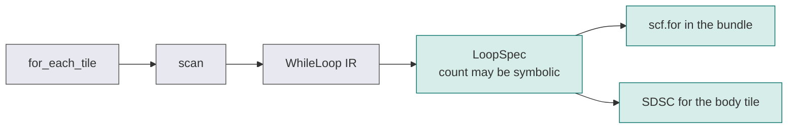
```mermaid
flowchart LR
  fet["for_each_tile"] --> sc["scan"]
  sc --> wl["WhileLoop IR"]
  wl --> ls["LoopSpec<br/>count may be symbolic"]
  ls --> sf["scf.for in the bundle"]
  ls --> sd["SDSC for the body tile"]
  classDef up fill:#e8e8f0,stroke:#555;
  classDef us fill:#d7ede9,stroke:#0f766e;
  class fet,sc,wl up
  class ls,sf,sd us
```

The first three boxes are existing PyTorch machinery. `scan` is a standard higher-order op and the WhileLoop IR already ships with PyTorch. Both WSR 1.0 and 2.0 land on the same `LoopSpec` and the same `scf.for`, so nothing is renegotiated with deeptools by this change.

#### Where the trip count is born, and three spellings that decide whether the tile survives

The trip count is not passed in. `for_each_tile` derives it, and under a symbolic length the
derivation is literally the expression the bundle later reads:

```python
if length % tile_size != 0:
    raise ValueError(...)                     # ragged tiles refused
spec = TileSpec(Kind.SLICE, axis, ..., length // tile_size)
```

That `length // tile_size` **is** the `FloorDiv(s, G)` that becomes `LoopSpec.count`, and that is
why Section 10.3 can extract the granularity from the count with no inference.

Three details of how the construct is spelled turn out to decide whether a symbolic length works at
all. All three were measured against every alternative, and none of them is a style preference.

**State the divisibility, do not only guard it.** The `!=` test above already guards the ragged
case. Adding `torch._check(length % tile_size == 0)` beside it puts `Mod(S, G)` into the shape
environment's divisibility set, which is what lets the simplifier fold `G * (S // G)` back to `S`.
Without the fact stated, the fold does not happen.

**Trim, then split.** A view has to reconcile the sizes it is handed against `numel`. Given `S` it
cannot prove `(S // G) * G == S`, so it re-derives the tile extent as `S // (S // G)`, which is
not secretly `G`: at `S = 100` it is 100. Nothing downstream can fold that and every pass assuming
a concrete tile breaks. Given `G * (S // G)` instead, the trailing factor it computes is
`FloorDiv(G*n, n)`, which cancels by gcd to the literal `G` with no prover involved. So the
operand is narrowed to `num_tiles * extent` first and split second. Both are views, so nothing
copies. Measured over sixteen spellings, including pinning the count, pinning the extent with -1,
view, reshape and `torch._check` on the product: trimming first is the only form that keeps the
extent literal.

**Fold the output with `as_strided`, not `flatten`.** `flatten`, `reshape` and `view` each walk the
dimensions and, on a symbolic leading extent, add two guards: `Ne(count, 1)` and
`Ne(Mod(count, G*count), 0)`. The first makes the compiled artifact invalid for a one-tile call, so
a request at exactly the granularity recompiles instead of reusing the binary. `as_strided` adds
nothing. It takes strides on trust, so it is used only when the leading axes are **provably**
contiguous, tested with `statically_known_true` so the test itself installs no guard, and falls
back to `flatten` otherwise. Slower to specialise, never wrong.

The general lesson, which is worth more than the three fixes: under a symbolic extent, **how a view
is spelled is a correctness decision**, because each spelling installs a different set of guards and
derives the remaining extents differently. A refactor that "simplifies" one of these back to the
obvious spelling reintroduces the bug silently.

### 8.3 The bridge, and where it sits

**The user never writes a `for_each_tile`.** Requiring model authors to restructure their code would kill portability, and a stock BERT or Granite would stop being stock.

The piece that turns a marked dynamic dimension into a tiled loop is the bridge, and it is the main new work in this design. Ref [#4379](https://github.com/torch-spyre/torch-spyre/issues/4379).

Where it sits is already decided by how `for_each_tile` works. It is not a graph node. It is ordinary Python in `wsr/for_each_tile.py` that builds a `combine_fn` and calls `scan`, so no pass can insert it as a node. What can call it is a decomposition, while AOT is tracing. The SDPA decomposition already does that in two places in `_inductor/decompositions.py`, and `for_each_tile` carries an explicit branch for being reached that way instead of through Dynamo.

So the bridge is two pieces. **Both are proposed, not built.** The op name below is a placeholder.

| Piece | Where it goes | Status |
|---|---|---|
| Region selection: pick the ops that should share one loop, lift them into a submodule, replace them with a single `spyre.tiled_region` call | `CustomPreGradPasses`, the pre-grad FX extension point, empty today | proposed |
| Loop construction: a decomposition of `spyre.tiled_region` that calls `for_each_tile` with `tile_size` set to the granularity | `_inductor/decompositions.py`, next to the SDPA ones | proposed, on an existing pattern |

Pre-grad and not post-grad, because decompositions run during AOT tracing and a post-grad pass is past that point.

Region selection is modelled on `hints_to_coarse_tile_groups` in `wsr/coarse_tile_hints.py`, which already does this for the WSR 1.0 hint path: walk in topological order, collect consecutive ops that agree, break when they stop agreeing, hand out `(ops, levels)` groups. Same algorithm, different key. That one keys on a `spyre_hint()` the model author wrote, ours keys on the marked dimension.

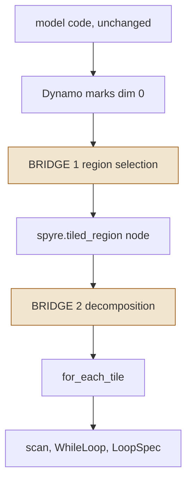
```mermaid
flowchart TB
  u["model code, unchanged"]
  dy["Dynamo marks dim 0"]
  p1["BRIDGE 1 region selection"]
  op["spyre.tiled_region node"]
  p2["BRIDGE 2 decomposition"]
  fet["for_each_tile"]
  rest["scan, WhileLoop, LoopSpec"]
  u --> dy --> p1 --> op --> p2 --> fet --> rest
  classDef new fill:#f2e5d0,stroke:#9a5a12;
  class p1,p2 new
```

#### What triggers it

Nothing in the model. The trigger comes from the annotation. When a tensor is moved to the device with a dynamic dimension declared, that dimension is marked underneath and Dynamo records it as a symbol with a finite range in the shape environment. A finite range is the signal: a dimension that went dynamic by accident, because Dynamo promoted an integer on a retrace, has no finite maximum and is deliberately left alone.

A fully static model never enters either piece and compiles exactly as it does today.

#### Why a region and not one op at a time

A decomposition registered on `aten.add` would give one loop per add, since separate `for_each_tile` calls get separate loop group ids and the scheduler groups by that id.

The cost of that is the whole point. Take the small network of Section 9.5. As one region it is:

```python
for i in range(S // 64):
    h = relu(x_tile @ W1 + b1)          # (64, 512), lives in LX
    y_tile = softmax(h @ W2 + b2, -1)
```

`h` is born and consumed inside one trip and never reaches HBM. Split the same graph into four loops and `h` is written out at 64 x 512 and read back, once per trip, for no reason. The weights get re-staged four times over instead of once. That is the working set reduction this construct exists to deliver, and it is only available if the grouping decision is made before the loop is built. Hence a pass, not a decomposition.

The Phase 1 rule is deliberately narrow.

| Step | Action |
|---|---|
| 1 | seed from inputs whose fake value carries a marked symbol |
| 2 | grow forward while the marked axis passes through one to one |
| 3 | stop at the first reduction along that axis, reshape across it, or matmul contraction on it |
| 4 | emit an equality check for operands sharing the axis, invariant 4 |
| 5 | lift the region and hand the granularity through as `tile_size` |

Step 2 is about the axis, not the op class, so a matmul whose varying axis is the outer one stays in the region. That is what lets the whole of Section 9.5 be a single loop.

How far to grow is bounded by LX, not by the graph. Every operand co-live in a trip has to fit, and `estimated_live_bytes_per_core` in the SDPA decomposition is the existing check for exactly that. A wider region needs a smaller tile, which means more trips, so the two trade against each other. Phase 1 takes the narrow rule and leaves the trade to the cost model, Section 13.

If the region's inputs do not share one symbol on that axis, refuse the region and leave the graph alone. An unhandled shape then degrades to today's behaviour instead of failing the compile. Reduction mode lands later as a second branch at step 3.

Hand-written `for_each_tile` stays available as a compiler-side escape hatch, the way the SDPA decomposition uses it today. It does not become a user-facing API.

### 8.4 What WSR 2.0 has already delivered

The epic is closed, ref [#3965](https://github.com/torch-spyre/torch-spyre/issues/3965), and the parts this design leans on are merged: the op itself ([#4136](https://github.com/torch-spyre/torch-spyre/pull/4136)), nesting ([#4705](https://github.com/torch-spyre/torch-spyre/pull/4705)), the SDPA rewrite onto nested `for_each_tile` ([#4551](https://github.com/torch-spyre/torch-spyre/pull/4551)), and a round of correctness fixes on the WhileLoop path ([#4751](https://github.com/torch-spyre/torch-spyre/pull/4751)).

Two consequences for us. Nesting being merged is what makes Phase 2 a tile_size question rather than new machinery. And the SDPA rewrite is the working example of a decomposition authoring `for_each_tile`, which is the pattern the bridge reuses.

## 9. Worked examples

Same setup throughout. Dim 0 varies between 64 and 512 with a granularity of 64, so the tile is 64 rows and the trip count is `S // 64`, between 1 and 8.

```python
x = x.to("spyre", dynamic={0: dict(min=64, max=512, granularity=64)})
```

### 9.1 Add, both operands dynamic

```python
z = x + y            # x, y are (S, 1024)
```

What the bridge authors:

```python
torch._check(x.size(0) == y.size(0))          # invariant 4, see Appendix A

_, z = for_each_tile(
    lambda carry, tiles: (None, tiles[0] + tiles[1]),
    (x, y),
    dims=(0, 0),                              # both SLICE on dim 0
    tile_size=64,                             # G
    out_dim=0,                                # MAP mode
)
```

**Mode: map.** `out_dim` is set and `init` is not, so each step writes its own 64-row slice and nothing carries. Trip count `S // 64`, derived from either operand since the check forced them equal.

Without that `torch._check`, marking `x` and `y` separately gives two different symbols, so two trip counts, and the kernel cannot launch.

### 9.2 Multiply by a weight vector

```python
z = x * w            # x is (S, 1024) dynamic, w is (1024,) static
```

```python
_, z = for_each_tile(
    lambda carry, tiles: (None, tiles[0] * tiles[1]),
    (x, w),
    dims=(0, None),                           # x SLICE, w INVARIANT
    tile_size=64,
    out_dim=0,                                # MAP mode
)
```

**Mode: map.** The interesting part is `dims`. `w` gets `None`, so it is INVARIANT: staged once and handed to every step whole, never tiled and never re-staged. Only `x` walks the loop, so only `x` contributes a trip count.

### 9.3 Multiply-accumulate, which is a linear layer

```python
y = x @ W            # x is (S, 1024) dynamic, W is (1024, 512) static
```

```python
_, y = for_each_tile(
    lambda carry, tiles: (None, tiles[0] @ tiles[1]),
    (x, W),
    dims=(0, None),                           # x SLICE, W INVARIANT
    tile_size=64,
    out_dim=0,                                # MAP mode
)
```

**Mode: map, even though this accumulates.** Look at which axis the accumulation runs on.

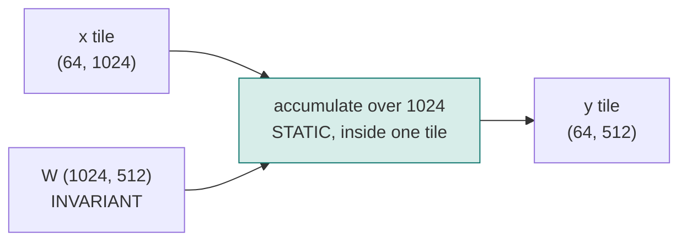
```mermaid
flowchart LR
  xt["x tile<br/>(64, 1024)"]
  wt["W (1024, 512)<br/>INVARIANT"]
  acc["accumulate over 1024<br/>STATIC, inside one tile"]
  yt["y tile<br/>(64, 512)"]
  xt --> acc
  wt --> acc
  acc --> yt
  classDef ok fill:#d7ede9,stroke:#0f766e;
  class acc ok
```

The contraction is over 1024, which is static and sits wholly inside one tile. The varying axis S is only the outer axis. So each step produces its own 64 rows and never looks at another step's data. No carry, `init` stays `None`, map mode.

The rule in one line: **multiply-accumulate is fine as long as the accumulation axis is not the varying one.**

#### Matmul, by which axis varies

A matmul is the op where the generic rule has to be stated carefully, because it has three distinct axes and the answer differs per axis. `C[M,N] = A[M,K] @ B[K,N]`:

| Varying axis | What it is | Mode | Status |
|---|---|---|---|
| M, the rows of A | an outer axis of the output | map | **works, one binary.** The case above, and the common one: M is the batch or the token count |
| N, the columns of B | an outer axis, but it belongs to a weight | not applicable | weights are never marked. A symbol here would be a weight whose shape varies, which is a different feature |
| K, the contraction | a reduction axis by definition | reduction | **works on one binary, but only in one layout.** See below |
| the batch of a `bmm` | an outer axis above both | map | same as M |

The K case is the interesting one and the earlier version of this document got it wrong, so it is worth being precise. A dynamic contraction axis was recorded as structurally impossible. It is not. Supplying `A` transposed, as `[K, M]`, so that K is **dim 0 of both operands**, reaches one binary across the whole range with correct numbers. Leaving K as A's inner dimension emits a binary per size.

The reason is the useful part, because it generalises past matmul. Nothing about reduction mode was the obstacle. The obstacle was that with K inner, the marked dimension is not the dimension the buffer was **reserved** along, so `stride(0)` is computed from the symbol, and a stride derived from the varying size is exactly what invariant 1 forbids. Move K to dim 0 and the stride becomes a constant again.

So the law is not "the varying axis must be outermost", which is how this was first written and which was right for the wrong reason. The law is:

> **The marked dimension must be the dimension the buffer was reserved along.**

Today that is dim 0, because the reservation call takes a dimension and the wrapper passes 0 as a literal. That one line of code is what makes "dim 0" look like a design law rather than a current limitation, and lifting it is what Phase 2 needs. The cost of the working K form is one pre-transpose of A outside the loop, which is a caller layout choice, plus a tile transpose inside the body, which is supported.

### 9.4 Sum along the varying axis, which is Phase 2

```python
total = x.sum(dim=0)          # reduce ALONG the varying axis
```

```python
total, _ = for_each_tile(
    lambda carry, tiles: (carry + tiles[0].sum(0), None),
    (x,),
    dims=(0,),
    tile_size=64,
    init=torch.zeros(1024),                   # REDUCTION mode
)
```

**Mode: reduction.** `init` is set and `out_dim` is not, so the body returns a carry instead of a tile.

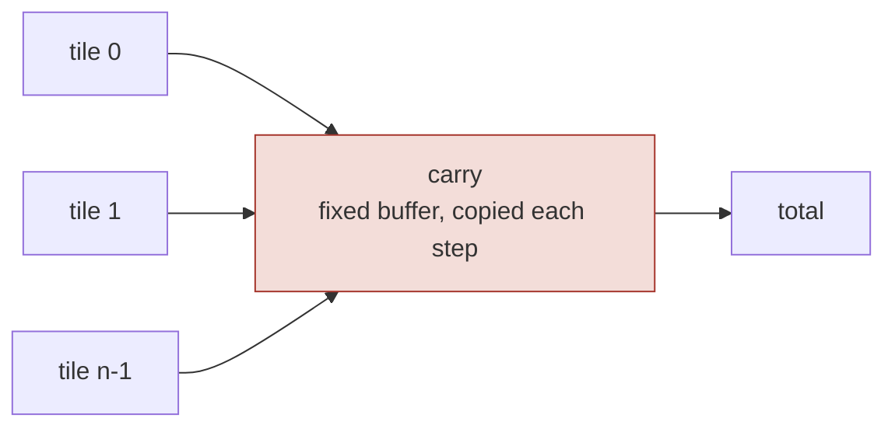
```mermaid
flowchart LR
  t0["tile 0"] --> a["carry<br/>fixed buffer, copied each step"]
  t1["tile 1"] --> a
  t2["tile n-1"] --> a
  a --> r["total"]
  classDef bad fill:#f3ddd9,stroke:#a5342b;
  class a bad
```

The construct expresses it fine. The cost is what makes it Phase 2: the carry cannot be a loop variable in the bundle so it rides a fixed buffer with a copy per step, that copy serialises the loop and gives up core parallelism, and `mean` would additionally need the true count, which has to arrive as data. Refs [#3062](https://github.com/torch-spyre/torch-spyre/issues/3062) and [#3063](https://github.com/torch-spyre/torch-spyre/issues/3063).

#### Reduction, by where it reduces

"Reduction" is not one case either, and three of its four forms are already Phase 1. Separating them is what keeps the coverage table in Section 14 honest.

| Form | Example | Mode | Status |
|---|---|---|---|
| Reduces over a **static** axis, outside any tiling | `softmax(dim=-1)` on a static last axis | map | **works.** The varying axis is untouched |
| Reduces over a **static** axis, **inside** the tile body | a row softmax or a layer norm over hidden, inside the loop | map | **works, one binary.** The body sees a concrete tile, so the reduction is an ordinary static reduction. Two chained reductions in one body also work |
| Reduces **along** the varying axis, with the axis at dim 0 of every operand | split-K matmul with A supplied as `[K, M]` | reduction | **works, one binary**, at the cost of the layout above |
| Reduces **along** the varying axis, axis not at dim 0 | `x.sum(dim=0)` on a tensor reserved along another dim | reduction | the Phase 2 case above: carry copy per step, and the true count as data |

Two asymmetries matter for planning and neither is visible from the table alone.

**Map mode and reduction mode degrade differently at a single tile.** When the runtime size equals one granularity, map mode is numerically correct and costs one extra binary, from an upstream contiguity guard rather than anything of ours. Reduction mode is a hard compile error. Same input, two different failure kinds, so they need separate entry criteria. The planned answer is a chooser rule that keeps the smallest legal input at two or more trips, Section 13.

**A reduction in the body is not the same risk as a reduction along the axis**, and conflating them overstates Phase 2. The second row of that table is the one every transformer needs, for every normalisation and every softmax over hidden, and it is measured working. Only the last row needs the cross-tile machinery.

### 9.5 A small network end to end

```python
h = torch.relu(x @ W1 + b1)                   # (S,1024) -> (S,512)
y = torch.softmax(h @ W2 + b2, dim=-1)        # (S,512)  -> (S,10)
```

| Step | Role of the varying axis | Mode | `dims` | Trip count |
|---|---|---|---|---|
| `x @ W1` | outer | map | `(0, None)` | S/64 |
| `+ b1`, `relu` | outer | map | `(0, None)` | S/64 |
| `h @ W2` | outer | map | `(0, None)` | S/64 |
| `softmax(dim=-1)` | not involved, reduces over 10 | map | `(0,)` | S/64 |

Every kernel gets the same trip count, resolved once per dispatch from the same runtime size, so they agree by construction. Softmax is safe here because it normalises over the last axis, which is static. Point the same softmax at the varying axis and it becomes Section 9.4.

A larger version of this has been run on device, on a real `nn.Module` with real `nn.Linear` weights and biases rather than bare tensors, and it is the strongest evidence in this document. Seven stages, each on one binary across 128 to 512, relative error between 0.0025 and 0.0044:

| Stage | What it adds |
|---|---|
| one `addmm` | a weight **and a bias**, which every earlier fixture had skipped by using bare `mm` |
| `addmm` plus `relu` | a pointwise chain after the matmul, inside the same tile |
| two `addmm` plus `relu` in one body | a **region**, with the intermediate never leaving the body |
| layer norm, as the aten op | the decomposition of Section 10.5, and its element-arrangement exemption |
| layer norm, hand written | the same mathematics as explicit mean, variance, rsqrt and affine |
| a residual diamond | two branches reading the **same** tile, then added |

The region stage is the one that matters for the bridge. A whole MLP runs inside one loop with the intermediate tile-sized, so the design's choice of a region over one loop per op is now backed by measurement: one loop per op would mean four sequential device loops, each re-reading its tile from HBM. The residual stage matters separately, because every transformer block has a skip connection and a diamond inside the body needs no second symbol and no equality assertion, both branches read one tile.

Wall time on the reused binary is 0.0004s against 9.2s for the first compile.

## 10. Compile time and runtime

### 10.1 Compile time, stage by stage

The whole path is stock PyTorch with six places where we attach. Naming them precisely matters, because the ordering between them is what makes the design work and two of the constraints below are not obvious from the code.

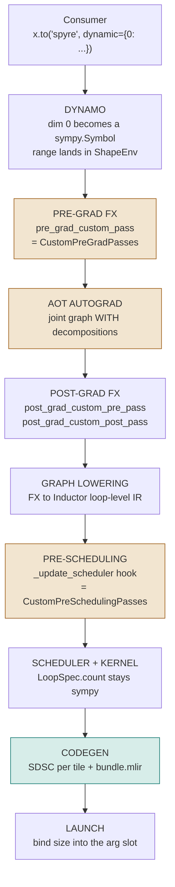
```mermaid
flowchart TB
  u["Consumer<br/>x.to('spyre', dynamic={0: ...})"]
  d["DYNAMO<br/>dim 0 becomes a sympy.Symbol<br/>range lands in ShapeEnv"]
  pg["PRE-GRAD FX<br/>pre_grad_custom_pass<br/>= CustomPreGradPasses"]
  ao["AOT AUTOGRAD<br/>joint graph WITH decompositions"]
  po["POST-GRAD FX<br/>post_grad_custom_pre_pass<br/>post_grad_custom_post_pass"]
  gl["GRAPH LOWERING<br/>FX to Inductor loop-level IR"]
  ps["PRE-SCHEDULING<br/>_update_scheduler hook<br/>= CustomPreSchedulingPasses"]
  sc["SCHEDULER + KERNEL<br/>LoopSpec.count stays sympy"]
  cg["CODEGEN<br/>SDSC per tile + bundle.mlir"]
  rt["LAUNCH<br/>bind size into the arg slot"]
  u --> d --> pg --> ao --> po --> gl --> ps --> sc --> cg --> rt
  classDef ours fill:#f2e5d0,stroke:#9a5a12;
  classDef new fill:#d7ede9,stroke:#0f766e;
  class pg,ao,ps ours
  class cg new
```

**1. The annotation, eagerly, before any tracing.** `.to("spyre", dynamic=...)` does two unrelated things. It allocates the device buffer with capacity for the declared maximum, and it marks the dimension so Dynamo will treat it as a symbol. The reservation is a real allocation call that takes the dim to reserve; today the wrapper passes dim 0 as a literal, which is why Phase 1 is dim 0 and not merely conventionally so. Section 11.2.

**2. Dynamo.** The marked dimension becomes a `sympy.Symbol` and its range goes into the `ShapeEnv`. Nothing of ours runs here. One consequence that shapes the whole contract: `.to()` ran **eagerly, outside the traced region**, so whatever it learned about min, max and granularity is not automatically inside the trace. Something has to carry it across that boundary, and Section 7.3 is where that is still open.

**3. Pre-grad FX passes, `pre_grad_custom_pass`.** This is the first point we own, and **this is where region selection belongs**. It runs before AOT, which is the constraint that pins it: a decomposition only fires during AOT, so a pass that wants to influence what gets decomposed has to run earlier. The pipeline is registered and **its pass list is empty today**, so the bridge's first half is an addition to an existing hook rather than a new extension point.

**4. AOT autograd, where decompositions run.** This is the second point we own and **this is where the loop is constructed**. The reason is mechanical: `for_each_tile` is not a graph node. It is ordinary Python that builds a combine function and calls `scan`, so no pass can insert it as a node. Only something that *traces* can call it, and the only tracer in the pipeline is AOT. The SDPA decompositions already do exactly this today, so the mechanism is in use and not speculative.

Two halves, then, and the split is forced rather than chosen:

| Half | Where | Why it cannot be the other place |
|---|---|---|
| Region selection: group ops, lift them, emit a marker | pre-grad pass | needs to see many ops at once, so it must be a pass; must precede AOT or the decomposition never fires |
| Loop construction: call `for_each_tile` | a decomposition | only a tracer can call it, and AOT is the only tracer |

No single point both sees the whole graph and can trace. The handover between them is a marker op the decomposition is registered against.

The Spyre decomposition table also matters for a reason unrelated to the bridge: several aten ops are rewritten here into Spyre ops with particular layouts, and `layer_norm` is the one that bites. It becomes a mean through `spyre.exx2`, an epsilon scale through `spyre.layernormscale`, and a five-argument `spyre.layernormnorm`, substituting ones and zeros when the affine parameters are absent. That is why the no-affine case is not a simpler case, and the walkthrough in Section 10.5 follows it through.

**5. Post-grad FX passes.** Two more hooks, `post_grad_custom_pre_pass` and `post_grad_custom_post_pass`, plus a pre-fusion and a post-fusion hook. Nothing symbolic-specific lives here.

**6. Graph lowering, then the pre-scheduling pipeline.** Inductor lowers FX to its loop-level IR, and we take over through the `_update_scheduler` hook, which runs the pre-scheduling pipeline exactly once per graph. The order of that pipeline is the heart of the compile path, and the first pass in it is the one that turns a loop into our IR.

| # | Pass group | What it does to a symbolic loop |
|---|---|---|
| 1 | `splice_while_loops` | **the step that creates the loop IR.** Converts `for_each_tile`'s WhileLoop bodies into inlined IR with `loop_info` attached. After this the body is concrete and the only symbol left is the trip count |
| 2 | `deadcode_elimination` | removes what the splice orphaned |
| 3 | hint-driven working-set reduction: `propagate_named_dims`, `validate_named_dims`, `assign_dim_hints`, coarse tiling | runs before stickification, so it only needs host sizes and strides |
| 4 | `insert_bmm_padding` | pads a matmul's K to a stick boundary while buffers still have plain host layouts |
| 5 | stickification: `split_multi_ops`, `propagate_spyre_tensor_layouts`, `reorder_nonstick_dims`, `validate_ops`, `optimize_restickify_locations`, `finalize_layouts`, `insert_restickify` and its followers | device layouts are chosen here. **Every size that feeds a device layout must already be the declared maximum**, or the geometry tracks the warm-up size and the binary stops serving the range |
| 6 | `dedup_and_promote_constants` | constants |
| 7 | device-layout-aware working-set reduction | needs real `device_size` and `stride_map`, so it cannot run earlier |
| 8 | core division: `span_reduction`, `_distribute_work` | divides the **tile**, which is static, so this is unchanged from a static kernel |
| 9 | LX planning | scratchpad, then copy elision |

`splice_while_loops` running first is an invariant with named dependents, not an accident. The coarse-tiling pass skips itself once the splice has done anything, and `insert_restickify` branches on whether `loop_info` has already been stamped to decide whether a per-trip advance belongs on the restickify stage or on the consumer. Move the splice later and that branch silently takes the wrong path, which is a wrong answer rather than a crash.

Two passes in group 5 deserve singling out because both have already produced a real bug under a symbolic count. `validate_ops` refuses an incompatible mix of element arrangements in a multi-argument op, and it keys its exemptions on an op name, which a tiled body changes. `insert_restickify` creates whole-operand transfers whose extent must be the declared maximum rather than the symbolic size. Section 20.

#### Four places the stock pipeline does not survive a symbolic trip count

Not design choices, defects on the path, each one found by running it. Listed here because they are
compile-path facts a reader will otherwise rediscover, and because together they are why "the
symbol is just a sympy expression all the way down" is true in principle and needed work in
practice.

**The scan-to-while-loop decomposition raises `KeyError`.** Upstream rebuilds the scan output's
shape through `resolve_shape_to_proxy`, against an environment keyed by the scan's SymInt arguments
plus the scan length. But `sympy_interp` consults that environment only for a bare `sympy.Symbol`
leaf, so an expression key like `FloorDiv(s97, 64)` sits in the dict and is never looked up: it
recurses into `s97` and fails. The proxy for the whole expression is already in the dict, as the
scan length, so matching the expression before falling back to the symbol walk is the fix. This
fires **exactly** when the body is fully static and only the trip count is symbolic, which is the
shape this whole design produces.

**The trip count has to be recovered by replaying the condition graph.** The loop bound is not a
field anywhere. The splice replays the condition graph's `inner_fn` under a recording ops handler
and pattern-matches `load(first_placeholder, 0) < bound`. A concrete bound arrives as
`ops.constant`. A **symbolic** one arrives as `ops.index_expr` carrying the sympy expression. Record
only constants, as stock does, and every symbolic loop declines silently and the kernel specialises
with nothing logged.

**`while_op.inputs` is not positionally aligned with the body's placeholders.** `WhileLoop.__init__`
splits `[*carried, *additional]` by symbol type and passes only the tensors as `inputs`, so a SymInt
operand lands in `constant_args` and disappears from `inputs` while the body graph still lists its
placeholder. With no symbolic operand the two happen to line up, which is why this breaks **only**
under dynamic shapes, and breaks as a bare `IndexError` naming nothing. Rebuilding
`[*carried_inputs, *additional_inputs]` recovers the order the body was traced with.

**A SymInt operand is not a buffer.** It arrives as `ShapeAsConstantBuffer`, an expression with no
buffer to redirect reads at, so it is skipped. Tested by **type**, not by
`hasattr(x, "get_name")`: that check looks right and is wrong, because the class inherits
`get_name` as an attribute that raises only when called, so `hasattr` returns True and the skip
never happens.

**7. Scheduler and kernel construction.** The trip count is still a sympy expression. Two things are resolved here while the information is available and then carried, because codegen also runs in a reload phase where the `ShapeEnv` no longer exists: the per-symbol maximum and granularity, and the mapping from each symbol to the launch argument and dimension it will be read from. A symbol whose source cannot be determined is left out rather than guessed, and bundle generation then refuses to emit a parameter for it. That is the right failure: a wrong argument-and-dimension pair would bind the wrong number and be silently wrong on every launch.

**8. Codegen.** One SDSC per tile, fully static, and one `bundle.mlir` with the `scf.for` of Section 7.5.

**9. Launch.** The runtime fills the dimension argument from the launch tensor's **logical** size. Under a max-strided reservation the allocation is deliberately larger than that, and it is the logical size that varies per call and that the loop count has to track.

### 10.2 Runtime

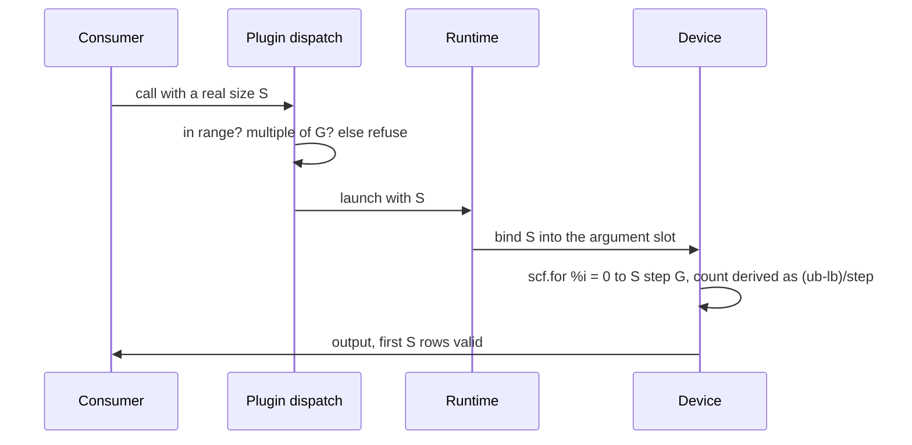
```mermaid
sequenceDiagram
  participant U as Consumer
  participant P as Plugin dispatch
  participant R as Runtime
  participant Dv as Device
  U->>P: call with a real size S
  P->>P: in range? multiple of G? else refuse
  P->>R: launch with S
  R->>Dv: bind S into the argument slot
  Dv->>Dv: scf.for %i = 0 to S step G, count derived as (ub-lb)/step
  Dv->>U: output, first S rows valid
```

No compile happens on this path. Note the loop is `to S step G`, not a precomputed count: we author no division, and the trip count is the device's own `(ub - lb) / step`. Section 7.5.

### 10.3 The IR objects

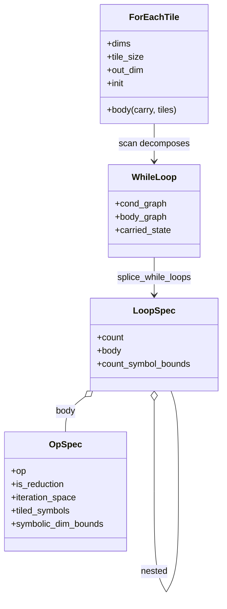
```mermaid
classDiagram
  class ForEachTile {
    +body(carry, tiles)
    +dims
    +tile_size
    +out_dim
    +init
  }
  class WhileLoop {
    +cond_graph
    +body_graph
    +carried_state
  }
  class LoopSpec {
    +count
    +body
    +count_symbol_bounds
  }
  class OpSpec {
    +op
    +is_reduction
    +iteration_space
    +tiled_symbols
    +symbolic_dim_bounds
  }
  ForEachTile --> WhileLoop : scan decomposes
  WhileLoop --> LoopSpec : splice_while_loops
  LoopSpec o-- OpSpec : body
  LoopSpec o-- LoopSpec : nested
```

The arrow from WhileLoop to LoopSpec is a named pass, `splice_while_loops`, and it is the first pass in the pre-scheduling pipeline. Section 10.1 has why that position is an invariant rather than a default.

- The loop count is per nesting level, and each level is independently a constant or a symbol. Nesting is merged, so that shape already works: a symbolic outer count over a concrete inner count reaches the bundle as two `scf.for` levels.
- The WhileLoop carried state cannot survive into the bundle, `scf.for` allows none. The carry goes to a fixed buffer moved with copies, which is what Section 9.4 pays for. A carry of more than one value is fine: the attention fixture threads three and reaches one binary.
- `count_symbol_bounds` carries the max and granularity per symbol down to codegen. It has to be carried rather than looked up, because codegen also runs in a reload phase where the ShapeEnv is gone, which is the same reason the SDSC size resolver reads carried integers.

That last point is worth stating as a pattern, because this is the one place in the project that most nearly gets it right by construction. A value that has to survive into generated source needs **four** things, and missing any one of them is a bug that appears only on the reload path and never in a direct test: the field on the IR object, an entry in the provenance schema, an entry in the **cache key**, and a line in the serializer.

`count_symbol_bounds` has the field, the typed schema entry and the serializer line. It does **not**
have the cache-key entry, and that was checked rather than assumed. `compute_specs_hash` hashes
`str(LoopSpec.count)`, so two kernels with different trip-count expressions or different tile sizes
never collide. But two kernels whose count expression is identical and whose **declared maximum
differs**, say 512 against 1024, produce the same key while emitting different `max_value=` in the
bundle. That is the fourth item of the same pattern that has already bitten this area four times,
and it is in scope for the front-end PR.

One more instance of the same class, suspected and not yet confirmed. The serializer emits an
expression as `sympify('<str>')`, and `str(FloorDiv(s, 64))` prints `(s//64)`. On reload sympy
re-parses `//` into `floor(s/64)`, which is a different type from the `FloorDiv` the emitter
type-checks for. If that is what happens, the reload path refuses a loop it had just emitted. Any
code interpreting such a value must accept every spelling the round trip can produce, at **one**
interpretation point.

#### Where the declared granularity actually comes from. Settled 5 Oct 2025

An earlier version of this section said the granularity is inferred from the symbol's derived lower
bound, that a bound can be raised by an unrelated op's guard during tracing, and that Section 7.3
was where the fix belonged. The first two are correct and that is exactly how a bundle came to
declare 128 while its loop stepped 64. The conclusion was wrong.

The fix is not to read the declared contract here. It is that **the granularity is already in the
trip count**. A region is built with `for_each_tile(tile_size=G)`, so the count arrives as
`FloorDiv(s, G)` and the emitter extracts `G` from it exactly, with no inference and no choice to
make. The bundle's `granularity=` and the loop's own `step` then come from the same expression and
cannot disagree.

That is strictly better than reading a better source, because it makes the mismatch
**unrepresentable** rather than merely unlikely. It is the same reasoning as handing
`for_each_tile` its tile size from the declared contract rather than a bare literal.

Two consequences. The old inference path, `compute_granularity` reading a derived lower bound,
serves only the older symbolic-SDSC route and the loop route never calls it. And the contract is
not on the critical path for the mechanism at all. It is needed only where a granularity must be
chosen **before** a loop exists, which is the region builder and the host check. Sections 7.3
and 7.5.

### 10.4 The symbol's names along the way

The same value has a different name at every stage.

| Stage | Called | Concrete or symbolic |
|---|---|---|
| User annotation | min, max, granularity | concrete |
| Dynamo | the dimension symbol, range in ShapeEnv | symbolic |
| Inductor | a range expression | symbolic |
| `for_each_tile` | tile extent and tile count | extent static, count symbolic |
| LoopSpec | `count` | symbolic |
| SDSC | tile geometry | concrete, and the max never appears |
| Bundle | `input_arg` with granularity and max, read as the loop bound | symbolic until launch |
| Launch | the bound value in an argument slot | concrete |

### 10.5 A deep walkthrough: one MLP region, annotation to launch

One example, followed through every stage of Section 10.1 with the real artefacts. This is the region shape the bridge exists to produce, and it is measured working on device, so the walkthrough is a description rather than a proposal.

```python
# x: (S, 128) with S varying.  W1: (128, 256).  W2: (256, 64).
def forward(x, W1, g, b, W2):
    h = torch.relu(x @ W1)
    n = torch.nn.functional.layer_norm(h, (256,), g, b, 1e-5)
    return n @ W2
```

**Stage 1, the annotation.** `x = x.to("spyre", dynamic={0: dict(min=64, max=512, granularity=64)})`. The buffer is allocated with capacity for 512 rows. The device layout that comes back is sized from the maximum and not from the first call: a stick split plus layout axes giving `device_size=[2, 512, 64]` with `stride_map=[64, 128, 1]`. The 512 is the declared max. Had it been the warm-up size, every later size would have needed its own binary, and that failure mode has appeared three separate times in this work, each time as "sized from the hint, not the max".

`W1`, `g`, `b` and `W2` are moved plainly and never marked. The audit confirms this holds: through the whole region exactly one graph input is symbolic, the activation, and no weight or bias geometry depends on the varying size.

**Stage 2, Dynamo.** Dim 0 becomes a symbol, call it `s33`. The `ShapeEnv` holds `64 <= s33 <= 512` and the divisibility fact `Mod(s33, 64) == 0`. Both channels coexist cleanly, which is the point of keeping min and granularity as separate fields: the range is a bound and the divisibility is a congruence, and neither is derivable from the other.

**Stage 3, pre-grad.** Region selection runs here and groups the four ops into one region, lifting them and leaving a marker node behind. Today this pipeline is empty, so in the measured experiments the region is written by hand as a `for_each_tile` call. That substitution is exactly what the bridge will automate and it is why the region result is already trustworthy: the thing downstream of the bridge has been exercised, only the selection is pending.

**Stage 4, AOT.** The marker's decomposition traces and calls:

```python
for_each_tile(body, (x, W1, g, b, W2),
              dims=(0, None, None, None, None),
              tile_size=64, out_dim=0)
```

`dims=(0, ...)` tiles `x` along dim 0. Every `None` marks its operand **invariant**, meaning the body sees it whole on every trip. That is what keeps the weights out of the symbol's reach.

Inside the same stage, `layer_norm` hits the Spyre decomposition table and becomes three Spyre ops:

```python
mean      = spyre.exx2(input, 1.0 / 256, False)
norm_mean = spyre.layernormscale(mean, eps)
out       = spyre.layernormnorm(input, mean, norm_mean, weight, bias)
```

with ones and zeros substituted if `weight` or `bias` is absent. Two consequences fall straight out of that listing. `layernormscale` takes the *mean*, not the affine parameters, so it is the epsilon scale and not the scale-and-shift. And because the decomposition substitutes defaults, an `elementwise_affine=False` norm produces the **same three ops** plus a constant fill, so it is not a simpler path. Both of those were learned the expensive way.

**Stage 5, scan to WhileLoop.** `for_each_tile` builds a combine function and calls `scan`, which decomposes to the WhileLoop IR. The trip count arrives as `FloorDiv(s33, 64)`.

**Stage 6, `splice_while_loops`.** The body is inlined and `loop_info` is stamped on every stage of it. This is the moment the invariant of Section 3 becomes literal: after the splice, every extent inside the body is the concrete 64, and `s33` survives in exactly one place, the loop's trip count. Anything that still holds a symbolic extent at this point is a bug, and the audit that checks it has to look at graph inputs and their device layouts as well as the operations, because an earlier version walked only the operations and reported a clean state while a load was reading a symbolic stride.

**Stage 7, stickification and layouts.** The body is a concrete 64 x 256 tile, so layouts are chosen exactly as for a static kernel. This is where the region's one genuine difficulty lives. `layernormnorm` is a multi-argument op whose operands do not share an element arrangement:

```
input      STANDARD
mean       EXX2        <- a reduction ordering, two values per stick
norm_mean  EXX2
weight     STANDARD
bias       STANDARD
```

EXX2 mixed with STANDARD is refused by the general compatibility rule, deliberately, because EXX2 is a reduction ordering rather than a broadcastable one. Layernorm is allowed through by a named exemption instead. Inside a tiled body that exemption stopped matching, because an op's resolved name becomes the enclosing loop's name once the body is a subgraph, so the exemption that exists specifically to permit layernorm could never fire. The fix is to ask the whole origin set rather than the single resolved name. Section 20 generalises it, because the class is wider than this one op.

**Stage 8, core division.** Divides the 64-row tile across cores, identically to a static kernel. The symbol is not visible here, which is why core division never appeared on the dependency list.

**Stage 9, the kernel.** `LoopSpec(count=FloorDiv(s33, 64), count_symbol_bounds={"s33": (512, 64)})`, and the symbol is resolved to the launch argument and dimension it will be read from, here argument 0 and dimension 0.

**Stage 10, codegen.** The region's work becomes device programs, each describing a static tile with no mention of `s33` or of 512, inside one bundle whose loop is `scf.for %i = %c0 to %dim_s33 step %step_0`, strides divided by 64 as Section 7.5 requires. How many programs the region becomes is Inductor's fusion decision and is unchanged by this feature: grouping changes the number of **loops**, not the number of programs inside one.

Inductor's own kernel name records the fused region, which is a useful sanity check on the walkthrough:

```
sdsc_fused_add_copy__exx2_layernormnorm_layernormscale_mm_relu_select_slice_view
```

Every op of the region appears in one kernel: the matmul, the `relu`, the three layernorm ops and the tile `select` and `slice`. That is the whole argument for a region rather than one loop per op. Separate `for_each_tile` calls get separate loop groups and the scheduler groups by that, so one loop per op would mean four sequential device loops, each re-reading its tile from HBM.

**Stage 11, launch.** The runtime reads `x.size(0)` into the dimension argument. At `S = 320` the device computes `(320 - 0) / 64 = 5` trips. At `S = 512` the same binary computes 8.

**What it measures.** This exact region runs on **one binary** across 128, 256, 320, 448 and 512, with a relative error between 0.0025 and 0.0032, recompiling only on the first call. Wall time on the reused binary is 0.0004s against 9.2s for the first compile, which is the project's thesis in two numbers.

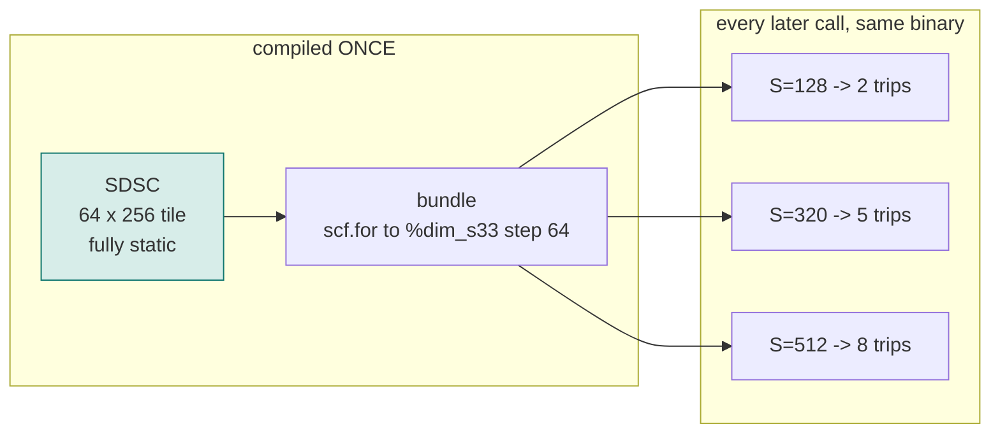
```mermaid
flowchart LR
  subgraph once["compiled ONCE"]
    sd["SDSC<br/>64 x 256 tile<br/>fully static"]
    bu["bundle<br/>scf.for to %dim_s33 step 64"]
  end
  subgraph calls["every later call, same binary"]
    c1["S=128 -> 2 trips"]
    c2["S=320 -> 5 trips"]
    c3["S=512 -> 8 trips"]
  end
  sd --> bu
  bu --> c1
  bu --> c2
  bu --> c3
  classDef st fill:#d7ede9,stroke:#0f766e;
  class sd st
```

## 11. Tiling, granularity and allocation

### 11.1 One granularity for now

The first release uses a single granularity, taken straight from the annotation.

```python
x = x.to("spyre", dynamic={0: dict(min=64, max=512, granularity=64)})
```

One granularity over the whole range, so the tile is 64 rows and any admissible size is a multiple of 64.

Real serving traffic is rarely uniform, though. Sizes often cluster low and thin out high, so a fine step is worth it at the bottom of the range and wasteful at the top. That is what bands are, and the annotation already expresses them as a list of the same dicts.

```python
x = x.to("spyre", dynamic={0: [
    dict(min=64,   max=512,  granularity=64),    # band A, tile 64
    dict(min=512,  max=4096, granularity=256),   # band B, tile 256
]})
```

Two bands means two tile sizes, and the tile size is baked into the SDSC, so every kernel touching the varying axis is compiled twice. N bands is N binaries per kernel. Cold compile time multiplies by N, which is why this is not in the first release: cold compile time is the cost the whole project exists to reduce, so spending it back needs the parallel per-SDSC invocation work first.

Dispatch with bands is two steps instead of one. Find the band the size falls in, then check the multiple against that band's granularity. Size 704 shows why both steps are needed. It is inside the global range, and it divides 64, but it falls in band B whose granularity is 256, so it is refused. A single global divisibility check would have let it through.

Everything below the dispatcher is band blind. Each band is an ordinary compiled artifact with a static tile, so nothing in the bridge, the bundle, the deeptools contract or the runtime changes. Bands cost compile time and program memory, not design.

Choosing a granularity automatically, rather than taking the one the user gave, is a separate optimisation and is covered in Section 13.

#### Two granularities, and why the contract one is not the execution one

The single granularity above is the **contract** granularity: it defines which sizes are admissible and it is the number the caller has to satisfy. The tile the device actually executes need not be the same number, and keeping them separate is what resolves several otherwise awkward problems.

| | Contract granularity | Execution granularity |
|---|---|---|
| Who sets it | the caller, in the annotation | the compiler, per kernel |
| What it governs | which sizes are admissible | how much work one trip does |
| Who must know it | the caller and the dispatcher | nobody outside the kernel |
| Constraint | `max` is a multiple of it | it divides the contract granularity |

The second constraint is what keeps the user-facing contract still while the compiler is free to pick a tile that fits the scratchpad, or a smaller one that leaves room to double buffer. A chooser also needs one more rule, from a failure rather than from theory: the contract granularity divided by the execution granularity should be at least 2, so the smallest legal input is provably more than one trip. That removes a whole class of single-tile edge cases without excluding anything from the caller's contract, and Section 13 has the measurement.

Two practical notes on the numbers. The granularity has no floor at a stick: the default minimum is 4, so a dynamic batch with a granularity of 8 or 16 is admissible and the chooser's range is wider than a stick width. And the cap on how many steps fit in a range, `max` divided by `G`, is currently 32, which is a limit inherited from the bucketing design rather than anything this design needs. It is low enough to block the highest-value serving scenario and should be revisited as a constant, not designed around.

One correction to "band blind", which is true of the dispatcher and the bundle but not of the chooser. Once there are two granularities, the chooser has to respect the band's contract granularity when picking an execution tile, so the band structure is visible to exactly one component below the dispatcher. Everything else stays blind.


### 11.2 Why the addresses stay static

Tile `i` sits at `base + i * G * row_stride`, and the row stride does not depend on the varying axis. So every tile address is a compile-time constant and a smaller runtime size does not move anything, it only makes fewer tiles live.

**This is a hard prerequisite with no fallback, not an optimisation.** The current backend pipeline
**refuses** an address correction for a call inside a loop and fails the pass, with a message about
needing a latch program it does not build. So there is no slow-but-working path where a symbolic
address gets corrected per trip. Either the reservation keeps the addresses static or the kernel does
not compile. That makes the reservation work of Section 16.1 load-bearing in the strict sense, and it
is why this document treats it as part of the Stage 1 gate rather than a parallel improvement.

There is a useful distinction the deeptools guidance draws, and it changes how much memory we hold.

| The varying dim is | Layout requirement | Memory effect |
|---|---|---|
| Outermost in the device layout, the Phase 1 case | nothing strides over it, so no sparse layout is needed. The buffer only needs capacity for the max | data stays dense, no holes |
| An inner dimension, the Phase 2 nested case | every stride above it is computed from its max, so the tensor is stored sparsely at max stride | real holes in HBM, the tensor occupies its max size |

For Phase 1 this means the buffer is sized for the largest batch we might see, but the data in it is contiguous and there are no gaps. It is capacity, not waste. The nested sequence case is the one that genuinely pays, and that is a runtime allocation question, ref [#2434](https://github.com/torch-spyre/torch-spyre/issues/2434).

### 11.3 The tail, and what the caller may read

We do not pad. The caller hands us a size that is already a multiple of the granularity, so the tiles are exact and no partial tile exists.

What does exist is unused buffer. The output has capacity for the maximum, so after a dispatch at a smaller size the rows past the real extent hold whatever was there before.

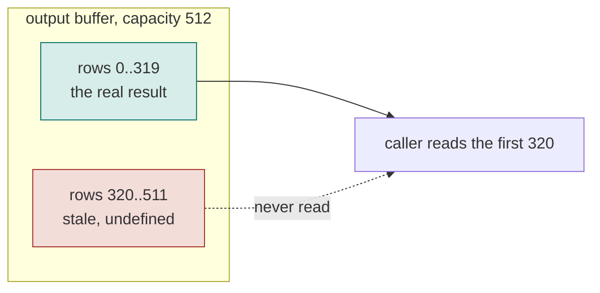
```mermaid
flowchart LR
  subgraph buf["output buffer, capacity 512"]
    r["rows 0..319<br/>the real result"]
    t["rows 320..511<br/>stale, undefined"]
  end
  r --> c["caller reads the first 320"]
  t -.->|"never read"| c
  classDef bad fill:#f3ddd9,stroke:#a5342b;
  classDef ok fill:#d7ede9,stroke:#0f766e;
  class t bad
  class r ok
```

Phase 1 is correct under one condition, that nothing reads those rows. Inside the graph no op does, because every op reads only its own tile. Outside, the caller reads the extent it asked for.

Phase 2 is where this stops being free. Once something reduces along the varying axis, invariant 6 applies: the region has to hold the reduction's identity, or be removed with a select. Not multiplied by a mask, because an uninitialised region can hold a NaN bit pattern and NaN times zero is still NaN. [GSPMD](https://arxiv.org/abs/2105.04663) reaches the same conclusion from production experience.

## 12. Guards and graceful exit

A caller will eventually send a size we cannot serve. What happens then decides whether this is usable in production.

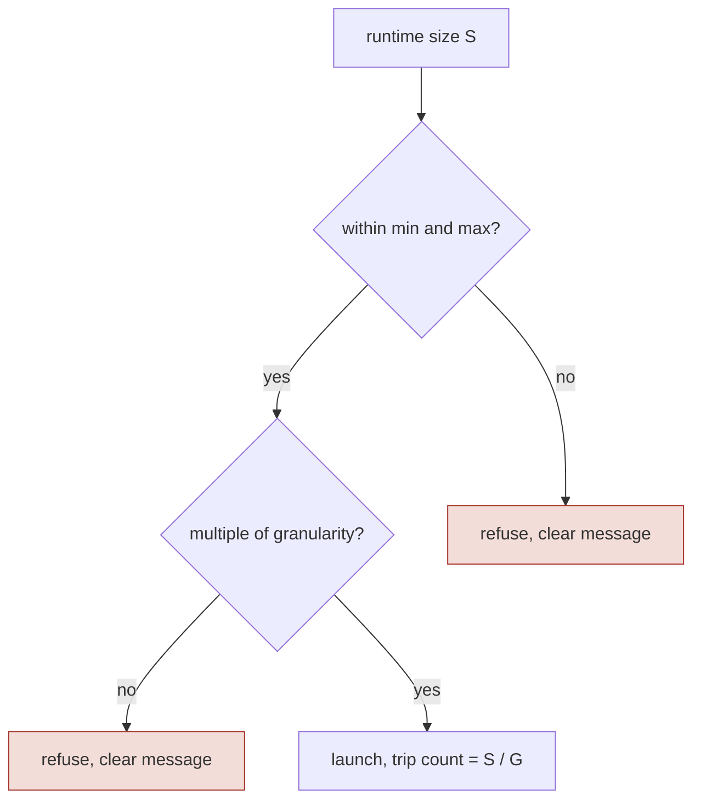
```mermaid
flowchart TB
  s["runtime size S"]
  d{"within min and max?"}
  g{"multiple of granularity?"}
  run["launch, trip count = S / G"]
  e1["refuse, clear message"]
  e2["refuse, clear message"]
  s --> d
  d -->|no| e1
  d -->|yes| g
  g -->|no| e2
  g -->|yes| run
  classDef bad fill:#f3ddd9,stroke:#a5342b;
  class e1,e2 bad
```

**We do not pad.** A size that is not a multiple of the granularity is refused, with a message naming the size, the granularity and the nearest admissible values. Padding on our side would mean silently changing the caller's data and then silently trimming it back, and the caller is the only party that knows whether a padded row is meaningful. The consumer already pads, because it had to pad for the static path too.

Dynamo holds the range guard and we do not duplicate it. Two PyTorch behaviours limit how far we lean on it. The minimum is not reliably enforced today, so we re-check it. And when a frame exceeds the recompile limit PyTorch marks it skipped and discards every compiled entry for it permanently, which would take the model off the device path entirely. So the design never uses recompilation as a fallback.

The divisibility check has to be ours in any case. A size can sit inside the declared range, look perfectly reasonable, and still not be a multiple of the granularity. Only a check that knows G catches it.

For a graceful stop the public API is the compiler stance that fails on recompile. The stance that falls back to eager must never be used, because eager on this device means off the device path, a silent performance collapse rather than an error. Ticket ref [#4384](https://github.com/torch-spyre/torch-spyre/issues/4384), replacing the raw ConstraintViolationError of [#3005](https://github.com/torch-spyre/torch-spyre/issues/3005).

## 13. Optimisations [ In scope after functional enablement ] 

None of these are needed for the feature to work.

**Choosing the granularity automatically.** Today the user's granularity is used as is. A cost model could pick a smaller execution granularity that fits LX better, trading more iterations for room to double buffer. Ref [#4381](https://github.com/torch-spyre/torch-spyre/issues/4381).

Three rules it has to hold, and the third is the one that was learned rather than designed.

- The execution granularity **divides** the contract granularity, so the caller's contract does not move.
- It fits the scratchpad for that kernel, which is the point of the exercise.
- The contract granularity divided by the execution granularity is **at least 2**.

That third rule is worth the space because it buys more than it looks like. It makes the smallest legal input at least two trips, which keeps a trip-count comparison on one side of its boundary for every admissible size. Single-tile inputs are the one remaining rough edge on otherwise-passing scenarios, and they degrade asymmetrically: in map mode a single tile is numerically correct but costs an extra binary, from an upstream contiguity guard rather than from anything of ours, while in reduction mode it is a hard compile error. Making the rule part of the chooser removes both without narrowing the caller's contract by a single size.

**More than one granularity over the range.** Fine steps at small sizes, coarse at large. Each granularity is a separate binary per kernel on the varying axis, so this needs the parallel per-SDSC invocation work first.

**Region widening.** Phase 1 uses the narrow region rule of Section 8.3. Widening it means fewer loops and fewer HBM re-reads, and it is the same cost model question as granularity.


## 14. Op and model coverage

An op is safe under a symbolic count when it reads only inside its own tile along the varying axis. That is the whole rule, and it is exactly the map versus reduction mode question from Section 8.1.

#### Name the axis first, because it decides almost everything else

Coverage is a property of **which** axis varies, far more than of which ops appear. The same model
is either fully covered or barely covered depending on that one choice, so no coverage claim in this
document should be read without it.

| The varying axis is | What it means for coverage |
|---|---|
| **batch**, or the flattened token count | no reduction in a transformer runs over it. Section 14.1 checks this op by op. So per-tile iteration covers the **whole model**, attention included, and Phase 1 is sufficient |
| **sequence** | softmax over the key sequence, the value product and pooling all land on it at once. Needs a carry across iterations and a defined pad, so it is Phase 2 |
| **hidden**, or a head dimension | every reduction in the model is over these. Not a target |

Phase 1 is dim 0 for two independent reasons that happen to agree, and conflating them has already
cost us. The buffer is reserved along dim 0 because the reservation call is passed a literal zero,
which is a current limitation. And dim 0 is where batch and token counts sit in the layouts the
consumers use, which is the axis that is actually clean. The first is fixable in one line, the
second is a property of transformers. Section 9.3 is the measurement that separated them.

| Op class | Along the varying axis | Verdict |
|---|---|---|
| Pointwise, for example gelu, add, multiply | reads only its own element | **Phase 1, measured, inside a tiled region.** Untiled it is REFUSED: an untiled symbolic dim takes the older symbolic-SDSC route, which is gated at the compile boundary pending a runtime payload that was never built. There is no zero-code-change path until the bridge lands |
| Matmul where the varying axis is the outer axis | contraction is over a static axis | **Phase 1, measured** |
| Layer norm or softmax over a static axis, including inside the tile body | the reduced axis is static, so the body sees an ordinary static reduction | **Phase 1, measured.** The aten `layer_norm` path additionally needs the element-arrangement exemption of Section 10.5 |
| A residual branch inside the body | both branches read the same tile | **Phase 1, measured.** No second symbol, no equality needed |
| Elementwise with two independently marked operands | two symbols, two counts | **Phase 1.** They unify by themselves on a shared **tiled** axis, because the loop's own tile-count comparison forces the guard. An explicit equality is still required for a shared axis that is not tiled |
| Matmul where the varying axis is the contraction axis | a reduction by another name | **Phase 1 in one layout**, with the axis at dim 0 of both operands. A binary per size otherwise. Section 9.3 |
| Reduction along the varying axis, for example sum or max over it | folds the tail into the answer | Phase 2 |
| Mean along the varying axis | also needs the true count, which is data and not geometry, and that path is untested | Phase 2 |
| Attention over a varying KV length | a reduction along it, with a multi-value carry | **works on one binary**, 256/384/512. The remaining Phase 2 work is allocation and the integer block arithmetic, not the carry. Section 5.3 |
| Gather or scatter under a symbolic count | the addresses come from data | separate track, issue #4382 |

Two refinements to "that is the whole rule", both learned from failures rather than from the model.

The rule is about the **reserved** dimension, not the outermost one. An op can read strictly inside its own tile and still force a binary per size, if the marked dimension is not the one the buffer was reserved along, because then a stride is computed from the symbol. Section 9.3.

And an op can be perfectly tile-local and still be refused for a reason that has nothing to do with the varying axis. Moving an op inside a loop body changes its resolved name and its layout context, and any compiler pass that keys a decision on either can change its mind about an op that did not change. That is how the aten `layer_norm` path failed. Section 20 treats it as a class.
### 14.1 BERT, checked op by op

| Op | Reduces over | Touches the batch axis? |
|---|---|---|
| embedding lookup | nothing, it is a gather | no |
| layer norm | hidden | no |
| attention scores | head dim | no |
| softmax | key sequence | no |
| attention times V | sequence | no |
| feed forward | hidden | no |
| pooling head | sequence | no |

Mean and max do appear in BERT, but over hidden and over sequence. **Not one reduction runs over the batch axis.** That is why dynamic batch is the clean case. Mark batch dynamic and every reduction in the model is happening on a static axis inside a tile, so map mode covers the whole model. Mark sequence instead and softmax, the value product and the pooling mean all land on the varying axis at once.

The model already handles its own padding the right way. It does not multiply scores by a 0/1 mask, it adds a large negative number to padded positions before softmax so they vanish after the exponent. And mean pooling divides by the sum of the mask, not by the padded length. That is invariant 6, arrived at independently by the model authors.

### 14.2 The three attention shapes

**Paged attention on vLLM.** Opaque to the compiler, and the mechanism is worth stating exactly, because it is load-bearing and a future reviewer may otherwise propose removing it. The opacity is not the custom-op registration by itself. The attention implementation allocates its own query and output staging buffers at a **constant** row count and copies the caller's rows in and out around the kernel call, specifically so the kernel never sees the model graph's token bucket. Their own comment gives the reason: a kernel taking the caller's buffers would be guarded on that row count, so no recorded variant would ever match. The varying token count therefore stops at a slice assignment and never reaches the kernel's guards.

Record this as an invariant we **preserve**. A symbolic token count collapses the body graphs and should leave the attention path untouched.

**Encoder attention on hf-adapters.** In graph, flash style, with an online softmax over fixed-width KV tiles. This is the harder of the two in-graph shapes, because the encoder's score matrix is square: one symbol lands on both the row and the column axis of the product and on both axes of the mask, where a decoder has two independent dimensions. The decomposition also computes block counts with plain integer arithmetic, which specialises a symbolic length silently.

One correction worth carrying, because it changes where the work lands. hf-adapters has **no** paged or custom-op attention anywhere, and its decoder path uses the **same** in-graph attention as its encoder. So the opaque-boundary row above is about the vLLM plugin only, and on the hf-adapters path every adapter hits the in-graph decomposition. The expensive problems there are also not the attention mathematics: the masks are built by host Python loops whose trip count is the sequence length, producing a tensor quadratic in it, and the rotary embedding does a host round trip with a `.item()` on a value that would be symbolic. Neither is a torch-spyre change.

**Static dense decode.** Recompiles per cache position and is not a target of this work.

### 14.3 Indirect access

Gather and scatter are a separate track, ref [#4382](https://github.com/torch-spyre/torch-spyre/issues/4382) under epic [#866](https://github.com/torch-spyre/torch-spyre/issues/866). Two shapes: a symbolic dim on the value tensor is only a range constraint on the index values, and a symbolic dim on the index tensor is a dimension symbol with no tiled loop.

One finding worth carrying, from ref [#4581](https://github.com/torch-spyre/torch-spyre/issues/4581): a `for_each_tile` per-iteration tile index and a gather index already flow through the **same** `indirect_sizes` mechanism in codegen. So this is not new plumbing, it is making a shared path symbol-safe. Reproducers already exist, refs [#4346](https://github.com/torch-spyre/torch-spyre/issues/4346), [#4638](https://github.com/torch-spyre/torch-spyre/issues/4638), [#4304](https://github.com/torch-spyre/torch-spyre/issues/4304), and all three are one bug: something calls `int()` on a symbol on the indirect path.

## 15. Integrating with spyre-inference and hf-adapters

Both consumers already pad an input up to a chosen size and already track the real length separately from the padded one, which is the structure this design needs. Integration is mostly replacing a list of sizes with a range.

### 15.1 What changes on the consumer side

| Today | With symbolic shapes |
|---|---|
| a list of buckets, chosen up front | one range with a granularity |
| pad the input up to the nearest bucket | pad the input up to the next multiple of the granularity |
| pick the binary matching that bucket | one binary, the trip count is computed from the size |
| one compile per bucket during warmup | one compile for the whole range |
| a new size outside every bucket is a failure or a fresh compile | a new size inside the range is free, outside it is a clear refusal |

The padding code does not go away, and neither does the logic that remembers the real length. Both stay, they just work against a granularity instead of a bucket table.

### 15.2 The contract you have to hold

Four things, and all four are checkable before a call reaches the device.

- The size is within the declared min and max.
- The size is a multiple of the declared granularity. We check this and refuse, we do not pad on your behalf, for the reason in Section 12.
- You read only the real extent of the output. The buffer has capacity for the maximum, so rows beyond the real extent are stale, not zero.
- Weights are never marked dynamic.

### 15.3 spyre-inference and vLLM

The varying axis is the packed token count at dim 0 of the decoder input, which changes on nearly every iteration under continuous batching.

The pieces you already have map directly. `SpyreAttnBucketer` holds `query_buckets`, `kv_buckets`, `num_seqs_buckets` and `num_blocks_buckets`, and `min_real_query_len(padded_query_len)` already answers "how much of this padded tensor is real". That method is the real-extent tracking this design depends on, so it stays. The change is that the axis being made symbolic stops needing a bucket list at all, while the other axes can keep theirs.

A staged migration works. Make one axis symbolic first, keep the rest bucketed, and compare. Nothing in the design requires all axes to move together.

Paged attention is a registered custom op, so it is an opaque boundary to the compiler. The varying token count crosses it and we never compile inside it. This is the reason the decode path is in the first phase at all, and it means the attention path needs no change for this feature.

#### Scope the benefit honestly, because the graph count is mostly not the body

On the plugin's own documented Granite decode configuration the compiled graph count is about 45, of
which the **body** contributes roughly 5. The remaining graphs are an attention product, over query,
KV and block buckets, that a symbolic token dimension does not touch, by design, because of the
opaque boundary described above.

So Phase 1 collapses the body buckets and leaves the attention product as it is. That is a real and
worthwhile reduction, and it is not a 45-to-1 claim. Anyone quoting a compile-count saving should
quote the body figure.

One more thing that bounds how the feature is reached from here. The plugin pins `dynamic=False` at
four separate sites, and its default is a per-block compile rather than a whole-model one. So
enabling this is a plugin-side change at those sites, not something that follows from the compiler
supporting it.

### 15.4 hf-adapters

The varying axis is the batch at dim 0, formed from whatever requests arrived.

`assert_spyre_dimensions` in `hf_common.py` already validates that dimensions are stick multiples and raises a readable error when they are not. A granularity check is the same shape of validation, aimed at a different number, so it belongs next to that one rather than somewhere new. `AutoSpyreModelForCausalLM.from_pretrained` and its siblings are the natural place to surface the declaration, so a caller states the range once when the model is loaded rather than on every call.

The encoder sequence axis is the harder one and is the second phase, because in-graph attention reduces along it. Batch first, sequence later.

### 15.5 What does not change

Model code is untouched. Nobody writes a `for_each_tile` and nobody imports anything from the compiler, per Section 8.3. Weight loading is untouched. Custom ops stay opaque. And a model with no declared dynamic dimension compiles exactly as it does today, on exactly the same path.

### 15.6 Sizing, and one caution

For the batch and token-count axis the buffer needs capacity for the declared maximum, but the data inside it is dense, so this is the same number you already use when choosing your largest bucket. It is capacity, not per-tensor waste. Section 11.2 has the detail and the case where it does cost more.

The caution is that a generous maximum is not free. Declaring a much larger max than you will really serve reserves memory you could have spent on KV cache. Activation memory is not currently accounted for on the vLLM path, so an over-commitment shows up as a crash rather than as a clean out-of-memory error. Pick the max from what you will actually admit.

## 16. Work outside the front end

Two components, torch-spyre and deeptools.

### 16.1 torch-spyre runtime: allocation

The dynamic tensor's buffer needs capacity for the declared maximum, and for an inner symbolic dimension the layout has to be at max stride. Section 11.2 has the distinction. Ref [#2434](https://github.com/torch-spyre/torch-spyre/issues/2434).

### 16.2 torch-spyre runtime: dispatch and launch

At dispatch the runtime binds base addresses and the real size into the argument slots. Ref [#4964](https://github.com/torch-spyre/torch-spyre/issues/4964), superseding [#221](https://github.com/torch-spyre/torch-spyre/issues/221).

An earlier version of this section said most of this already exists and that the dispatch path
already binds a dimension from a launch tensor. That was too generous, and the correction matters
because it moves a real item onto the critical path.

What exists is the **shape** of the mechanism, not the mechanism. The symbolic-argument kind for a
dimension is defined, the payload struct carries both a tensor index and a dimension index, and the
header documents what the dimension kind is for. What does **not** exist is the resolution: the
launch path asserts `kind == kAddress` and refuses a dimension argument with
"`SymbolicArgKind::kDimension` is not yet implemented". So a bundle with a dimension parameter
reaches that assertion and stops.

Two small pieces close it, and both have been written and run on device in the prototype. The
launch payload builder emits a dimension argument for a `loop_dimension` symbol rather than
treating every symbol as an address. And the launch path resolves it as `tensor.size(dim_index)`,
with a range check on the dimension index.

It reads the **logical** size deliberately, since under a max-strided reservation the allocation is
larger than the logical extent and it is the logical extent that varies per call. Reading the
allocated extent instead would make every call run `max / G` trips while appearing to work.

So the remaining work here is small and well understood, but it is not zero, and a plan that assumes
it is already done has no path to a running kernel.

One defect found there is ours rather than theirs, and it is the kind that a correctness-only test would miss. A split-K kernel compiled, emitted a correct bundle, and was then rejected by **our own** job-plan step-order validator, which required a compute step at a fixed index. It had to be relaxed to require only that a compute step follows. The reason it matters beyond that one case: the host-compute step at index 0 is not symbolic-only, every launch has one for the address-correction blob, so that validator gates every kernel on the device and any change to it has to be run against the full suite rather than the symbolic tests.

### 16.3 deeptools: the device loop

The distinction the host makes at dispatch is the whole game.

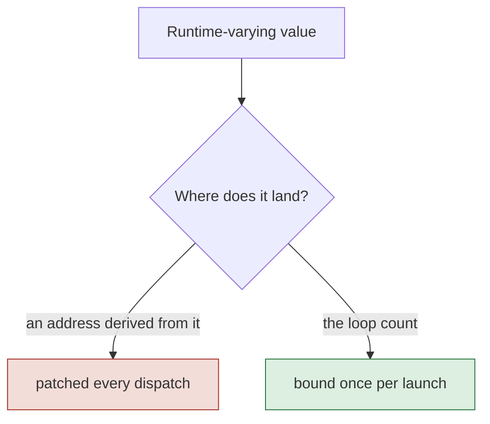
```mermaid
flowchart TB
  v["Runtime-varying value"] --> q{"Where does it land?"}
  q -->|"an address derived from it"| corr["patched every dispatch"]
  q -->|"the loop count"| bind["bound once per launch"]
  classDef bad fill:#f3ddd9,stroke:#a5342b;
  classDef good fill:#dcefe0,stroke:#2f7a44;
  class corr bad
  class bind good
```

Argument binding fills a value into a slot the program reads at launch and leaves the body alone. Patching rewrites values baked into the body before the launch.

Base addresses are patched either way, that is normal and it is not what this design changes. What matters is how often. Our tile addresses are `base + i * constant`, and the constant is the tile stride, which does not depend on the varying dimension. So a different size on the next call does not invalidate anything that was already patched.

What crosses the boundary is the size, not the count, for the reason in Section 7.5. **We author no division.** The bundle emits `to <dim> step <G>` and the device derives the trip count itself.

An earlier version of this section said the bundle derives the bound with a `ceildivsi` which deeptools was adding. That is wrong twice over and the correction matters, because the wrong version would send the loop down a different backend path.

A `ceildivsi` is not rejected outright: it round-trips correctly inside a **symbol expression**, which is a different channel. What it cannot be is the `scf.for` bound itself. The instruction that builds the device loop counter switches on the bound's defining operation, and only a constant, a query-map result or a symbol-creation result becomes a true symbolic loop count. Anything else, a `ceildivsi` included, falls through to a generic dynamic-loop path. So "author no divide" is still right, and the reason is which operation the bound is, not a reject list.

#### What the device side already does

Traced through their source rather than inferred, because the status matters for the delivery plan.

| Step | Status |
|---|---|
| The SDSC derives the trip count as a division of the symbolic dimension by the static tile, and holds it as the loop's count | implemented |
| That becomes a symbol-creation operation carrying the symbol id, the maximum and the granularity, and an `scf.for` with lower bound 0 and step 1 | implemented |
| The loop lowers through a subtraction and a division, which folds back to the symbol because the bound is 0 and the step is 1 | implemented |
| The device loop-count instruction takes it as a variable symbol immediate | implemented |
| The declared `granularity` is read by anything | **no reader exists** |
| The declared `max_value` is read | implemented, for worst-case address splitting |

So the capability this design depends on is present and working across their compiler, which is a stronger position than "unassigned and pending". What is not resolved is a specification question: their bundle specification still describes a symbolic loop bound as a future revision item while the implementation already supports it, so the written contract is behind the code. That gap is worth closing explicitly rather than relying on the implementation.

#### One hard constraint that changes our dependency list

The current correction pipeline **refuses** to build a correction for a program that is called from inside a loop, and fails the pass rather than degrading. An older implementation did support it. We expect not to encounter it because none of our addresses is **derived from** the varying dimension, so nothing inside the loop needs recomputing per dispatch. Note that this is not the same as our bundles carrying no symbols: they carry base addresses like every other kernel. Section 7.5.

That turns max-strided reservation from an optimisation into a **hard prerequisite with no fallback**. If anything ever makes an address symbolic inside our loop, the compile fails outright. The reservation work is therefore load-bearing in the strict sense, and we should guard it on our side: fail loudly if a bundle we emit puts an address or stride **derived from the varying dimension** on a program inside a symbolic loop, rather than letting it surface as a backend pass failure about latch programs. The check is on derivation, not on the symbol count, which would flag every kernel. Which of the two correction implementations the reference bundle targets is a question to settle with them.

Loop support is tracked on the deeptools side as two options, by repeating programs ([#1520](https://github.com/torch-spyre/torch-spyre/issues/1520)) and by program looping with a symbolic bound ([#1522](https://github.com/torch-spyre/torch-spyre/issues/1522)). The second is the one this design needs. Our ask [#4397](https://github.com/torch-spyre/torch-spyre/issues/4397) describes the same capability plus a request for an example bundle and SDSC pair, so it likely folds into #1522, ref [#4380](https://github.com/torch-spyre/torch-spyre/issues/4380).

#### The cost argument, stated correctly

The per-dispatch cost claim needs restating, and the honest version is **stronger** than the one this document used to make.

There is no per-allocation patching cache. The correction is a host-compute command inside the job plan, so when it exists it runs on **every dispatch of that job**, in three parts: a host patch that evaluates every symbol and rewrites every location, a transfer of the patched tensor to the device, and a device scatter program with its companion. Only symbols already constant at the call site are lifted out, at compile time. So keeping addresses independent of the varying size does not avoid an occasional patch, it removes an unconditional per-dispatch cost in its entirety. The design goal is that no address is a function of the varying dimension, which is not the same as a bundle carrying no symbols. Section 7.5.

One caveat to keep visible: the trip count travels on a **different** channel from the addresses, so "no correction" is a claim about addresses and not about the count. The count still reaches the device, just not through the correction machinery.

Finally, a caveat on the measured number that motivates this project. The roughly 795 microseconds per dispatch was measured with the correction host path in its default configuration, and a considerably faster path exists in their tree but is **off by default**. So that figure is a slow-path number and should be quoted with that qualification. The argument survives either way, because the fast path only addresses the first of the three parts above while having no size-derived address removes all three, and that is the version to rely on because it does not depend on a number that may move.

## 17. Alternatives considered and rejected

| Alternative | Why not |
|---|---|
| Deriving addresses from the varying dimension, ref [#2289](https://github.com/torch-spyre/torch-spyre/issues/2289) | the address of every tile then changes with the size, so the program is patched on every dispatch instead of once per allocation |
| Bucketing, a binary per size band | multiplies cold compile time and binary count, and still pads. It is the thing this design replaces, not a fallback |
| Specialising the trip count to an integer and compiling a variant per count | works on today's deeptools with no new support, and is implemented in [PR #4684](https://github.com/torch-spyre/torch-spyre/pull/4684). But the compile happens on the dispatch path, so an unseen count stalls a forward pass, the variant set grows with the data and is never evicted, and it declines map mode with stacked outputs by name, which is our dynamic batch case. It keeps the count inside the binary, so it does not reach one binary for a range |
| Making the granularity structural in the reshape | does not work. Every reshape spelling produces the same divided expression, see Appendix A |
| Requiring model authors to write `for_each_tile` | breaks portability. A stock model would stop being stock |
| Declaring the range with `mark_dynamic(min=, max=)` | it installs a strict constraint, and adding the divisibility check a granularity needs then raises a constraint violation. The two cannot coexist, which is the concrete reason Section 7.3 needs its own interface rather than a convenience wrapper |
| `mark_unbacked`, upstream's own answer to the 0/1 specialisation | it is the right shape for the single-tile problem and it graph-breaks on a branch over the tile count, which our loop construction performs. The chooser rule of Section 13 solves the same problem without leaving the graph |
| Expressing the granularity **structurally** as `S = G * n` | genuinely attractive and not rejected on merit. Upstream supports derived dimensions of the form `Ax + B`, so this is expressible, and it would remove the trim-then-split step, the strict-constraint conflict above and a whole class of expression-interpretation bugs. It is out of the first release because it changes the user-facing shape of the annotation, and the divisibility route is already measured working |

On #4684, the part worth keeping is the split between the planning extent and the runtime count, which is our invariant 2 implemented in the spec layer. We are not blocked on it. Our bridge authors the loop, so it already knows the marked dimension and the granularity and does not need to recover a count out of a lowered subgraph. What is left is small and we have written our own, so the overlap is a merge conflict to manage rather than a dependency.

## 18. Delivery plan

Ordered by dependency. Stage 1 is the only stage where nothing is usable until every part of it exists.

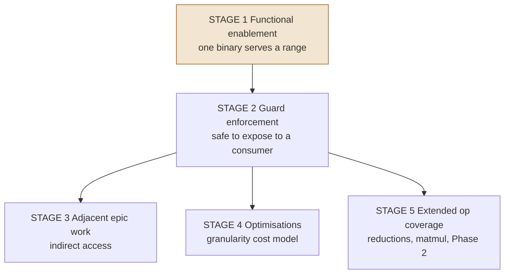
```mermaid
flowchart TB
  s1["STAGE 1 Functional enablement<br/>one binary serves a range"]
  s2["STAGE 2 Guard enforcement<br/>safe to expose to a consumer"]
  s3["STAGE 3 Adjacent epic work<br/>indirect access"]
  s4["STAGE 4 Optimisations<br/>granularity cost model"]
  s5["STAGE 5 Extended op coverage<br/>reductions, matmul, Phase 2"]
  s1 --> s2 --> s3
  s2 --> s4
  s2 --> s5
  classDef gate fill:#f2e5d0,stroke:#9a5a12;
  class s1 gate
```

### 18.1 Stage 1, functional enablement, broken into the PRs that deliver it

Four pieces of work, three owners. Nothing here delivers value alone, which is why this is the gate
for the project rather than a sequence of improvements.

| PR | What it delivers | Owner | Rough size |
|---|---|---|---|
| **N** | the declaration and the reservation: the `dynamic={dim: {...}}` API, the per-dim contract map on the tensor, reservation and layout pinning at the declared maximum, the resize guard, and the accessor the compiler reads | runtime | medium |
| **A.1** | the compiler mechanism: a symbolic trip count surviving tracing, reaching codegen, emitted as the loop form of Section 7.5, and bound at launch. Plus the four fundamental refusals | front end | ~2700 lines, 55% tests |
| **A.2** | the ergonomics: the contract reader, the automatic region builder, and the in-trace assertions, so a model needs no code change | front end | ~2200 lines |
| **R** | the host admissibility check with a usable message | guards | small |

One sequencing decision is worth stating because an earlier version of this plan had it wrong. The
declaration channel sits **inside** this gate and not in the guard stage that follows. It is not a
guard. Without it the documented interface compiles, reuses one binary, refuses nothing, warns
nothing, and returns garbage above the warm-up size. A path that lacks it is not shippable even as a
preview, so it belongs in the gate. Section 7.3.

**N and A.1 are developed in parallel and merged locally for a combined end-to-end test before
either goes upstream.** Neither waits for the other, which is what the frozen contract of Section
7.4 buys. The only thing crossing between them is boundary 2 of that table, one accessor.

#### What is true after each step, which is worth stating precisely

| After | True | Not yet true |
|---|---|---|
| N alone | the buffer is reserved at the max, the layout is pinned, the declaration is validated and readable | nothing is a loop. The compiler still specialises per size |
| **N + A.1** | **one binary serves the range, measured on device** | the test declares the range with `torch._check` and writes the region with `for_each_tile` by hand |
| + A.2 | a model needs no change beyond the transfer call | the failure message on a bad size is still poor |
| + R | safe to expose to a consumer | |

That second row is the milestone that de-risks the project, and the distinction in its right-hand
column matters. N + A.1 is functional enablement of the **mechanism**. The consumer-facing promise,
no code change beyond the transfer call, arrives with A.2. Both have been called "functional
enablement" in conversation and they are not the same date.

#### What A.1 contains, and why it is one PR rather than two

A.1 opens with four commits that are behaviour-preserving for concrete shapes: the
`max % granularity` validation fix, the three view spellings of Section 8.2, a de-duplication of two
origin-resolution helpers, and comment corrections where a comment states a superseded reason. Then
the mechanism: the four upstream-boundary fixes of Section 10.1, the count producers, the carry to
codegen including the cache-key entry of Section 10.3, the emission of Section 7.5, the launch
binding of Section 16.2, and four refusals.

Those two halves were planned as separate PRs and combined, because they are **serial rather than
parallel**: the view spellings are a hard prerequisite for the mechanism, since without trimming
first the tile extent comes out as `S // (S // G)`. A separate cleanup PR would have blocked A.1 and
bought no parallelism. The review separation is preserved by commit structure instead, with the two
halves stated as two separate review questions and the cleanup commits kept individually revertible.

A.1 is not a capability no one can reach. `for_each_tile` is already called by the SDPA
decomposition in map mode with one level, which is exactly A.1's scope, so the honest framing is
that A.1 makes an existing compiler-side construct work when its tiled dimension is symbolic.
That also names the collateral gate: the SDPA suites, not only the broad building-blocks suite.

#### Tickets

| Row | Ticket |
|---|---|
| the bridge, region selection and the decomposition | [#4379](https://github.com/torch-spyre/torch-spyre/issues/4379), [#4380](https://github.com/torch-spyre/torch-spyre/issues/4380) |
| reservation at the declared maximum | [#2434](https://github.com/torch-spyre/torch-spyre/issues/2434) |
| the launch binding the real size into the argument slot | [#4964](https://github.com/torch-spyre/torch-spyre/issues/4964) |
| the API change carrying the contract | [#4965](https://github.com/torch-spyre/torch-spyre/issues/4965) |
| a loop whose bound comes from an input argument | [#4397](https://github.com/torch-spyre/torch-spyre/issues/4397), [#1522](https://github.com/torch-spyre/torch-spyre/issues/1522) |
| the host admissibility check | [#4384](https://github.com/torch-spyre/torch-spyre/issues/4384), closing [#3005](https://github.com/torch-spyre/torch-spyre/issues/3005) |

The deeptools row is in better shape than this plan used to assume. The device-side capability is
implemented end to end in their compiler and we have run against it repeatedly, so the open item is
a specification gap and a reference bundle rather than an unstarted feature. Section 16.3. The
strategic exposure is that our load-bearing dependency has no regression test in the repository that
owns it, so a refactor there would break us with nothing on their side catching it. Getting a
symbolic-bound bundle into their golden set is cheap insurance and is a conversation, not a PR.

The front end proves what it can against structure rather than numbers, so it does not stall on
anything external. What cannot be closed that way is the end-to-end proof, and Section 19 says why a
numerical match is not evidence.

### 18.2 Stage 2, guard enforcement

Stage 1 makes it work and makes it honest. Stage 2 makes the **failure modes** good: an out-of-range or misaligned size produces a clear refusal naming the size, the granularity and the nearest admissible values, rather than a constraint violation raised from inside Dynamo with no actionable text. Ref [#4384](https://github.com/torch-spyre/torch-spyre/issues/4384), closing [#3005](https://github.com/torch-spyre/torch-spyre/issues/3005).

Two specifics for this stage, both from measurement. A non-conforming size currently surfaces as a fake-tensor error from deep inside the tracer, which is a diagnosis task rather than a message. And the host validator has to check **every** marked dimension, not one: a split-K kernel reads its trip count from one operand's dimension while nothing validates the other, so a mismatch between two marked operands is not caught by checking either in isolation.

And the reason this gates exposure is stronger than a message-quality argument, which is how it was
first written. A size that fails a guard does not simply raise. It triggers a recompile, and when a
frame exceeds PyTorch's recompile limit, PyTorch marks that frame **skipped and discards every
compiled entry for it permanently**. So a client sending a handful of non-conforming sizes does not
get a handful of errors, it takes the model off the device path for the life of the process, which
presents as a performance collapse rather than a failure. That is also why the design never uses
recompilation as a fallback anywhere, and why the compiler stance that falls back to eager must
never be used on this path.

Nothing should be exposed to vLLM or hf-adapters before this lands.

### 18.3 Stage 3, adjacent epic work

Indirect access, ref [#4382](https://github.com/torch-spyre/torch-spyre/issues/4382) under epic [#866](https://github.com/torch-spyre/torch-spyre/issues/866). Symbolic shapes owns how many iterations run, indirect access owns where each iteration reads, and a symbolic-count loop over an indirect body is a valid combination. Section 14.3 has the concrete starting point, since reproducers are already filed.

MoE is where the two meet, since a per-expert token count is a symbolic loop count whose source is routing rather than an input shape. Keeping the count source-agnostic is what keeps that door open. [MegaBlocks](https://arxiv.org/abs/2211.15841) reports up to 4.35x from removing the expert-capacity padding this would remove. The MoE enablement issue itself is closed, so this is a follow-on to raise when Phase 1 lands rather than a live dependency.

### 18.4 Stage 4, optimisations

Section 13. The granularity cost model, ref [#4381](https://github.com/torch-spyre/torch-spyre/issues/4381), more than one granularity over the range, and weight residency. All of these improve a working feature and none of them is required for it to work.

### 18.5 Stage 5, extended op coverage

Reductions and matmul on the varying axis, refs [#3062](https://github.com/torch-spyre/torch-spyre/issues/3062) to [#3065](https://github.com/torch-spyre/torch-spyre/issues/3065), re-scoped from the old address framing to the loop-count route. This is the first real use of reduction mode and the point where the tail rules of Section 11.3 start to bite. Phase 2, dynamic sequence and SDPA, sits on top of it.

## 19. Acceptance, and the false green trap

A binary compiled at the static maximum produces numerically correct results at every smaller size. It passes a CPU comparison, runs clean, and looks exactly like success. It is also the complete absence of the feature.

So acceptance asserts **structure**, not only numbers. Three properties at once:

- a live symbolic loop bound in the emitted bundle, fed from an input argument, not a constant
- tile addresses that advance by a constant stride, with no authored division and nothing derived from the varying dimension
- an SDSC describing one tile, carrying the addresses it always did and no dimension symbol

That runs with no hardware and is how the front end is proven before the deeptools support lands. The on-pod gate is then one compiled kernel, several real sizes, all correct, no recompile.

#### This is not a hypothetical trap

It has happened repeatedly during this work, and in the measurement tooling rather than in the compiler, which is what makes the rule above worth enforcing instead of merely stating. Six instances, all the same family:

- bundle counting that could report binary reuse that did not happen, which is the project's headline claim,
- probe cases that returned a fixed verdict and could never fail,
- log capture that silently kept only warnings while the harness advertised a full trace,
- two stages compared against the wrong reference, which looked like backend failures,
- an error string truncated at exactly the point the diagnostic information began,
- a diagnostic logged at a level that never emitted, whose silence was then briefly read as evidence about the thing it was meant to measure.

Three rules follow, and they apply to any gate built for this feature.

**A harness reports what it measured, not what it intended,** and it distinguishes "the system under test is wrong" from "the harness is wrong". The two failures look identical in a summary line and need different responses.

**A single-size run of a symbolic scenario proves nothing.** The one size guaranteed to pass is the warm-up size, because the geometry matches it by construction. One scenario reported success on a single size while in fact emitting a binary per size. Minimum three sizes, at least one above the warm-up.

**The absence of a diagnostic is not evidence** until the diagnostic itself is proven to emit.

### 19.1 The test inventory

What exists, what each thing actually proves, and which gate it belongs to. Written down because the
suite list this work inherited was a fixed set left over from someone else's feature, and the
subtree's own conventions warn against exactly that.

**Structural, no device needed.** These are what prove the feature is present rather than that the
numbers are right, which is the distinction the false-green trap turns on.

| Area | Asserts |
|---|---|
| the declared contract | round trip and read back, a conflicting re-declaration refuses, an unreadable declaration refuses, a declared-dynamic dim that lowered concrete is reported and not an error |
| the loop form | the emitted text is `to <dim> step <step>`, no `divsi`, `divui`, `ceildiv` or `floordiv` appears anywhere, a concrete count still emits a constant bound with step 1, the strides on a symbolic level are divided by the step, an indivisible stride raises |
| the symbol kinds | a `dimension` symbol is refused at the compile boundary, a `loop_dimension` symbol passes. **Both, side by side**, so that collapsing the two kinds fails a test instead of silently disabling the feature |
| the carry to codegen | the per-symbol bounds round trip through the **real** serializer, not a hand-built object, and the cache key distinguishes two kernels that differ only in the declared maximum |
| the trip-count recovery | a symbolic bound arriving as `index_expr` is recognised, and every decline path names its reason |
| the refusals | an unrecognised count shape, more than one symbol on one level, a symbol reaching a stride or an address, and a marked dimension with no declaration each raise, each naming the symbol |

**Multi-size, on device.** The half that cannot be skipped, and the reason is specific: a binary
compiled at the static maximum is numerically correct at every smaller size, so numbers alone cannot
distinguish the feature from its absence.

At least three sizes with one **above** the warm-up, asserting no recompile against a pinned
compilation cache, plus numerics against CPU. Two scenarios minimum, one tiled pointwise and one
tiled region containing a matmul. Plus three assertions that pin behaviour we have measured but not
audited: the returned tensor's logical shape is the real size and not the maximum, its storage byte
count recorded at two sizes, and a call at exactly one tile.

**Composition, which is its own category.** Two confirmed bugs came from passes that were correct
alone and wrong once composed with a loop, so a change that gates or replaces a path another change
depends on ships with a test that exercises the composition. The element-arrangement test is the
model: it puts a layer norm **inside** a tiled body and asserts the region did not unroll, so it
cannot pass without actually exercising the case.

**The regression gate is matched to the files touched, not inherited.** The broad
collateral-damage suite runs always. Beyond that, the suites that correspond to the changed files,
and for a change to the tiling construct that includes the SDPA suites, because the SDPA
decomposition is an existing caller. Clearing the compiled-wrapper cache layer between runs is part
of the procedure, not an optimisation: that cache is not cleared by the obvious API and a stale
wrapper makes a pass change look like it is not running.

## 20. Risks and open items

**The widest risk: any pass that keys on something tiling moves.** This is the one to carry forward, because it has already produced two confirmed bugs and it will keep producing them one real model at a time. Moving an op inside a loop body changes its resolved name, its layout context and the extent visible on its operands. Any compiler pass that keys a decision on one of those can silently change its mind about an op that did not change.

Two instances so far, both found on real models rather than by inspection, and **both now fixed**.
Neither pass was wrong on its own. Both were correct until composed with the loop.

A whole-operand transfer inside the loop carried the full symbolic extent instead of the declared
maximum, which broke attention and transposed split-K. It surfaced a long way downstream as
"symbolic stick dim is not supported yet", which sent us after layouts for a session. The fix
concretises a loop-invariant whole-operand copy to the declared maximum, which is valid at every
runtime size because the reservation has already padded the buffer to it.

An element-arrangement exemption keyed on an op **name** became unreachable inside a tiled body,
because a subgraph buffer's origin resolves to the enclosing loop's node, so every op in every
tiled body is named for the loop. The exemption that exists specifically to permit layer norm could
therefore never fire. The fix asks the whole origin **set** rather than the one resolved name, which
is also order-free, since the origin collection is unordered and picking "the first non-loop origin"
would make a compile decision depend on iteration order. Confirmed on device by a dump of the
inspected op: skip-by-name false, skip-by-origin true, arrangements incompatible so it had to be
exempted or raise.

The response to the class is an audit rather than a bug at a time. The name-keyed decision sets are
the place to start, and the general question to ask of each pass is whether its key still means the
same thing for a buffer inside a subgraph.

**The reload path is a second class with the same shape, and it has bitten four times.** An object
round-trips through *generated source*: the compiler writes a Python file and the file is
re-executed later. The round trip silently loses a field or a type, and the bug never shows in a
direct test, only on the reload. A value that has to survive needs four things and missing any one
is a defect: the field, the provenance-schema entry, the **cache-key** entry and the serializer
line. Section 10.3 has the two live instances, one confirmed missing and one suspected type change
through sympy's own re-parsing of `//`.

**A size comparison inside a tiled construct is a guard on the symbol.** The tiling helper used by
the SDPA decomposition short-circuits with `if sliced_operand.size(sliced_dim) == tile_size` and
with `if num_kv_tiles == 1`. Under a symbolic length both are comparisons on the symbol, so they
either specialise or install an inequality that makes the artifact invalid at exactly one tile. This
is the mechanism behind the single-tile rough edge of Section 13, and the chooser rule there removes
it without narrowing the caller's contract.

**In the front end.** The tile extent is a sympy expression and not an int, so any integer type check or interval reasoning on it will misbehave. The tail contract depends on the caller reading only what it asked for, and if a caller forgets, the wrong answer is silent, so it needs a test on their side too. The tile advance must stay in static geometry and never become a bundle symbol. A pooled scratch intermediate inside a symbolic loop body is a new path that has been exercised only at the warm-up size.

**Any audit must say what it did not check.** The symbolic-range audit reported a clean state while a load was reading a symbolic stride, because it walked the operations and never the graph inputs and their device layouts. A guard that reports "0 problems" without stating its scope is worse than no guard, because it is believed.

**Region selection is the open design question.** The insertion mechanism is settled and already used by the SDPA decomposition. What is not settled is how much graph goes inside one loop. Too little and the loop overhead and the HBM re-reads eat the benefit, too much and the region stops being tile-local and has to be refused. Phase 1 uses the narrow rule in Section 8.3 and leaves widening to the cost model in Stage 4.

**A second symbolic mechanism is in flight.** [#4370](https://github.com/torch-spyre/torch-spyre/issues/4370) resolves a dimension symbol per launch through the SuperDSC symbol table, for cases a loop bound cannot express such as indirect access. It is not a competing answer, but the two need to stay separable so a kernel of this shape does not pick up a dimension symbol it does not need.

**deeptools.** The device loop capability is implemented end to end on their side, so this is no longer an unstarted dependency. What remains is a written-contract gap, their bundle specification still describing a symbolic loop bound as a future revision item, and the reference bundle and SDSC pair, which is what lets both sides build to the same artefact. Separately, two in-loop correction implementations exist and the current one refuses, so which the reference targets needs settling. Section 16.3. Whether a dimension symbol can be ingested on the other mechanism is still open on [PR #4911](https://github.com/torch-spyre/torch-spyre/pull/4911).

**Memory accounting has no owner, and it is the only item here that fails silently and destructively.** On the vLLM serving path there is no device-memory query at all: the function that reports available memory returns a configured constant derived from host memory, its own comments say as much, and there is no profile run and no activation term anywhere. So a max-sized reservation is noticed by nobody until the device allocator faults. There is no activation budget to extend, which makes this a new interface needing an owner before this feature reaches a serving path rather than after. The consequence for the user-facing contract is stated in Section 15.6 and bears repeating here: an over-large maximum is a device abort, so choosing the maximum is a correctness instruction and not advice.

## 21. References

[Orca](https://www.usenix.org/conference/osdi22/presentation/yu) on continuous batching, [vLLM](https://arxiv.org/abs/2309.06180) on paged attention, [Triton dynamic batching](https://docs.nvidia.com/deeplearning/triton-inference-server/user-guide/docs/tutorials/Conceptual_Guide/Part_2-improving_resource_utilization/README.html), [CoRa](https://arxiv.org/abs/2110.10221) on ragged tensors, [Nimble](https://arxiv.org/abs/2006.03031) and [DISC](https://arxiv.org/abs/2103.05288) on dynamic-shape compilation, the [PyTorch 2 paper](https://dl.acm.org/doi/10.1145/3620665.3640366), [Inductor's define-by-run IR](https://dev-discuss.pytorch.org/t/torchinductor-a-pytorch-native-compiler-with-define-by-run-ir-and-symbolic-shapes/747/3), [GSPMD](https://arxiv.org/abs/2105.04663) on identity padding and select masking, [PyTorch/XLA bounded dynamic shapes](https://github.com/pytorch/xla/issues/3884) and its [docs](https://docs.pytorch.org/xla/master/learn/dynamic_shape.html), [torch.nested](https://docs.pytorch.org/docs/2.8/nested.html), and [MegaBlocks](https://arxiv.org/abs/2211.15841).

Epic [#43](https://github.com/torch-spyre/torch-spyre/issues/43). WSR 2.0 epic [#3965](https://github.com/torch-spyre/torch-spyre/issues/3965).

## Appendix A. The evidence

Two kinds. CPU experiments against the real `for_each_tile` implementation, which settle questions about the construct and the symbol algebra, and on-device runs, which settle whether one binary actually serves a range. The device results are the ones the design claims rest on, so they are given with the sizes.

### A.1 CPU experiments, the construct and the symbol algebra

| What | Result | Consequence |
|---|---|---|
| `x + y`, both marked dynamic, no tiling | two separate symbols, two trip counts | does not compile. `torch._check` on the sizes collapses them to one. Invariant 4 |
| the same, on a shared **tiled** axis | they unify by themselves | the loop's own tile-count comparison forces the guard, so an explicit check is a no-op there. Still required on a shared axis that is not tiled |
| respelling the tile reshape, 16 spellings | every spelling gives the same divided expression | making the granularity structural through a reshape is dead. Trimming to a multiple first is what collapses it |
| tile extent type | sympy expression, not an int, cannot be bounded | never use an integer type check on it. Note `isinstance(x, int)` is **true** for a `SymInt`, so that check does not protect you |
| `mark_dynamic(min=, max=)` plus a divisibility check | constraint violation | the two cannot coexist. Section 7.3 |
| derived dimensions of the form `Ax + B` | supported upstream | so `S = G * n` is expressible. Section 17 |
| reduce along the axis, stale tail | wrong | the tail has to be handled |
| reduce along the axis, identity in the tail | correct | invariant 6 |
| reduce along the axis, multiply by a 0/1 mask with NaN in the tail | **still wrong** | NaN times zero is NaN. Never mask by multiplying |
| reduce along the axis, select | correct for NaN, Inf and 1e30 | invariant 6 |

### A.2 On device, one binary across sizes

Sizes 128, 256, 320, 448 and 512 unless stated, with 320 as the warm-up. "One binary" means no recompile after the first call, measured against a pinned compilation cache rather than inferred.

| Scenario | Result |
|---|---|
| Pointwise map | one binary, all sizes |
| Two operands both marked on a shared tiled axis | one binary |
| Matmul with a varying outer axis | one binary |
| Nested loops, symbolic outer over concrete inner | one binary, two loop levels in one bundle |
| A reduction inside the tile body, including two chained | one binary |
| A transpose applied to a tile inside the body | works |
| Matmul with the varying axis as the contraction axis, at dim 0 of both operands | one binary |
| The same with the contraction axis left inner | correct numbers, **a binary per size**. Section 9.3 |
| Attention, flash inner loop over a varying KV length, three-value carry | one binary at 256, 384 and 512, 19 SDSCs in one bundle |
| A real `nn.Module` region: `addmm`, `addmm`+`relu`, two `addmm` in one body, layer norm both ways, a residual diamond | one binary per stage, all sizes, relative error 0.0025 to 0.0044. Section 9.5 |
| A size that is not a multiple of the granularity | refused |
| A size equal to one granularity | map mode: correct, one extra binary. Reduction mode: hard compile error. Section 13 |
| A marked dimension with **no** declared range | compiles, one binary, **silently wrong** above the warm-up size. Section 7.3 |

### A.3 What the device runs cost us to learn

Four results that changed the design rather than confirming it, kept because each one was expensive and none is obvious.

**Geometry has to come from the declared maximum, everywhere.** Three separate scenarios failed above the warm-up size because something had been sized from the first call's hint instead of the declared maximum. It is the same defect each time and it is always invisible at the warm-up size.

**The varying axis must be the reserved one, not the outermost one.** A dynamic contraction axis was recorded as structurally impossible, then reached one binary once the layout put it at dim 0 of both operands. The reservation call takes a dimension and the wrapper passes zero, which is what made a current limitation look like a law.

**The declared granularity can disagree with the loop's own step.** A bundle declared 128 while its loop stepped 64, because the granularity is inferred from a derived lower bound that an unrelated operation's guard had raised during tracing. Nothing was buggy in isolation; three correct steps composed into a wrong contract. It was accepted because nothing downstream reads that field. Sections 7.4 and 10.3.

**The dangerous configuration is a marked dimension with no declared range,** not the absence of tiling. With the range declared, the compiler refuses what it cannot do. Without it, the same program returns a correctly shaped wrong answer. Section 7.3.

**A tile-local op can be refused for a reason that has nothing to do with the varying axis.** The
aten `layer_norm` path failed inside a tiled body and the failure looked like a layout problem.
Bisection **inverted** the prediction that had been written down: the version with no affine
parameters still failed, and a hand-written mean, variance and reciprocal square root **with**
affine passed. That eliminated the reduction and the affine broadcast from both directions at once
and left only the decomposition, which is what led to the name-resolution cause in Section 20.

Two process lessons came out of it and both have been paid for. A two-outcome prediction table has
now missed the actual outcome twice, so the "neither" case has to be enumerated before the run.
And a diagnostic placed at a level that never emitted was briefly read as evidence about the thing
it was meant to measure: the logger defaults mean a decisive diagnostic belongs at warning level,
gated behind an environment variable, and nothing else can be trusted to appear.

**Untiled is refused, and a refusal message was read as a capability.** A stock pointwise model
with a marked dimension and no region was recorded in three documents as compiling and running
across the range with no code changes. Measured, it is refused at every size, because an untiled
symbolic dimension takes the older route of Section 6.1 and that route is gated at the compile
boundary. The claim came from reading a work-division refusal that describes which ops *that pass*
accepts and says nothing about what the compile boundary does afterwards. There is no
zero-code-change path until the region builder lands.
| one compile, several sizes | served 8, 12, 16 and 40 correctly, refused 10 | the symbolic trip count works, and the divisibility guard is inherited from the reshape |
