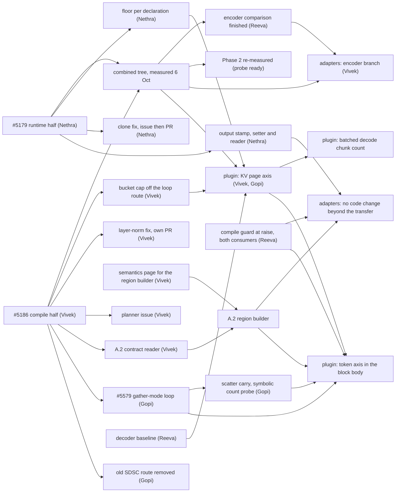

```mermaid
flowchart LR
  N["#5179 runtime half (Nethra)"] --> C["combined tree, measured 6 Oct"]
  A1["#5186 compile half (Vivek)"] --> C
  N --> F["floor per declaration (Nethra)"]
  N --> CL["clone fix, issue then PR (Nethra)"]
  N --> ST["output stamp, setter and reader (Nethra)"]
  A1 --> CAP["bucket cap off the loop route (Vivek)"]
  A1 --> LN["layer-norm fix, own PR (Vivek)"]
  A1 --> PL["planner issue (Vivek)"]
  SEM["semantics page for the region builder (Vivek)"] --> RB["A.2 region builder"]
  A1 --> A2a["A.2 contract reader (Vivek)"] --> RB
  A1 --> G["#5579 gather-mode loop (Gopi)"]
  G --> SC["scatter carry, symbolic count probe (Gopi)"]
  A1 --> CU["old SDSC route removed (Gopi)"]
  C --> E1["encoder comparison finished (Reeva)"]
  C --> P2["Phase 2 re-measured (probe ready)"]
  C --> HF1["adapters: encoder branch (Vivek)"]
  E1 --> HF1
  ST --> HF2["adapters: no code change beyond the transfer"]
  RB --> HF2
  CG["compile guard at raise, both consumers (Reeva)"] --> HF2
  DB["decoder baseline (Reeva)"] --> PA["plugin: KV page axis (Vivek, Gopi)"]
  F --> PA
  CAP --> PA
  C --> PA
  PA --> PC["plugin: batched decode chunk count"]
  G --> PT["plugin: token axis in the block body"]
  SC --> PT
  RB --> PT
  PA --> PT
  CG --> PT
```
